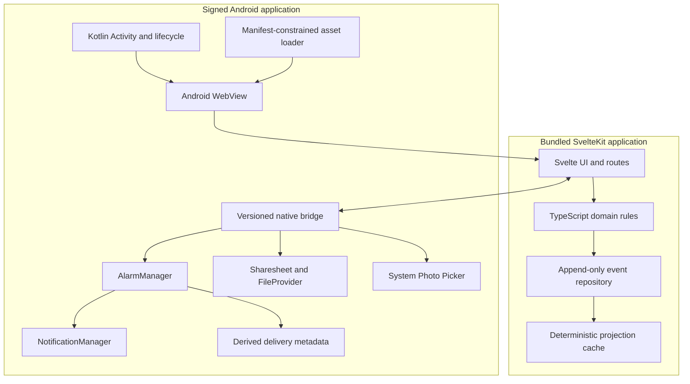

# Offline Android Shell Design

## 1. Outcome

Ship Learn Your Appetite as a phone-first Android application whose existing
SvelteKit interface runs inside a native `WebView` and remains fully useful
without network access, including on first launch. The Android layer packages
the web build, contains navigation, schedules local reminders, presents system
sharing and photo surfaces, and manages application/WebView lifecycle. It does
not duplicate the product's domain model.

The IndexedDB append-only event sequence remains the source of truth. Kotlin
must neither edit projected records nor create a second domain database. The
same deterministic TypeScript playback that powers the browser and iOS builds
materializes Android view state.

Distribution is exclusively through Google Play links and tracks. There is no
browser-installable PWA, Chrome-minted WebAPK, custom web install page, direct
APK download, or remotely hosted application shell. Internal testing provides
the development install link; Open testing is available if SPNSS EOOD chooses
to run a public beta; Production provides the permanent public listing.

This document is the Android counterpart to `IOS_DESIGN.md`. Product behavior
continues to come from `MVP_DESIGN.md`, screen behavior from `UX_DESIGN.md` and
`UX_OVERHAUL.md`, and browser verification from `E2E_GUIDE.md`.

The historical filename is retained so the open design PR and its review links
remain stable. “PWA” no longer describes the proposed distribution mechanism.

## 2. Acceptance criteria

The Android shell is ready for release when it:

- installs from a Google Play Internal, Open, or Production track link and
  behaves as a normal Android application in the launcher, Recents, App info,
  notification settings, updates, and uninstall;
- completes onboarding, paired check-ins, insights, experiments, Profile,
  export, photos, and deletion in airplane mode from a fresh install;
- launches no loopback or remote server and loads no runtime application
  resource from the network;
- preserves the canonical event log through process death, force-quit, WebView
  renderer termination, device restart, and an in-place Play update;
- rebuilds every editable projection by replaying events after its projection
  cache is removed;
- schedules, replaces, restores, opens, and cancels on-device notifications
  without Firebase Cloud Messaging, Web Push, or a Hunger backend;
- requests notification permission only after an explicit reminder-setting
  action and completes onboarding normally after denial;
- requests no special exact-alarm access for the MVP;
- blocks web navigation and subresource access outside its bundled origin;
- uses Android system Back, permissions, controls, Sharesheet, Photo Picker,
  edge-to-edge layout, accessibility, and theme behavior;
- passes its supported-device, accessibility, privacy, alarm-delivery, and
  upgrade matrix; and
- can be built, tested, audited, bundled, and uploaded from a clean checkout
  through commands exposed by `flake.nix`.

“Offline” means all core behavior works before the application has ever opened
with a network connection. It does not mean a previously visited website was
cached. Google Play needs a connection to install or update the package; the
installed application does not need one to run.

## 3. Architectural decisions

| Area | Decision | Reason |
| --- | --- | --- |
| Native UI | One Kotlin Activity containing one Android `WebView` | Mirrors the deliberately thin iOS shell and uses the mature native WebView/lifecycle APIs. |
| Supported OS | Provisional minimum Android 10/API 29; compile and target API 36; validate before locking | Gives a practical support window while meeting the September 2026 Play target requirement. |
| Dependencies | Android platform plus narrowly pinned AndroidX Activity, Core, WebKit, and test libraries | Avoids a generic hybrid runtime and limits privacy and supply-chain surface. |
| Web origin | Stable `WebViewAssetLoader` HTTPS origin, proposed as `https://appassets.androidplatform.net/assets/webapp/` | Gives packaged routes and IndexedDB one contained same-origin identity without a server or `file://`. |
| Asset loading | Manifest-constrained loader backed only by signed APK assets | Prevents missing local assets from falling through to the internet. |
| Web data | The application's persistent WebView data directory at the immutable packaged origin | Keeps IndexedDB durable and isolated within the app sandbox. |
| Domain state | Existing IndexedDB events plus deterministic TypeScript projection | Preserves the event-sourced model and avoids Android/iOS/browser divergence. |
| Browser service worker | Browser build only | The installed package is Android's offline asset authority; a second cache/version authority creates stale upgrades. |
| Native integration | Small, allowlisted, versioned request/reply bridge | Adds only capabilities the web layer cannot reliably provide. |
| Reminders | `AlarmManager` one-shot inexact alarms plus `NotificationManager` | Provides local delivery outside the app lifetime without server push or exact-alarm special access. |
| Updates | Google Play application update only | Keeps native code and executable web assets signed, reviewed, versioned together, and available offline. |
| Distribution | SPNSS EOOD Google Play organization account | Provides trusted installation, tester links, managed signing, updates, and public listing without a separate install website. |

As of September 2026, Google Play requires new phone apps and updates to target
Android 16/API 36. This is a moving release constraint, not a product data
contract, and must be rechecked before each release. See the current
[target API requirements](https://support.google.com/googleplay/android-developer/answer/11926878).

### 3.1 iOS parity map

The two shells should differ only where their operating systems require it.

| Concern | Existing iOS shell | Android shell |
| --- | --- | --- |
| Container | SwiftUI lifecycle plus `WKWebView` | Kotlin Activity plus Android `WebView` |
| Packaged origin | `hunger-app://app/` scheme handler | HTTPS-like `WebViewAssetLoader` origin |
| Persistent web state | Named `WKWebsiteDataStore` | App-scoped persistent WebView data directory |
| Bridge | `WKScriptMessageHandlerWithReply` | `WebViewCompat.addWebMessageListener` and reply proxy |
| Local reminders | `UNUserNotificationCenter` | `AlarmManager` plus `NotificationManager` |
| Reboot recovery | OS notification requests remain owned by iOS | Android receiver recreates alarms from derived delivery metadata |
| Permission | iOS notification authorization | Android 13+ `POST_NOTIFICATIONS` plus channel state |
| Share | `UIActivityViewController` | Android Sharesheet using a scoped content URI |
| Photos | WebKit picker, native fallback if needed | Android Photo Picker/camera intent, native fallback if needed |
| Lifecycle route | Typed `app.lifecycle` event | Same typed lifecycle event |
| Human preview | TestFlight | Play Internal testing |
| Public beta | TestFlight External testing | Optional Play Open testing |
| Public release | App Store | Play Production |

The SPA exposes one platform-neutral native adapter. UI copy may name the
current platform where helpful, but domain logic, event schema, projection
playback, reminder derivation, and application routes stay shared.

### 3.2 Component boundary



The bridge never sits between domain actions and the event repository. A
check-in completes entirely in web code: append an event, replay the sequence,
update the disposable projection cache, and render. Kotlin is unaware of the
episode.

## 4. Phase-zero feasibility gate

`WebViewAssetLoader` is the preferred origin architecture, but its storage and
upgrade behavior must be proven on the actual support matrix before building
the complete shell. Android System WebView can update independently of the app,
so this proof includes both OS and WebView versions.

Build a minimal signed shell that:

1. loads a bundled page at the permanent HTTPS-like asset origin;
2. creates the production IndexedDB schema and appends a real versioned event;
3. destroys and recreates the Activity and WebView;
4. survives process death and WebView renderer termination;
5. survives force-stop followed by an intentional relaunch and device restart;
6. installs a second signed fixture build over the first without uninstalling;
7. updates Android System WebView between supported fixture versions where the
   device permits it;
8. deletes projection stores and reproduces identical state by replay; and
9. performs the complete sequence in airplane mode.

Run the proof on emulators and physical phones at the provisional minimum API,
the current Android version, and one intervening version. Test release-like
builds as well as Debug. Record device, OS, System WebView, and build versions
in the pull request.

Proceed only if the same event origin remains durable in every required case.
If it fails, stop and revise this design before feature work. Permitted fallback
investigation is limited to another stable, app-owned HTTPS origin mapping or a
carefully migrated WebView data configuration. Do not switch to `file://`, run
a localhost server, export events into native preferences, replace IndexedDB
with Room, or make a Kotlin projection the source of truth.

Android documents `WebViewAssetLoader` as the supported way to expose packaged
content under an HTTP(S) URL compatible with same-origin behavior. See
[loading in-app content](https://developer.android.com/develop/ui/views/layout/webapps/load-local-content).

## 5. Packaged web application

### 5.1 Native build mode

Add a distinct build entry point, tentatively `bun run build:android`, that
sets `VITE_NATIVE_SHELL=android` and emits static content into a staging
directory. Browser and iOS behavior remain unchanged.

The Android web build must:

- use the existing static prerendered SvelteKit pages;
- preserve relative route and asset resolution beneath the permanent asset
  root;
- skip the browser marketing page and route a fresh native install directly to
  onboarding;
- omit service-worker registration and every browser/PWA install affordance;
- remove the development WebSocket allowance from Content Security Policy;
- exclude source maps and the development-only `__HUNGER_E2E__` fixture bridge;
- include fonts, SVGs, ambient theme images, and every product route locally;
- fail if emitted HTML, CSS, or JavaScript contains an unexpected `http:`,
  `https:`, `ws:`, `wss:`, protocol-relative URL, or remote source map;
- generate a sorted manifest containing path, byte size, MIME type, and SHA-256
  digest; and
- copy the verified manifest and assets into the Android application as an
  explicit input of every APK/AAB assembly task.

The Gradle build must make stale web assets impossible. Its dependency graph
either builds the SPA or verifies that the staged output exactly matches a
source/build stamp. CI prepares the pinned Nix/Bun/Gradle environment before
Gradle runs; the release task must not download application content or mutate
dependency locks.

### 5.2 Route and asset resolution

Use an AndroidX `WebViewAssetLoader` path handler beneath an immutable URL:

```text
https://appassets.androidplatform.net/assets/webapp/
```

The route mapping mirrors iOS:

| Request | Bundled file |
| --- | --- |
| `/assets/webapp/` | `index.html` |
| `/assets/webapp/settings` | `settings.html` |
| `/assets/webapp/check-in/new` | `check-in/new.html` |
| `/assets/webapp/check-in/new/` | `check-in/new.html` |
| `/assets/webapp/app/immutable/...js` | Exact manifest-listed asset (the Android-safe SvelteKit app directory) |

The loader/client normalizes percent encoding once, then rejects NUL bytes,
backslashes, dot segments, repeated decoding that changes path meaning,
directory traversal, unknown hosts, unknown prefixes, MIME mismatches, and
paths absent from the manifest. Query strings and fragments do not participate
in filesystem lookup.

Known files are returned with their declared MIME type, byte count, digest
verification policy, no-sniff response, and local caching rules. Missing files
produce a small bundled recovery surface and structured Debug log. They never
fall through to an internet request.

The origin and root path are persistent data identifiers once released.
Changing either can create a new WebView origin and strand IndexedDB data, so
they require an explicit data migration and upgrade test.

### 5.3 Service-worker split

The public browser application continues to register `service-worker.js`. In
Android native mode `registerOfflineShell()` returns without registering it.
The signed Android package and asset loader are the complete native asset
source.

The Android app does not download a replacement web bundle, remote JavaScript,
configuration that changes executable behavior, or a runtime patch. Every
native or web-code change ships as a Play application version.

## 6. Persistence and data ownership

The WebView uses the application sandbox's normal persistent data directory and
one immutable packaged origin. Do not enable ephemeral/incognito storage or
change `WebView.setDataDirectorySuffix` after release without a migration
design. The origin, path root, WebView data configuration, IndexedDB database
name, and source-event schema are release compatibility contracts.

Ownership rules are identical to iOS:

- `events` in IndexedDB is canonical and append-only;
- entity, insight, experiment, settings, and photo metadata stores are
  disposable materialized projections;
- projections are written only by deterministic event playback;
- web code owns event schema migration and projection rebuilding;
- Kotlin owns only platform state required to deliver native capabilities;
- no event or projected record is mirrored to Room, SQLite, DataStore,
  `SharedPreferences`, files, Account Manager, or cloud backup;
- app updates replace bundled code without clearing WebView data; and
- uninstall or explicit Delete Everything removes local data.

The only native reminder persistence is a bounded delivery cache containing
validated identifiers, fire windows/timestamps, notification kind, and route.
It exists so Android can recreate alarms after reboot while the WebView is not
running. It contains no scores, notes, reasons, photos, event IDs, insight text,
or program projection. Foreground reconciliation always replaces it from the
schedule freshly derived by TypeScript event replay.

Photo blobs may remain in the existing IndexedDB-backed store if the phase-zero
quota and memory tests pass. Metadata follows the same event/projection rules.
The shell never silently uploads photos, adds them to the system gallery, or
includes them in export.

### 6.1 Delete Everything transaction

Deletion crosses web and native ownership and uses the same two-party protocol
as iOS:

1. the user confirms in the web UI;
2. web code closes repository handles, removes source events, projections,
   blobs, caches, and preferences, and verifies absence;
3. web code calls `privacy.completeDelete` with no domain payload;
4. Kotlin cancels every app-owned alarm and delivered notification and deletes
   native delivery metadata and temporary export/photo files;
5. Kotlin replies only after verification; and
6. the Activity creates a fresh WebView at onboarding using the same persistent
   application origin.

If active WebView handles prevent database deletion, the page explicitly
acknowledges readiness, the Activity destroys that WebView, clears only the
audited app-owned web storage, then recreates it. This fallback is verified as
one transaction. A partial failure shows a retry state and never reports
successful deletion.

Individual episode deletion remains an event tombstone; Kotlin is not involved.

## 7. Navigation and network containment

Containment is enforced at the asset handler, navigation client, bridge origin,
Content Security Policy, Android manifest, and release audit layers.

The `WebViewClient` allows only main-frame/subframe requests to the exact
packaged HTTPS origin and manifest-listed root. It cancels remote HTTP(S),
cleartext, WebSocket, `file:`, `content:`, `data:`, intent, unknown scheme,
malformed URL, redirect, and new-window destinations. A user-initiated support
or legal link may be handed to a confirmed external browser only after that
small allowlist is deliberately added and tested; it never loads inside the
application WebView.

Required settings include:

- `allowFileAccess = false` and `allowContentAccess = false`;
- file-URL universal/file access disabled;
- mixed-content mode set to never allow;
- cleartext traffic disabled in the application manifest;
- JavaScript window opening disabled;
- multiple windows disabled unless explicitly designed;
- no arbitrary intent URI dispatch;
- DOM storage enabled only because IndexedDB requires the persistent web
  application store;
- release WebView debugging disabled; and
- a restrictive `default-src 'self'` Content Security Policy with only audited
  exceptions for locally generated photo/blob presentation.

Omit the `INTERNET` permission if final Play, WebView, Photo Picker, and external
browser handoff testing confirms the installed app does not need it. Even if a
platform integration forces the permission to exist, request interception and
network-security configuration must still prove that the WebView cannot fetch
remote application resources.

## 8. Native bridge

### 8.1 Shape and isolation

Generalize the existing TypeScript capability type from `platform: 'ios'` to
`platform: 'ios' | 'android'`; do not create an Android-specific copy of the
adapter or UI workflow.

On Android, expose one object through
`WebViewCompat.addWebMessageListener`, registered before navigation and limited
to the exact packaged origin in `allowedOriginRules`. The listener receives and
verifies `sourceOrigin` and accepts only the main frame. Android identifies this
as its recommended modern WebView bridge. The legacy
`addJavascriptInterface` is not acceptable because it exposes its object to
every frame and lacks origin-based access control. See Android's
[native bridge guidance](https://developer.android.com/develop/ui/views/layout/webapps/native-api-access-jsbridge).

Requests use the shared versioned JSON envelope: protocol version, unique
request ID, exact command, and typed payload. Before dispatch, Kotlin validates
origin, main-frame status, command allowlist, allowed fields, value types,
string lengths, array counts, date ranges, serialized size, and lifecycle
state. Every accepted request completes once with a structured success or error
reply.

If the provisional minimum WebView cannot support `WEB_MESSAGE_LISTENER`, raise
the supported WebView/Android minimum or revise this design before continuing.
Do not silently fall back to the legacy interface.

Native-to-web lifecycle messages use the established fixed adapter and typed
arguments. There is no command for arbitrary JavaScript evaluation, file
reading, URL navigation, event manipulation, projection querying, or product
setting changes. Release logs contain command names and result codes, never
notes, scores, events, exports, or photo data.

### 8.2 Shared command allowlist

| Command | Direction | Android behavior |
| --- | --- | --- |
| `capabilities.get` | web → native | Returns bridge version, `android`, and exact command list. |
| `notifications.authorizationStatus` | web → native | Returns runtime permission and channel-enabled state without prompting. |
| `notifications.requestAuthorization` | web → native | Requests `POST_NOTIFICATIONS` after an explicit reminder action when required. |
| `notifications.replaceSchedule` | web → native | Atomically replaces app-owned alarms and derived delivery metadata. |
| `notifications.cancelAll` | web → native | Cancels app-owned alarms and delivered notifications. |
| `notifications.pendingSchedule` | web → native | Returns only owned identifiers and count for Settings diagnostics. |
| `app.openNotificationSettings` | web → native | Opens this package's Android notification settings. |
| `appearance.set` | web → native | Matches launch, recovery, status, and navigation surfaces to the chosen theme. |
| `export.share` | web → native | Writes validated export content to a temporary file and presents the Sharesheet. |
| `privacy.completeDelete` | web → native | Finishes native cleanup only after web deletion succeeds. |
| `app.ready` | web → native | Allows queued lifecycle/notification routes to be delivered. |
| `app.lifecycle` | native → web | Reports foreground, clock/timezone, and notification-open reasons. |

The TypeScript reminder and export result types report native capability plus
`platform`, rather than encoding iOS in types or strings. Browser adapters keep
their current honest degradation. UI never claims scheduling succeeded merely
because the bridge exists.

## 9. Local notifications

Use Android `AlarmManager` to wake a small receiver and `NotificationManager`
to post a local notification. Do not add Firebase, Web Push, remote-notification
services, an ongoing foreground service, or a Hunger backend.

Android recommends inexact alarms for user actions that should happen after a
time or within a window. Exact alarms are reserved for cases where precise
timing is core, such as alarm clocks and calendars, and require special access
on current Android. Hunger's Morning, Midday, and Evening prompts are broad
noticing windows, so the MVP declares neither `SCHEDULE_EXACT_ALARM` nor
`USE_EXACT_ALARM`. See Android's
[alarm scheduling guidance](https://developer.android.com/develop/background-work/services/alarms).

This differs slightly from iOS: Android may delay an inexact alarm under Doze,
Battery Saver, or manufacturer power policy. Product copy must promise a window,
not an exact minute. Physical-device testing determines whether the delayed
pending-completion reminder remains useful; if it does not, revise that product
behavior rather than silently requesting exact-alarm access.

### 9.1 Permission and channel flow

Create one idempotent low-interruption notification channel named **Gentle
reminders** before querying or requesting notification state. Its initial
importance, sound, vibration, lock-screen visibility, and description match a
private reflection prompt, not an alarm. Android lets the user control the
channel after creation; the app reports that state and never tries to override
it.

Android 13+ requires `POST_NOTIFICATIONS`. Ask only in context:

1. the onboarding reminder branch expands Morning, Midday, and Evening
   Material switches;
2. switches append preference events but do not prompt;
3. **Turn on reminders** requests permission and schedules the selected windows
   after success;
4. **Not now** completes onboarding with reminders off;
5. denial also completes onboarding and offers an Android Settings recovery
   action later;
6. foreground and every reminder action recheck runtime permission and channel
   state; and
7. disabling all windows, pausing/completing the program, or deleting data
   cancels alarms and delivered notifications.

On older Android versions, the bridge still checks whether application and
channel notifications are enabled. Android recommends requesting notification
permission from a meaningful user action and rechecking whether notifications
remain enabled. See the current
[notification permission guidance](https://developer.android.com/develop/ui/compose/notifications/notification-permission).

### 9.2 Schedule replacement and delivery

Rules mirror the iOS coordinator wherever Android permits:

- TypeScript derives the entire desired schedule from replayed events;
- use a small fixed namespace of stable identifiers/request codes;
- `replaceSchedule` cancels all owned pending intents, validates the complete
  desired set, stores bounded delivery metadata, and creates one-shot inexact
  alarms so repeated calls cannot duplicate reminders;
- use `setAndAllowWhileIdle()` for user-selected reminders that should occur
  after a window begins, subject to the platform's delivery bounds;
- the receiver verifies a package-explicit immutable pending intent before
  posting;
- after delivery, schedule only the next already validated cached occurrence,
  or let foreground reconciliation replace the complete set;
- use `RECEIVE_BOOT_COMPLETED` plus time/timezone/package-replaced receivers to
  recreate only future alarms from delivery metadata;
- DST gaps/overlaps, timezone changes, manual clock changes, expired triggers,
  reboot, and app update produce at most one future occurrence per identifier;
- pausing, completion, permission/channel loss, or Delete Everything removes
  both alarms and delivered notices; and
- notification taps open or resume the existing Activity, queue one fixed
  lifecycle route, and deliver it only after `app.ready`.

The notification title/body stays neutral:

> Want to notice how your body feels?

Payloads contain only a fixed route (`today`) and kind (`window`, `context`,
`experiment`, or `pending-completion`). They never contain a score, reason,
note, meal description, photo, insight, event ID, or Profile result.

### 9.3 Honest system limitations

The Settings diagnostic shows actual permission, channel state, owned scheduled
count, and last reconciliation result. It explains rather than disguises these
Android constraints:

- inexact alarms may arrive later under idle and battery policies;
- a user can disable the channel/app, revoke permission, restrict background
  behavior, or force-stop the package;
- a force-stopped app cannot resume ordinary background delivery until the user
  intentionally launches/interacts with it again; and
- Android clears alarms at reboot, so the declared boot receiver recreates
  future derived deliveries.

No copy claims delivery while system controls prevent it.

## 10. Export and photos

The TypeScript export generator and redaction contract remain authoritative.
In native mode the export button sends the finished JSON or HTML string,
suggested filename, and audited MIME type to `export.share`. Kotlin validates a
conservative size limit, MIME allowlist, and sanitized filename; writes an
app-private temporary file; exposes it through a narrowly configured
`FileProvider` content URI; presents the Android Sharesheet; and deletes the
file after completion and on next launch.

No app receives a file until the user selects it in the system Sharesheet. URI
access is read-only, scoped to the chosen target, and revoked promptly. Photos,
source-event internals, and projection caches remain excluded from exports.

Use Android's system Photo Picker for library choice because it grants access
only to selected media without broad library permission. Keep the WebView file
input only if it produces the same consistent system flow across the support
matrix. Camera capture uses a package-scoped output URI and declares camera
permission only if the tested intent path requires it.

Native returns chosen/captured bytes or a bounded app-scoped content result;
existing web code performs validation and downsampling and appends the event.
Cancellation is normal, temporary grants/files are cleaned up, and a photo
failure never discards the required sensation entry.

## 11. Application and WebView lifecycle

The Activity owns one `WebAppController`, which owns the configured WebView for
the task.

Launch sequence:

1. apply the persisted native launch-theme mirror;
2. configure the immutable local origin, asset handler, navigation policy,
   bridge, WebView settings, and native coordinators;
3. create the WebView exactly once and load the packaged root;
4. show a static theme-matched launch background, not a second interactive UI;
5. wait for both main-frame completion and the web adapter's `app.ready`;
6. deliver any queued notification-open route exactly once; and
7. reveal web content or a native accessible **Try again** recovery screen.

Foregrounding refreshes notification/channel status and sends a clock,
timezone, and lifecycle signal. TypeScript reconciles program lifecycle and the
event-derived reminder schedule. Native code never fabricates a check-in.

Implement `onRenderProcessGone` and fatal-load recovery. Recreate the WebView at
the last allowlisted application route, let IndexedDB replay committed state,
and prevent loops with a bounded retry count. Never clear website data to fix a
renderer failure. An uncommitted form may be lost and the UI must not claim it
was saved.

System Back behavior is part of the shell contract:

1. dismiss a native system surface if it owns Back;
2. ask the SPA to close its active dialog/sheet or retreat from a safe form
   step;
3. traverse allowlisted SPA history;
4. at the application root, move the task to the background; and
5. never show an invented “Are you sure you want to exit?” dialog.

Support Android predictive Back when available without exposing intermediate
private content in snapshots. Preserve one task and one active WebView; do not
add multi-window/document behavior until storage, bridge, and schedule
coordination are separately designed.

## 12. Native presentation and accessibility

The web application remains visually authoritative. Do not add a native app
bar, bottom navigation, onboarding, Today, or Settings implementation that
duplicates the SPA. The Activity supplies only safe-area/inset treatment,
launch/recovery UI, temporary system presentation, system Back, and native
capabilities.

The approved themes remain recognizable: warm liquid glass in light mode and
nano-banana glass in dark mode. Android adapts interaction grammar rather than
product identity:

- apply Material 3 geometry, elevation, state layers, and motion tokens;
- render reminder choices as Material switches, never HTML checkboxes or iOS
  switch imitations;
- present the existing destinations as a Material Navigation Bar treatment
  using repository-owned SVGs and no emoji;
- keep actions at least 48 by 48 density-independent pixels;
- integrate edge-to-edge layout with status/navigation bars, display cutouts,
  gesture/three-button navigation, and the keyboard;
- synchronize launch, status, and navigation surfaces to the SPA theme so dark
  mode never has bright framing bars;
- maintain each screen's dominant CTA above the fold at supported phone sizes
  and common font/display scaling;
- animate meaningful size/position changes with Android motion conventions and
  respect Remove animations/reduced-motion settings; and
- never show a web marketing or install page inside the installed application.

Verify on real devices that TalkBack order, labels, roles, values, selected
states, headings, errors, live announcements, and focus restoration cross the
WebView/native boundary correctly. Large font and display size, bold text, high
contrast, color correction, dark theme, reduced animation, keyboard, Switch
Access, portrait/landscape, and screen magnification must not clip actions or
trap focus.

## 13. Security and privacy posture

The Android shell retains the iOS shell's deliberately small surface:

- signed, manifest-listed bundled resources only;
- exact-origin navigation, frame, and bridge checks;
- no analytics, ads, crash-upload SDK, remote configuration, account, sync,
  telemetry, FCM, Web Push, or third-party runtime content;
- no cookies or web credentials required;
- no broad filesystem/media access, arbitrary intent dispatch, arbitrary URL
  opening, or JavaScript-evaluation bridge;
- no cleartext traffic or remotely downloaded executable web bundle;
- release WebView inspection disabled and sensitive logcat content prohibited;
- temporary exports/photos use app-private storage and bounded URI grants;
- notification content and Recents presentation reveal no appetite details;
- minimum permissions and no exact-alarm special access; and
- Play Data safety, Health Apps declaration, store listing, and privacy policy
  match the local-only implementation.

Proposed manifest permissions/capabilities:

| Permission/capability | Decision |
| --- | --- |
| `POST_NOTIFICATIONS` | Declare; request in context on Android 13+. |
| `RECEIVE_BOOT_COMPLETED` | Declare solely to restore validated future alarms. |
| Photo Picker | Use scoped system access; no broad media permission. |
| Camera | Declare only if final capture integration requires it. |
| `INTERNET` | Prefer omission; validate against final integrations. |
| `SCHEDULE_EXACT_ALARM` / `USE_EXACT_ALARM` | Do not declare. |
| Location, contacts, Health Connect, advertising ID | Do not declare. |

Backups require an explicit decision. The default recommendation is to exclude
WebView appetite data and native delivery metadata from Android cloud/device
transfer until encrypted restore, permission semantics, deletion, and event
migration are designed. The privacy policy must say what the final manifest
actually does.

Because Hunger provides health/wellness functionality, SPNSS EOOD should use a
verified Google Play Organization account, complete the Health Apps declaration,
publish an active non-PDF privacy policy, avoid medical claims, and include the
required non-medical/seek-professional-advice wording. See Google's
[Health Content and Services policy](https://support.google.com/googleplay/android-developer/answer/16679511)
and [organization account guidance](https://support.google.com/googleplay/android-developer/answer/13634885).

## 14. Proposed project layout

```text
android/
├── build.gradle.kts
├── settings.gradle.kts
├── gradle.properties
├── gradle/
│   ├── libs.versions.toml
│   └── wrapper/
├── app/
│   ├── build.gradle.kts
│   ├── proguard-rules.pro
│   └── src/
│       ├── main/
│       │   ├── AndroidManifest.xml
│       │   ├── java/com/anicolao/hunger/
│       │   │   ├── HungerActivity.kt
│       │   │   ├── WebAppController.kt
│       │   │   ├── OfflineAssetLoader.kt
│       │   │   ├── NavigationPolicy.kt
│       │   │   ├── NativeBridge.kt
│       │   │   ├── NotificationCoordinator.kt
│       │   │   ├── NotificationReceiver.kt
│       │   │   ├── RestoreAlarmsReceiver.kt
│       │   │   ├── ShareCoordinator.kt
│       │   │   └── PhotoCoordinator.kt
│       │   ├── res/
│       │   │   ├── drawable/
│       │   │   ├── mipmap-anydpi-v26/
│       │   │   └── values/
│       │   └── assets/webapp/       # generated; policy decided in implementation
│       ├── test/java/com/anicolao/hunger/
│       └── androidTest/java/com/anicolao/hunger/
scripts/
├── build-android-web.sh
├── verify-android-bundle.sh
└── verify-android-release.sh
```

Suggested release identifiers, to confirm before Play application creation:

- product name: **Learn Your Appetite**;
- module name: `app`;
- application ID: `com.anicolao.hunger`;
- permanent packaged origin:
  `https://appassets.androidplatform.net/assets/webapp/`; and
- notification channel ID: `appetite.gentle-reminders`.

The application ID, Play application, signing identity, origin, IndexedDB name,
and source-event schema are permanent or expensive to change after release.

## 15. Nix and reproducible tooling

All repository-facing Android environment, configuration, build, test,
emulator, audit, signing-neutral packaging, and Play release scripts must be
exposed through `flake.nix`. Android Studio may be used as an editor, but no
document or CI job assumes an unrecorded Android Studio configuration.

Pin through the flake and repository locks:

- a compatible JDK;
- Android command-line tools, platform SDK/API 36, build tools, emulator, and
  CI system image;
- Gradle wrapper URL and checksum;
- Kotlin, Android Gradle Plugin, AndroidX, lint, and test versions through the
  version catalog;
- Bun and browser dependencies already managed by the repository; and
- asset, checksum, bundle-inspection, and screenshot utilities.

Proposed flake commands parallel the iOS contract:

```text
nix develop
nix run .#android-build-web
nix run .#android-generate
nix run .#android-test-unit
nix run .#android-test-ui
nix run .#android-build-release
nix run .#android-audit-release
nix run .#android-verify
nix run .#android-play-configure
nix run .#android-play-preflight
nix run .#android-play-upload-internal
nix run .#android-play-status
nix run .#android-play-promote
```

`android-verify` composes web checks, TypeScript tests, browser E2E, native web
bundle audit, Kotlin unit tests, lint, emulator instrumentation, and a
signing-neutral release bundle. Local and CI workflows call these flake apps
instead of copying shell logic into documentation or YAML.

A deliberate dependency-prefetch/update operation may require the network, but
normal verification cannot mutate locks or download application content. Play
credentials and upload keys stay outside the repository and Nix store, are
owner-readable only, and enter only narrowly scoped release commands through a
documented configuration handoff.

## 16. Verification strategy

### 16.1 Fast tests

Continue all TypeScript domain, event-replay, component, and Playwright tests.
Add JVM tests for:

- route mapping, percent decoding, MIME types, hashes, and traversal rejection;
- navigation policy across schemes, origins, frames, redirects, and new windows;
- bridge version/origin/frame/command/payload/size validation and exactly-once
  replies;
- permission and notification-channel mapping across Android versions;
- stable alarm identifiers, window calculation, DST/timezone/clock changes,
  replace/cancel idempotency, and expired alarms;
- boot/time/package receiver validation and derived-cache restoration;
- notification privacy and fixed route/kind payloads;
- export type/name/size/URI grant/cleanup behavior;
- photo cancellation, bounds, grants, and cleanup; and
- cross-boundary deletion verification.

### 16.2 Android tracer bullets

Each implementation slice adds or extends a black-box instrumentation journey:

1. **Cold offline launch** — fresh install, airplane mode, onboard, create a
   paired check-in, kill the process, relaunch, and see replayed state.
2. **Persistence upgrade** — install fixture build A, append events, install B
   over it, remove projections, and recover identical state from events.
3. **Contained navigation** — exercise every route and assert attempted external
   navigation, subresource, and bridge-origin access is blocked with no network.
4. **Native reminders** — choose switches, request permission in context,
   replace an accelerated schedule, kill the process, observe delivery, tap
   into Today, pause, and verify cancellation.
5. **Permission recovery** — deny permission, finish onboarding, enable it in
   Android Settings, foreground, and reconcile once with no duplicate alarms.
6. **Reboot and time change** — schedule, reboot, restore one set, change
   timezone/clock, and retain exactly one future occurrence per identifier.
7. **Back and renderer recovery** — dismiss layers in order, use gesture and
   predictive Back, terminate the renderer, and restore committed state without
   clearing data.
8. **Private export and photo** — share both export formats, inspect redaction
   and URI scope, verify cleanup, choose/capture/cancel a photo, and retain the
   sensation event after photo failure.
9. **Delete Everything** — seed events, projections, photo, alarm, delivered
   notification, delivery cache, and temporary export; delete; relaunch; verify
   onboarding and absence in both layers.
10. **Accessible Android journey** — complete the primary flow with TalkBack,
    keyboard/Switch Access, large font/display, dark mode, high contrast,
    reduced animation, gesture navigation, and a cutout.

Test seams may provide a deterministic clock, accelerated alarm coordinator,
permission/channel fixtures, renderer termination, and source events. They are
compiled out of Release and never inject materialized projections.

### 16.3 Required matrix

| Dimension | Minimum coverage |
| --- | --- |
| OS | Provisional Android 10/API 29, current Android, and one intervening major version |
| Target | API 36 release build and current Play pre-launch checks |
| WebView | Oldest supported and current stable Android System WebView |
| Hardware | Oldest supported small phone, current standard phone, current large/cutout phone; tablet/foldable smoke test if distributed |
| Navigation | Three-button and gesture navigation; predictive Back where available |
| Install | Fresh, relaunch, process kill, documented force-stop behavior, device restart, low storage, in-place Play update |
| Power | Normal, Doze, Battery Saver, and at least two materially different OEM power policies |
| Appearance | Light, dark, high contrast, reduced animation, largest supported font/display combinations |
| Input | Touch, TalkBack, keyboard/Switch Access; Photo Picker and camera on physical hardware |

Emulator CI is necessary but insufficient for IndexedDB durability across
System WebView updates, alarm delivery, Doze/OEM policy, notification surfaces,
camera/library behavior, and Play update proof. Record physical-device release
candidate checks before track promotion.

### 16.4 CI gates and review artifacts

Add an Ubuntu or Linux KVM Android job that:

1. enters the repository's Nix environment;
2. installs JS/Gradle dependencies without changing locks;
3. runs web checks, unit tests, browser E2E, and production build;
4. builds and audits the native SPA bundle;
5. runs Kotlin unit tests and Android lint;
6. builds the application for the pinned emulator;
7. runs phone-primary instrumentation tests; and
8. archives screenshots, selected screen recordings, JUnit reports, filtered
   logcat, asset manifest, bundle metadata, and checksums.

Existing browser PR previews remain useful for shared SPA changes but are not an
Android install preview. Native PR artifacts include an installable debug APK
and instrumentation evidence. A Google Play Internal testing link is the human
physical-device preview path once the Play application and signing handoff
exist.

## 17. Coherent implementation commits

`ANDROID_IMPLEMENTATION_PLAN.md` should convert this design into the following
green, independently reviewable commits. Every feature commit carries its
tracer bullet and is pushed before the next begins.

1. **`test(android): prove stable offline WebView event storage`**
   Add the smallest shell and the phase-zero process/reboot/WebView/upgrade
   persistence proof. Stop and revise the design if it fails.
2. **`feat(android): package and contain the offline web application`**
   Add the Gradle project, reproducible native build mode, asset manifest,
   contained loader, navigation policy, launch/recovery UI, and cold-offline
   journey.
3. **`feat(android): add the versioned platform bridge`**
   Generalize the TypeScript boundary, add origin-constrained messaging,
   payload validation, lifecycle handshake, and adversarial tests.
4. **`feat(android): schedule private local reminders`**
   Add permission, notification channel, inexact one-shot alarms, derived cache,
   reboot/time recovery, replacement/cancellation, diagnostics, and tap routing.
5. **`feat(android): integrate Android presentation and lifecycle`**
   Add Material platform tokens, switches/navigation, edge-to-edge theme bars,
   system/predictive Back, accessibility, and renderer recovery.
6. **`feat(android): share exports and choose photos privately`**
   Add scoped temporary files, Sharesheet, Photo Picker/camera integration,
   cancellation, failure, and cleanup tests.
7. **`feat(android): coordinate deletion and migration recovery`**
   Make Delete Everything atomic across web/native state and certify event-based
   process/update recovery.
8. **`test(android): certify the offline release shell`**
   Complete the API/WebView/device/accessibility matrix, privacy/health review,
   signing-neutral release audit, and Play release checklist.
9. **`ci(android): automate Google Play internal delivery`**
   Add credential-safe preflight, build/upload/status commands, CI artifacts,
   and an Internal testing link handoff through `flake.nix`.

Do not combine the persistence spike with reminders, sharing, or Play setup.
Its result determines whether the rest of the architecture is sound.

## 18. Google Play distribution

The Android application is distributed only through Google Play:

```text
PR debug APK → Play Internal testing → optional Open testing → Production
```

Internal testing is the expected development and stakeholder path. Open testing
is optional; SPNSS EOOD may submit directly from validated Internal testing to
Production. Production review is still required before the public listing.

Persistent external setup that must happen before full automation:

1. create/verify the SPNSS EOOD Play Organization account and D-U-N-S identity;
2. create the Play application with the permanent application ID;
3. enroll in Play App Signing and create a separate protected upload key;
4. configure the store listing, countries, support contact, and privacy-policy
   URL;
5. complete Data safety, Health Apps, ads, target audience, content rating, and
   app-access declarations; and
6. create the Internal tester group and decide whether an Open track is needed.

After that handoff, flake-backed tooling should automate release preflight,
version-code allocation, signed AAB construction, artifact audit, Internal
upload, status polling, release notes, tester-track assignment, and promotion
of the same reviewed artifact. Publishing/promoting to a broader audience
remains an explicit human action; automation prepares and executes it only when
requested.

Google requires Play App Signing for new applications distributed as Android
App Bundles. See Android's [upload](https://developer.android.com/studio/publish/upload-bundle)
and [app signing](https://developer.android.com/studio/publish/app-signing)
guidance. Credentials, upload keys, service-account JSON, tester emails, and
legal declarations never enter git or the Nix store.

The store listing must accurately describe the local-only architecture:

- no account or server is required;
- appetite records and photos stay on the device;
- local reminders can be disabled in the app or Android Settings;
- an export leaves only through an explicit system share action; and
- the app is a reflection/learning tool, not a medical device and not a source
  of diagnosis or treatment.

## 19. Risks and mitigations

| Risk | Mitigation / release gate |
| --- | --- |
| Packaged-origin IndexedDB changes across System WebView versions | Phase-zero WebView/device/upgrade proof; immutable origin and data settings; stop before feature work if it fails. |
| Android native cache becomes a second source of truth | Store delivery metadata only; replace it from event-derived TypeScript schedule on foreground; adversarial data-ownership tests. |
| Reboot/time change loses or duplicates reminders | Namespaced one-shot alarms, bounded derived cache, explicit receivers, deterministic clock/timezone tests. |
| Inexact alarm arrives later than expected | Promise broad windows, test Doze/OEM behavior, show honest diagnostics, revise pending-completion UX if necessary. |
| User force-stops or restricts the app | Explain actual state after relaunch, reconcile then, and never claim background delivery while disabled. |
| Bridge exposes native capabilities to untrusted content | `addWebMessageListener`, exact origin/main frame, no wildcard, contained assets/navigation, strict schemas, adversarial tests. |
| Missing asset falls through to the network | Manifest-constrained custom handler, no remote navigation, URL audit, preferably no `INTERNET`, zero-network test. |
| App still feels like an iOS page | Shared product structure plus Android Material controls, Back, insets, system surfaces, TalkBack, and screenshot review. |
| App update archives stale SPA output | Gradle dependency inputs, digest manifest, clean-checkout AAB test, bundle audit. |
| WebView wrapper appears low-value in Play review | Demonstrate a complete offline 30-day product, native reminders/share/photos/lifecycle, accessibility, privacy, and original owned functionality. |
| Health policy declarations conflict with product copy | Organization account, explicit Health Apps review, public privacy policy, no medical claims, matching non-medical disclaimer. |
| Nix tooling works only on one developer machine | Flake-owned commands, pinned SDK/JDK/Gradle inputs, nix-darwin plus Linux CI verification. |

## 20. Deliberate non-goals

The Android shell does not add a browser-installed PWA, WebAPK, Trusted Web
Activity, custom install landing page, direct APK distribution, accounts,
cross-device synchronization, a Hunger backend, FCM, Web Push, analytics, ads,
remote configuration, downloaded application code, Health Connect, widgets,
Wear OS, exact-alarm access, an ongoing foreground service, native domain
screens, or a second data model.

A future server, sync, remote push, or Play-independent distribution path
requires a separate product, privacy, threat, consent, retention, event-merge,
and operations design. None may be smuggled into the native bridge.

## 21. Decisions to confirm before implementation

The distribution and shell direction are now settled: a bespoke Android wrapper
containing the offline SPA, distributed only through Google Play links.

Confirm these durable choices before their implementation slice:

- provisional Android 10/API 29 minimum after the phase-zero device/WebView
  inventory and proof;
- phone-only Play availability versus phone-primary with tablet/foldable smoke
  support;
- permanent `com.anicolao.hunger` application ID under SPNSS EOOD;
- Google-managed app-signing key plus separate SPNSS EOOD upload key;
- permanent packaged HTTPS origin/path before any external tester data exists;
- Android backup disabled versus a separately designed safe event-store backup;
- generated web assets committed versus always generated during the build; and
- whether the first external release goes directly from Internal testing to
  Production or uses an optional Open-testing link.

The recommended defaults are Android 10 pending proof, phone-primary adaptive
distribution, Google Play App Signing with a separate upload key, backup
excluded, generated assets reproduced during the build, and Internal testing
followed directly by Production when release evidence is green.
