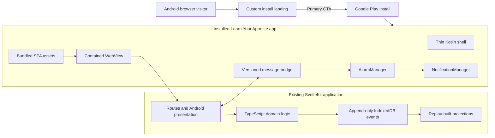
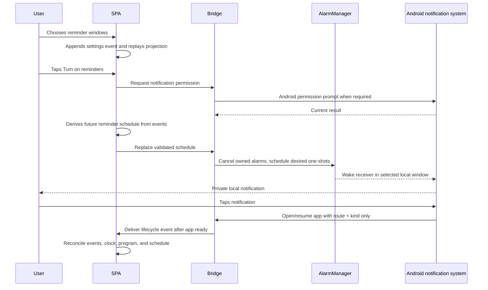

# Android Installed SPA Design

## 1. Decision in one paragraph

Learn Your Appetite should ship on Android as the same SvelteKit SPA packaged
inside a small native Android application, reached through a purpose-built web
install page. The Android package owns only installation, the `WebView`, local
alarms and notifications, system sharing, photo selection, lifecycle, and
release integration. The SPA continues to own every product screen and the
append-only event sequence in IndexedDB remains canonical.

This is intentionally **not a browser-only PWA**. A browser-installed PWA can
look installed and work from a service-worker cache, but it cannot reliably
wake itself at user-selected times to show private reminders without a push
message sent through a push service. Periodic Background Sync is controlled by
the browser, requires prior engagement and a previously used network, and can
stop when the app is not used. It is unsuitable for a reminder promise. Web
Push, in turn, begins with an application server sending a request to a browser
push service. See Chrome's descriptions of
[Periodic Background Sync](https://developer.chrome.com/docs/capabilities/periodic-background-sync)
and the [Web Push flow](https://web.dev/articles/push-notifications-overview).

The recommended package uses Android's `AlarmManager` to post local
notifications from device state. This needs no Hunger server, account, push
subscription, Firebase Cloud Messaging, or active network connection. Android
explicitly recommends inexact alarms for user actions that should happen after
a time or within a window; exact alarms are reserved for genuinely precise
alarm-clock or calendar behavior and add special permission and Play policy
costs. Hunger's Morning, Midday, and Evening windows fit the inexact model.
[Android alarm guidance](https://developer.android.com/develop/background-work/services/alarms)
is the platform contract for this choice.

The name of this document reflects the product shape—an installed SPA with a
web acquisition funnel—not a claim that browser APIs alone provide native
reminders.

## 2. Desired outcome

An Android user should be able to:

1. arrive at a focused install page from Chrome, a message, or a search result;
2. understand in one viewport that the app is private, offline, and sends
   reminders locally;
3. tap one primary **Install for Android** action;
4. complete the normal, trusted Android installation confirmation;
5. launch Learn Your Appetite from the launcher without browser chrome;
6. complete onboarding and the full 30-day program offline from first launch;
7. opt into Morning, Midday, or Evening reminders and receive them with no
   server connection; and
8. experience Android navigation, permissions, controls, safe areas, launch,
   notifications, sharing, and recovery as parts of one coherent app.

The install page is an acquisition surface. It is not a duplicate onboarding
or a long marketing site. The installed package starts directly at the
appearance choice for a new user and at Today for a returning user.

## 3. Acceptance criteria

The Android product is ready for public testing when it:

- installs through Google Play from the custom Android landing page;
- is available to Android launchers, Recents, App info, notification settings,
  backup/restore policy, and uninstallation like any other Android app;
- completes onboarding, paired check-ins, insights, experiments, Profile,
  export, photos, and deletion in airplane mode from a fresh install;
- packages every required HTML, JavaScript, CSS, font, icon, and image in the
  signed Android App Bundle; it runs no loopback or remote content server;
- preserves the canonical IndexedDB event sequence across process death,
  reboot, WebView renderer termination, and in-place application upgrades;
- reconstructs every editable projection by replaying that event sequence;
- schedules, replaces, restores, opens, and cancels local notification alarms
  without FCM, Web Push, or a Hunger backend;
- asks for notification permission only after a user explicitly chooses
  reminders, and completes onboarding normally after denial;
- never requests Android's special exact-alarm access for the MVP;
- blocks navigation and resource access outside the packaged application
  origin;
- follows Android visual, system-back, touch-target, permission, accessibility,
  and edge-to-edge conventions while retaining the approved Hunger themes;
- passes phone-primary browser, emulator, and physical-device tracer bullets;
  and
- can be built, tested, audited, and bundled from the repository through
  commands exposed by `flake.nix`.

“Offline” means useful before the device has ever connected after installation.
It does not mean that Chrome happened to cache an earlier website visit. The
Play Store necessarily needs a connection to download the package; the package
does not need one to run.

## 4. Feasibility: what each installation model can promise

| Model | Launcher app | First launch offline | Serverless scheduled reminders | Native Android behavior | Decision |
| --- | --- | --- | --- | --- | --- |
| Browser-installed PWA/WebAPK | Yes | Only after all assets were successfully cached | **No dependable mechanism** | Partial | Keep only as an explicitly limited fallback, if desired. |
| Trusted Web Activity | Yes, through an Android package | Depends on hosted content/cache | No native alarm bridge without adding Android integration | Strong browser presentation, weak offline ownership | Reject for this product. |
| Remote SPA in a WebView | Yes | No | Yes | Good after load | Reject because it violates offline-first and makes the server an availability dependency. |
| SPA bundled in a native WebView | Yes | **Yes** | **Yes, with local `AlarmManager` alarms** | Full shell integration | **Recommended.** |

### 4.1 Why a pure PWA is not enough

The Notifications API can display a notification when JavaScript or a service
worker is already running. It is not a durable clock that wakes a closed web
application at 8:00 a.m. JavaScript timers stop when the page is suspended or
terminated. Service workers are event-driven and the browser decides when to
start and stop them.

Periodic Background Sync does not close this gap. Chrome documents that it is
available only after installation, is gated by engagement, requires a network
the user has used, may stop when engagement drops, and does not let the
developer control firing time. It is designed to refresh content, not deliver
local alarms.

Web Push can wake a service worker, but the architecture includes a subscription,
a browser push service, and an application server that sends the push request.
That could be added later, with a separate privacy and infrastructure design,
but it is the opposite of the requested serverless local-reminder model.

The browser-only fallback must therefore say **Reminders require the Android
app**. It must never save reminder switches and imply that the operating system
will deliver them.

### 4.2 Why not request exact alarms

Hunger's reminder windows invite noticing; they are not deadlines. Inexact
alarms can run outside the app lifetime and while the device is idle, while
allowing Android to batch work for battery health. Current Android guidance
allows an inexact alarm to arrive later than its initial trigger—commonly up to
about an hour on modern versions, with additional delay possible under battery
restrictions. That is compatible with a broad Morning, Midday, or Evening
window if copy never promises a minute.

Exact alarms would add “Alarms & reminders” special access on Android 12+ and
are not pre-granted to fresh installs targeting Android 13+. Android says to
use them only when precise timing is core to the user-facing function. The MVP
will not declare `SCHEDULE_EXACT_ALARM` or `USE_EXACT_ALARM`.

## 5. Product boundary



The native host is a capability layer, not a second product implementation.
It must not know what an appetite episode, insight, experiment, score, or
program day means.

| Concern | Owner |
| --- | --- |
| Product routes, themes, copy, forms, insights, experiments | Svelte SPA |
| Domain validation and schedule derivation | TypeScript domain modules |
| Canonical events and deterministic projections | IndexedDB web repository |
| Web asset packaging and contained origin | Android shell/build |
| Notification permission, alarms, channel, and notification tap | Android shell |
| System Back, sharing, photo picker, safe areas, renderer recovery | Android shell plus narrow bridge |
| Marketing/install page and install-state presentation | Hosted Svelte browser build |

## 6. The custom install flow

### 6.1 Landing-page contract

Add an Android-focused acquisition state to the public website, not to the
packaged SPA. An Android browser with no active program sees it at `/` or at a
stable `/android` campaign route. The installed native build never shows it.

The first phone viewport contains, in order:

```text
┌─────────────────────────────────┐
│  Learn Your Appetite       leaf │
│                                 │
│  Learn what your body is        │
│  telling you.                   │
│                                 │
│  A private 30-day practice.     │
│  About 10 seconds at a time.    │
│                                 │
│  [ Install for Android ]        │
│                                 │
│  ✓ Works offline                │
│  ✓ Reminders stay on this phone │
│  ✓ No calories or account       │
│                                 │
│  How it works                   │
└─────────────────────────────────┘
```

The primary action must be visible without scrolling on the smallest supported
phone with 200% text. The existing light and dark ambient artwork remains, but
the CTA uses Android/Material motion and press feedback. No autoplay video,
carousel, account form, cookie banner, or notification request belongs here.

“Reminders stay on this phone” means scheduling and notification content are
local. It must not imply that Android system backup behavior is disabled unless
the release manifest actually disables it.

### 6.2 Install state machine

| State | Primary action | Secondary behavior |
| --- | --- | --- |
| Android + Play Store available | **Install for Android** | Open the verified Play listing with a web fallback. |
| Android app already installed and detectable through an app link | **Open app** | Route the verified app link to Today/onboarding. |
| Desktop or iOS | Platform-appropriate action | Do not offer an Android package as though it installs locally. |
| Android browser without Play | **Get installation help** | Explain supported Play installation; do not encourage untrusted APK sideloading for public release. |
| Play listing not yet public | **Join Android testing** | Open the approved tester opt-in/listing flow. |
| Browser-PWA fallback deliberately enabled | **Install web version** | Invoke the browser prompt and explicitly label reminders unavailable. |

The landing page may use a verified Android App Link to attempt **Open app**,
but it must always retain a visible Play fallback and must not loop between the
browser and app.

### 6.3 Optional browser-PWA fallback

If product review chooses to retain a browser-installed version, the site can
capture `beforeinstallprompt`, reveal its own **Install web version** button,
and call `prompt()` only from that tap. The browser still owns the final
confirmation; a site cannot silently install itself. The UI listens for
`appinstalled` and uses the `display-mode` media query to remove install
promotion after launch. This follows the documented
[custom PWA install flow](https://web.dev/articles/customize-install).

The fallback must remain subordinate to the full Android app because it cannot
meet the reminder requirement. It may offer the check-in program offline after
a successful cache, but Settings shows:

> Scheduled reminders need the Android app.

with an **Install Android app** action. It does not ask for browser notification
permission.

### 6.4 Web manifest and install assets

The existing manifest is a useful start but is not a release-quality Android
install identity. The browser fallback and landing-page metadata should add:

- a stable `id`, absolute `start_url`, and exact `scope`;
- `display: "standalone"` plus appropriate `display_override` fallbacks;
- separate theme and background colors consistent with the launch surface;
- raster 192 px and 512 px icons, including a genuinely padded maskable icon;
- a monochrome notification icon as a separate Android native asset;
- portrait phone screenshots and concise description metadata;
- no shortcuts until every shortcut has an offline route and a stable product
  value; and
- asset URLs that are part of the service-worker precache and pass an offline
  install audit.

The native app's launcher name, icon, colors, and Play listing must match the
web surface closely enough that the installation transition feels continuous.

## 7. Packaged SPA architecture

### 7.1 Android build mode

Add a static build mode using `VITE_NATIVE_SHELL=android`. It should share the
same routes and domain modules as browser and iOS builds while selecting
Android platform presentation and native capabilities at compile/runtime.

The build must:

- emit only prerendered static files and relative application routes;
- begin at onboarding when no event-backed program exists, otherwise Today;
- omit the marketing/install page and service-worker registration;
- package fonts, icons, ambient imagery, and all screen assets locally;
- compile out the development-only E2E fixture boundary and source maps;
- apply a release Content Security Policy with no remote script, style, font,
  image, connection, frame, or form destination;
- generate a sorted manifest of path, byte size, MIME type, and SHA-256 digest;
- fail when output contains an unexpected remote/protocol-relative URL or a
  development WebSocket; and
- copy only manifest-listed output into `android/app/src/main/assets/webapp` as
  an explicit Gradle dependency of every APK/AAB assembly task.

The Android package, not a service worker, is the installed asset version. A
new executable web bundle ships through a normal Play update. The browser
build keeps the current service worker and update flow.

### 7.2 Stable local origin

Serve packaged assets through AndroidX `WebViewAssetLoader` at one immutable
HTTPS-like origin, proposed as:

```text
https://appassets.androidplatform.net/assets/webapp/
```

Android recommends `WebViewAssetLoader` for packaged content because it loads
HTML and subresources through an HTTP(S) URL compatible with same-origin
policy. See [loading in-app WebView content](https://developer.android.com/develop/ui/views/layout/webapps/load-local-content).
Do not use `file://`, broad file access, `data:` bootstrapping, or a localhost
server.

The loader/client must:

- serve only exact, normalized paths present in the generated manifest;
- map prerendered routes deterministically to their HTML files;
- reject dot segments, encoded traversal, backslashes, NUL bytes, unknown
  hosts, unregistered paths, and MIME mismatches;
- never fall through to the network when a local file is absent;
- disable file and content URL access;
- block mixed content and cleartext traffic;
- reject all top-frame and subframe navigation outside the application origin;
- send intentional support/legal links to a confirmed external browser only
  after a user gesture; and
- show a small native retry/recovery screen for a corrupt or missing package,
  never a remote fallback application.

The origin, path prefix, WebView storage partition, IndexedDB database name,
and event schema become migration contracts after release.

### 7.3 Persistence and ownership

The installed Android SPA preserves the repository's existing model:

- `events` in IndexedDB is canonical and append-only;
- program, settings, episodes, patterns, insights, experiments, Profile, and
  photo metadata are replay-built, disposable projections;
- only TypeScript event playback writes projections;
- native Kotlin code never reads or writes domain records;
- a WebView renderer restart reconnects to the same durable store and replays;
- application updates replace assets without deleting the WebView data
  directory; and
- uninstall or explicit **Delete Everything** removes local state.

Android native storage may contain only platform facts required to function
without a live WebView: the validated next alarm specifications, stable request
codes, last package build identifier, permission diagnostics, and temporary
file paths. It must not contain hunger/fullness values, notes, reasons, photos,
insight text, event payloads, or a second settings model.

Because WebView persistence can differ across Android System WebView releases,
the first implementation tracer bullet must prove event retention and replay
across process death, renderer termination, reboot, and an A-to-B app upgrade
on the supported device matrix before other native features build on it.

## 8. Versioned Android bridge

### 8.1 Shared TypeScript contract

Generalize the existing iOS-only platform types rather than fork them:

```ts
type NativePlatform = 'ios' | 'android';

interface NativeCapabilities {
  version: 1;
  platform: NativePlatform;
  commands: readonly string[];
}
```

The command semantics stay cross-platform wherever possible:

| Command | Purpose on Android |
| --- | --- |
| `capabilities.get` | Return protocol version, `android`, and exact command allowlist. |
| `notifications.authorizationStatus` | Return permission plus channel-enabled state without prompting. |
| `notifications.requestAuthorization` | Request `POST_NOTIFICATIONS` in context when required. |
| `notifications.replaceSchedule` | Atomically replace all app-owned local alarms with the validated desired set. |
| `notifications.cancelAll` | Cancel app-owned alarms and delivered notifications. |
| `notifications.pendingSchedule` | Return only identifiers and count for Settings diagnostics. |
| `app.openNotificationSettings` | Open the system notification settings for this package. |
| `appearance.set` | Match status/navigation bars and launch/recovery surfaces to the SPA theme. |
| `export.share` | Present an Android Sharesheet for an ephemeral, content-URI export. |
| `privacy.completeDelete` | Finish native alarm, notification, preference, and temporary-file cleanup. |
| `app.ready` | Mark the web content ready for queued lifecycle/deep-link delivery. |
| native lifecycle event | Report foreground, Back, and notification-open reasons through one typed adapter. |

There is no domain CRUD, arbitrary file API, arbitrary URL navigation, raw SQL,
JavaScript evaluation, or generic reflection command.

### 8.2 Message transport and security

Use `WebViewCompat.addWebMessageListener`, registered before navigation, with
the exact packaged origin in `allowedOriginRules`. Android identifies it as the
recommended modern bridge: it enforces origin rules and supplies `sourceOrigin`
for each message. The legacy `addJavascriptInterface` exposes its object to
every frame and lacks origin-based access control, so it is not acceptable for
this app. See Android's
[JavaScript bridge guidance](https://developer.android.com/develop/ui/views/layout/webapps/native-api-access-jsbridge).

Every request is serialized JSON containing protocol version, unique request
ID, exact command, and payload. Native code verifies the source origin, main
frame, command, types, allowed fields, string lengths, array counts, date
ranges, total bytes, and lifecycle state before dispatch. Every accepted
request receives exactly one structured success or error reply. Unknown and
unsupported values fail closed.

If the oldest proposed Android/WebView combination does not support
`WEB_MESSAGE_LISTENER`, raise the minimum support version or design a contained
message-channel fallback before implementation. Do not silently fall back to
`addJavascriptInterface`.

Release builds disable WebView debugging. Logs contain command names and result
codes, never domain payloads or export/photo contents.

## 9. Serverless local reminders

### 9.1 Scheduling sequence



The web event sequence is authoritative. Native alarm metadata is a
reconstructable delivery cache. Opening or foregrounding the app recomputes the
desired schedule from events and replaces the cache. Native receivers may
restore already-validated future alarms after a reboot when the WebView is not
running, but they may not infer or modify domain state.

### 9.2 Android components

Use:

- one low-interruption notification channel named **Gentle reminders**;
- `AlarmManager` with one-shot inexact alarms, normally
  `setAndAllowWhileIdle()` for selected user windows;
- immutable, package-explicit `PendingIntent` values with stable request codes;
- a small manifest-declared `BroadcastReceiver` that posts the notification
  and schedules only the next validated cached occurrence if needed;
- `RECEIVE_BOOT_COMPLETED` and a boot/package-replaced receiver that restores
  future alarms from native delivery metadata;
- wall-clock/local-zone trigger calculation with explicit handling for DST,
  timezone, and manual clock changes; and
- `NotificationCompat`/AndroidX for supported-version behavior.

Prefer a bounded set of rolling one-shot alarms over a repeating alarm. It is
easier to replace idempotently, adapt to the program's decreasing cadence, and
avoid drift or an immediate fire after a time change. Every pending intent and
notification ID is namespaced and owned by Hunger.

The notification channel is created idempotently before permission/scheduling.
Its importance and sound/vibration defaults must match a gentle reflection
prompt, not an urgent alarm. Once created, Android lets the user control channel
behavior; the app reports that state honestly rather than repeatedly recreating
or overriding it. Android 8+ requires channels for posted notifications; see
[notification channel guidance](https://developer.android.com/develop/ui/compose/notifications/channels).

### 9.3 Permission flow

Android 13+ requires the runtime `POST_NOTIFICATIONS` permission. Android's
guidance is to ask in context after a user action and to check whether
notifications remain enabled. See the current
[notification permission guidance](https://developer.android.com/develop/ui/compose/notifications/notification-permission).

Hunger's flow is:

1. the onboarding reminder branch expands Morning, Midday, and Evening switches;
2. switches only select preference events; they do not prompt;
3. **Turn on reminders** asks for notification permission and schedules the
   chosen windows after success;
4. **Not now** completes onboarding with reminders off;
5. denial completes onboarding and explains, without a dead end, that Settings
   can open Android's notification controls later;
6. app foreground and every reminder operation recheck runtime permission and
   channel state; and
7. disabling all windows, pausing/completing the program, or deleting data
   cancels alarms and delivered app notifications.

On Android versions without the runtime permission, the bridge still checks
`areNotificationsEnabled()` and the channel. UI result types should use native
capability plus platform, not iOS-specific strings such as `native-ios` or copy
such as “iOS notifications are off.”

### 9.4 Privacy and payload

Use the existing neutral body:

> Want to notice how your body feels?

Notification content and intents contain only a fixed route (`today`) and a
fixed kind (`window`, `context`, `experiment`, or `pending-completion`). They
contain no scores, reason, note, meal description, photo, insight, event ID, or
profile result. The lock-screen visibility policy defaults to private and is
verified on physical devices.

### 9.5 Honest platform limitations

No implementation can override all Android user and power controls:

- inexact reminders can be delayed by Doze, Battery Saver, and manufacturer
  power policies;
- the user can disable the app or channel, revoke notifications, restrict
  background behavior, or force-stop the app;
- a force-stopped package will not resume ordinary background delivery until
  the user launches/interacts with it again;
- alarms are cleared by reboot and application data removal, so reboot recovery
  must recreate them; and
- restoring an app backup on a new device may not restore permission state or
  should not blindly recreate sensitive delivery preferences.

Settings should say **Morning window**, not **8:00 sharp**, and show the actual
permission/channel state plus scheduled count. A physical-device release test
must cover idle delay and the supported manufacturers; no UI copy claims an
exact minute.

## 10. Android app language and behavior

The approved Hunger light and dark themes remain recognizable, including warm
liquid glass in light mode and nano-banana glass in dark mode. Android changes
interaction grammar, not the product identity.

### 10.1 Platform adaptations

- use Material 3 geometry, elevation, state layers, and motion for Android;
- render reminder choices as Material switches, not iOS switch imitations or
  HTML checkboxes;
- use an Android Navigation Bar treatment for the existing bottom destinations,
  with the same repository-owned SVG icons and no emoji;
- make primary touch targets at least 48 by 48 density-independent pixels;
- use Android system fonts or the bundled accessible product font consistently;
- integrate edge-to-edge content with status/navigation bar contrast, cutouts,
  gesture insets, and the on-screen keyboard;
- keep status and navigation bar backgrounds synchronized with the selected
  light/dark theme so no bright bars frame dark mode;
- support system Back: close a sheet/dialog first, step back within a form when
  safe, traverse SPA history next, and background the root activity rather than
  inventing an exit dialog;
- support predictive-back progress where the supported Activity/WebView stack
  allows it;
- use the Android photo picker and Sharesheet through native surfaces where the
  WebView path is incomplete or misleading; and
- show a native launch screen only until the SPA is painted and reports ready.

The app has no duplicate native top app bar, tab bar, or Settings screen. The
web UI stays authoritative and uses runtime platform tokens/classes to present
the appropriate control language.

### 10.2 Density and above-fold rules

Existing UX-overhaul constraints remain in force:

- each screen presents one dominant decision or action;
- that CTA remains above the fold in the primary phone viewport, including
  common font scaling;
- use progressive disclosure instead of long explanatory pages;
- preserve the chosen value beside/inside every sensation-scale interaction;
- animate meaningful size and position transitions, respecting Remove
  animations/reduced-motion settings; and
- do not reintroduce the marketing landing page inside the installed app.

### 10.3 Accessibility

Verify TalkBack order, names, roles, values, selected states, headings, errors,
live announcements, and focus restoration across the WebView/native boundary.
Keyboard, Switch Access, large font/display size, bold text, high contrast,
color correction, dark theme, reduced animation, and landscape must not hide a
CTA or trap navigation. Alarms and permissions must remain understandable
without color, motion, sound, or notification heads-up presentation.

## 11. Lifecycle and recovery

Launch sequence:

1. initialize the immutable local origin, WebView settings, bridge, receivers,
   theme, and native coordinators;
2. create one WebView and attach the persistent application storage profile;
3. load the packaged root route;
4. keep a theme-matched static launch surface visible;
5. wait for successful main-frame load plus the SPA's `app.ready` signal;
6. deliver any queued notification route exactly once; and
7. reveal the application or a native, accessible **Try again** recovery state.

On foreground, native code reports the current clock, timezone, permission,
channel, and notification-open reason. The SPA reconciles program lifecycle and
the derived reminder schedule from events. Foregrounding never fabricates a
check-in.

If the WebView renderer dies, recreate it at the last allowlisted product route
with a bounded retry count. IndexedDB playback restores committed state. Never
clear website data as crash recovery. Uncommitted form fields may be lost; the
UI must not claim otherwise.

App update rules:

- native and SPA assets advance in one signed bundle version;
- schema migration runs before projection use and never rewrites source events
  in place;
- an incompatible or failed migration shows the existing export/reset recovery
  path rather than a blank WebView;
- a rollback test is not promised once an event schema intentionally advances,
  so release channels promote forward; and
- service workers are disabled in the native build to avoid a second asset
  version authority.

## 12. Delete Everything, export, and photos

### 12.1 Cross-boundary deletion

Deletion is one verified transaction:

1. web UI confirms intent;
2. web code closes repository handles and removes events, projections, blobs,
   caches, and web preferences;
3. web code calls `privacy.completeDelete`;
4. Android cancels alarms and notifications, deletes native delivery metadata
   and temporary share files, and verifies absence;
5. Android replies only after success; and
6. the Activity recreates a fresh WebView at onboarding using the same stable
   origin/profile.

A partial failure shows a retry state. Native code does not report success and
leave a schedule behind.

### 12.2 Export

The TypeScript export remains authoritative. Android validates an allowlisted
MIME type, bounded content size, and sanitized filename; writes an ephemeral
private file; exposes it through a narrowly configured `FileProvider` content
URI; opens the system Sharesheet; then deletes it after completion and on the
next launch. The exported contents follow the existing redaction contract and
never add photos or internal projection caches.

### 12.3 Photos

Prefer Android's system Photo Picker and camera intent through a narrow bridge
if WebView file-input testing does not provide a consistent Android experience.
Return only the selected/captured bytes or an app-scoped content reference,
then let existing web code validate, downsample, and append the event. Do not
request broad media-library permission when the system picker can grant access
to the chosen item. A photo failure must never discard the sensation check-in.

## 13. Security, privacy, and permissions

The release package should need only capabilities it uses:

| Permission/capability | MVP use |
| --- | --- |
| `POST_NOTIFICATIONS` | Local reminder notifications on Android 13+. Requested in context. |
| `RECEIVE_BOOT_COMPLETED` | Restore validated future alarms after reboot. |
| Photo/camera capability | Only if the chosen system flow requires it; prefer scoped picker grants. |
| Internet | Not required by the packaged application runtime; omit if Play/app-link behavior and audited code permit. |
| Exact alarm access | **Not declared.** |
| Location, contacts, health, advertising ID | **Not declared.** |

Security posture:

- only signed, manifest-verified bundled resources execute;
- exact local-origin and main-frame checks protect every bridge message;
- no third-party SDK, analytics, ads, account, sync, remote configuration,
  crash upload, or remotely supplied executable code;
- no cleartext network traffic, arbitrary WebView navigation, file URL access,
  universal bridge wildcard, or release WebView debugging;
- external links use an explicit user-initiated system-browser handoff;
- app backups are either disabled or deliberately scoped after a documented
  privacy/restore decision—never left accidental;
- sensitive values never appear in logcat, crash text, notification content,
  intents, task labels, or Recents snapshots; and
- Play Data safety answers and the privacy policy match the actual local-only
  implementation.

## 14. Proposed repository layout

```text
android/
├── build.gradle.kts
├── settings.gradle.kts
├── gradle/
│   ├── libs.versions.toml
│   └── wrapper/                    # pinned and checksum-verified
└── app/
    ├── build.gradle.kts
    └── src/
        ├── main/
        │   ├── AndroidManifest.xml
        │   ├── java/.../hunger/
        │   │   ├── HungerActivity.kt
        │   │   ├── OfflineAssetLoader.kt
        │   │   ├── NavigationPolicy.kt
        │   │   ├── NativeBridge.kt
        │   │   ├── ReminderScheduler.kt
        │   │   ├── ReminderReceiver.kt
        │   │   ├── RestoreAlarmsReceiver.kt
        │   │   ├── ShareCoordinator.kt
        │   │   └── WebAppController.kt
        │   ├── res/
        │   │   ├── drawable/      # vector/notification assets
        │   │   ├── mipmap-*/      # adaptive launcher icons
        │   │   └── values/        # themes, strings, colors
        │   └── assets/webapp/     # generated native SPA bundle
        ├── test/java/.../hunger/
        └── androidTest/java/.../hunger/
scripts/
├── build-android-web.sh
├── verify-android-bundle.sh
└── verify-android-release.sh
```

Suggested identifiers to confirm before the first published test build:

- product name: **Learn Your Appetite**;
- application ID: `com.anicolao.hunger` if Play permits the same reverse-domain
  identity used on iOS;
- packaged origin: `https://appassets.androidplatform.net` with a permanent
  `/assets/webapp/` root; and
- notification channel ID: `appetite.gentle-reminders`.

Application ID, signing key, Play package identity, origin, IndexedDB name, and
event schema are expensive or impossible to change after release.

## 15. Nix and reproducible tooling

All repository-facing Android environment, build, test, emulator, audit, and
Play-release commands must be defined by `flake.nix`; documentation and CI must
not require a developer to assemble an implicit Android Studio environment.
Android Studio can remain an optional editor.

The implementation should pin:

- a compatible JDK;
- Android command-line tools, platform SDK, build tools, and emulator/system
  images used by CI;
- Gradle wrapper distribution and checksum;
- Kotlin/Android Gradle Plugin/AndroidX versions through the version catalog;
- Bun and browser test dependencies already in the flake/lockfile; and
- required command-line utilities for deterministic asset and bundle audits.

Proposed flake application contract:

```text
nix develop
nix run .#android-build-web
nix run .#android-test-unit
nix run .#android-test-ui
nix run .#android-build-debug
nix run .#android-build-release
nix run .#android-audit-release
nix run .#android-verify
nix run .#android-play-preflight
nix run .#android-play-upload-internal
```

`android-verify` composes web checks, TypeScript tests, browser E2E, native asset
audit, Kotlin unit tests, lint, emulator instrumentation tests, and release
bundle assembly. CI and local development call these flake apps rather than
reproducing shell logic in YAML.

Gradle dependency resolution may require network access during a deliberate
prefetch/update step, but the pinned dependency set must be cacheable and the
normal release build must not download application content or silently change
lock/version metadata. Play credentials and signing keys stay outside the Nix
store and repository, are owner-readable only, and enter narrowly scoped upload
commands through documented environment/configuration files.

## 16. Verification strategy

### 16.1 Fast tests

Continue all TypeScript domain, event-replay, component, and Playwright tests.
Add JVM tests for:

- local route mapping, MIME types, hashes, and traversal rejection;
- navigation decisions for every scheme, origin, frame, redirect, and new
  window case;
- bridge origin/frame/version/command/payload/size validation and exactly-once
  replies;
- permission and channel-state mapping across Android versions;
- stable alarm identifiers, one-shot calculation, DST/timezone changes,
  replace/cancel idempotency, and expired-alarm handling;
- receiver validation and neutral notification payloads;
- export URI, type, name, size, sharing permission, and cleanup; and
- deletion and delivery-cache restore rules.

### 16.2 Browser install tracer bullet

On a phone-sized Chromium context:

1. load the install page with a fresh profile;
2. prove the first viewport contains title, primary CTA, and the three concise
   privacy/offline facts at normal and 200% text;
3. exercise Play, installed/open, unsupported, and tester states with controlled
   environment fixtures;
4. if PWA fallback ships, synthesize `beforeinstallprompt`, tap the custom CTA,
   assert one prompt invocation, handle accept/dismiss, and verify standalone
   launch removes acquisition UI; and
5. prove the browser fallback labels scheduled reminders unavailable.

### 16.3 Android tracer bullets

Every implementation slice extends one black-box instrumentation journey:

1. **Cold offline launch** — install a release-like debug APK, enable airplane
   mode before first launch, onboard, create a paired check-in, kill the
   process, relaunch, and see replayed event-backed state.
2. **Persistence upgrade** — install fixture build A, append events, install B
   over it, delete projections, and recover identical state from playback.
3. **Contained package** — traverse every product route and prove external
   navigation/resource/bridge-origin attempts are blocked with zero network.
4. **Local reminder** — choose a window, grant permission, schedule an
   accelerated test alarm, kill the process, observe the local notification,
   tap it into Today, then pause and prove cancellation.
5. **Denial and recovery** — deny notifications, finish onboarding, enable them
   from Android settings, foreground, and successfully reconcile without
   duplicate alarms.
6. **Reboot and clock** — schedule, reboot an emulator/device, verify restore,
   then change timezone and wall clock and verify a single future occurrence.
7. **Back and lifecycle** — close sheets/forms in the right order, use system
   and predictive Back, terminate the renderer, and restore committed state
   without an exit trap or data clear.
8. **Private export and photo** — share both formats, inspect redaction and URI
   permissions, verify temp cleanup, choose/cancel a photo, and retain the
   primary check-in after a photo error.
9. **Delete Everything** — seed events, projections, photo, alarm, delivered
   notification, delivery metadata, and temp export; delete, relaunch, and
   prove onboarding plus absence at both layers.
10. **Accessible Android journey** — complete the primary flow with TalkBack,
    Switch Access/hardware keyboard, large font/display, high contrast, dark
    theme, reduced animation, gesture navigation, and a cutout.

Test seams may accelerate alarms, provide a deterministic clock, kill the
renderer, and inject source events. They are compiled out of Release and never
inject materialized projection records.

### 16.4 Required device matrix

| Dimension | Minimum release evidence |
| --- | --- |
| Android | Oldest supported API, current API, and one intervening API |
| WebView | Minimum supported WebView and current stable Android System WebView |
| Hardware | Small phone, current standard phone, large/cutout phone; tablet/foldable smoke if Play distribution includes them |
| Navigation | Three-button and gesture navigation; predictive Back where available |
| Lifecycle | Fresh install, process kill, force-stop limitation, renderer kill, reboot, low storage, in-place upgrade |
| Power | Normal, Doze, Battery Saver, and at least two materially different OEM power policies |
| Appearance | Light, dark, high contrast, reduced animation, largest supported font/display combinations |
| Input | Touch, TalkBack, Switch Access or hardware keyboard; photo picker/camera on physical hardware |

Emulator CI is necessary but insufficient for real alarm delivery, Doze/OEM
behavior, notification surfaces, camera/photo flows, WebView updates, and Play
upgrade behavior. Each release candidate receives a recorded physical-device
check.

### 16.5 CI and review artifacts

The Android CI job should:

1. enter the pinned Nix environment;
2. install JS and Gradle dependencies without mutating locks;
3. run web checks, units, and production build;
4. build and audit the packaged SPA;
5. run Kotlin unit tests, lint, and release compilation;
6. start the pinned phone emulator and run instrumentation tests;
7. build the signed-neutral AAB/APK artifacts; and
8. archive screenshots, screen recording for key tracer bullets, test reports,
   logcat filtered for failures, asset manifest, APK/AAB metadata, and checksums.

The web PR preview validates the landing/install flow. An installable debug APK
from CI and, after signing setup, a Google Play internal-testing build are the
native review surfaces.

## 17. Distribution and release automation

Use Google Play App Signing and keep the upload key separate from the Play
signing key. Start with internal testing, promote the same artifact to closed or
open testing after evidence passes, and never rebuild between tracks. The exact
Play API automation is designed after the account, application ID, signing,
service account, tester groups, Data safety, content rating, store listing, and
privacy policy are established.

The release tooling should eventually automate through flake apps:

- preflight of package identity, signing handoff, listing completeness, tester
  groups, policy declarations, and version code;
- deterministic release AAB build and audit;
- upload to internal testing with release notes;
- status polling and artifact/version verification;
- tester-group assignment; and
- promotion of the already uploaded artifact after an explicit human approval.

Manual Play Console choices that create durable external state should happen
first and be documented. Credentials, keys, tester emails, and service-account
JSON do not enter git or the Nix store.

## 18. Proposed implementation slices

An `ANDROID_IMPLEMENTATION_PLAN.md` should turn these into one green commit and
one tracer bullet per slice after this design is approved:

1. prove packaged-origin IndexedDB persistence and replay;
2. add reproducible Android build mode and contained offline shell;
3. generalize and implement the versioned Android message bridge;
4. add notification permission, channel, inexact alarms, tap routing, and
   reboot/time-change recovery;
5. apply Android UI tokens, Back, edge-to-edge, theme bars, accessibility, and
   renderer recovery;
6. complete native export, photo, deletion, and privacy behavior;
7. build the custom install landing state and optional limited PWA fallback;
8. add the complete emulator/physical-device release matrix; and
9. automate Play internal-testing builds and promotion gates through `flake.nix`.

Each commit must leave all earlier tests green and be pushed to one Android MVP
PR branch so CI for one tracer bullet runs while the next is developed.

## 19. Risks and release gates

| Risk | Mitigation / gate |
| --- | --- |
| Product calls a browser PWA “equivalent” despite missing reminders | Make the Play-installed shell primary; label browser fallback accurately; E2E copy assertion. |
| Inexact alarm arrives later than the user expects | Use broad window language, test Doze/OEM behavior, show current schedule diagnostics, never promise an exact minute. |
| App is force-stopped or background-restricted | Explain system state in Settings after next launch; reconcile then; never claim delivery while disabled. |
| Reboot or time change creates missing/duplicate reminders | Persist only validated delivery metadata; namespaced one-shots; restore/reconcile receiver and deterministic tests. |
| Native state becomes a second source of truth | Kotlin owns delivery metadata only; foreground replacement from event-derived schedule; delete projections in upgrade tests. |
| WebView update changes storage or bridge behavior | Phase-zero support-matrix spike, pinned minimums, System WebView matrix, Play A-to-B test. |
| Local loader falls through to the network | Custom fail-closed client, URL audit, omit Internet permission if feasible, zero-network instrumentation assertion. |
| Android UI still feels like an iOS page | Runtime Android tokens/components, system Back/edge-to-edge/permissions, TalkBack and screenshot review. |
| Install page overpromises privacy or install behavior | Concise qualified copy, browser/platform state tests, Play/App Link fallback, no silent-install claim. |
| Build is irreproducible on nix-darwin or CI | All commands in `flake.nix`, pinned SDK/JDK/Gradle inputs, clean-checkout verification. |
| Play rejects exact alarm or wrapper behavior | Do not request exact alarm; demonstrate substantive offline functionality and native platform integration. |

## 20. Deliberate non-goals

This design does not add a Hunger backend, FCM, Web Push, accounts, cross-device
sync, remote configuration, remotely downloaded application code, analytics,
ads, social features, Health Connect, widgets, Wear OS, exact alarm permission,
ongoing foreground service, native duplicates of SPA screens, or a direct APK
sideload channel.

A future remote-push or sync feature requires a separate threat, privacy,
consent, retention, failure, and event-merge design. It is not a hidden fallback
for local alarm reliability.

## 21. Review decisions

One architectural decision needs approval before implementation:

1. **Approve the recommended packaged SPA:** the custom web page leads to a
   Play-installed thin Android shell, because dependable serverless local
   reminders are a hard requirement.

The following choices can be finalized in the implementation plan without
changing that architecture:

- whether to offer the explicitly limited browser-PWA fallback or only the full
  Android app;
- the oldest supported Android API after the WebView/physical-device
  feasibility spike;
- the final application ID, Play account, signing ownership, and testing-track
  names;
- whether Android backup is disabled or safely scoped to the canonical local
  event store; and
- the acceptable wording/tolerance for an inexact reminder window after device
  testing.

The recommended default is: full Android app primary, no browser-installed
fallback at first release, broad reminder-window language, and no exact-alarm
permission.
