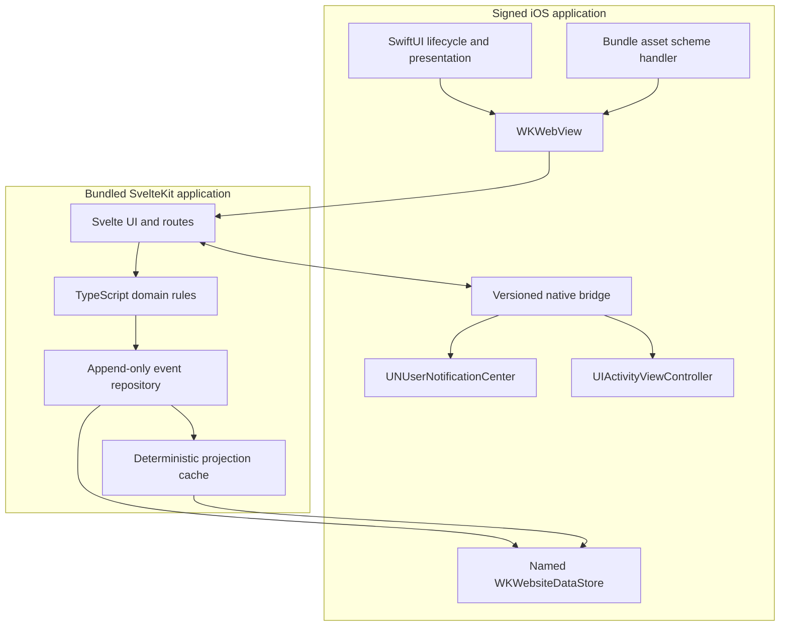

# Offline iOS Shell Design

## 1. Outcome

Ship Learn Your Appetite as an iPhone-first iOS application whose existing
SvelteKit interface runs inside a `WKWebView` and remains fully useful without
network access, including on first launch. The native layer packages the web
build, contains navigation, schedules local reminders, presents the system
share sheet, and manages WebKit lifecycle. It does not duplicate the product's
domain model.

The IndexedDB append-only event sequence remains the source of truth. Native
code must neither edit projected records nor create a second domain database.
The same deterministic TypeScript playback that powers the browser app
materializes the iOS view state.

This document is the implementation contract for the shell. Product behavior
continues to come from `MVP_DESIGN.md`, screen behavior from `UX_DESIGN.md`, and
browser verification from `E2E_GUIDE.md`.

## 2. Acceptance criteria

The shell is ready for release when it:

- completes onboarding, paired check-ins, insights, experiments, Profile,
  export, and deletion in airplane mode from a fresh install;
- launches no loopback or remote server and loads no runtime resource from the
  network;
- preserves the canonical event log through force-quit, WebKit process
  termination, normal relaunch, and an in-place app upgrade;
- rebuilds every editable projection by replaying events after its projection
  cache is removed;
- schedules, replaces, and cancels local notifications without APNs or a
  backend;
- blocks web navigation and subresource access outside its bundled origin;
- passes its supported-device, accessibility, privacy, and upgrade test matrix;
  and
- can be archived from a clean checkout without fetching runtime dependencies
  during the Xcode build.

“Offline” means that all core behavior works before the device has ever had a
network connection. It does not merely mean that a previously visited page is
in a service-worker cache.

## 3. Architectural decisions

| Area | Decision | Reason |
| --- | --- | --- |
| Native UI | SwiftUI application containing one UIKit `WKWebView` through `UIViewRepresentable` | Keeps the shell small while using the mature WebKit APIs available before iOS 26. |
| Deployment target | iOS 17.0 initially; validate before locking it | Allows a named persistent `WKWebsiteDataStore` and covers a reasonable support window without adopting iOS 26-only WebKit UI. |
| Dependencies | Apple frameworks only | Avoids a package-manager/network requirement and reduces privacy and supply-chain surface. |
| Web origin | Stable application-specific scheme, proposed as `hunger-app://app/` | Gives routes and assets one contained origin without a server or changing port. |
| Asset loading | `WKURLSchemeHandler` reading only a signed app-bundle manifest | Maps static Svelte routes, returns correct MIME types, and prevents filesystem access. |
| Web data | One named persistent `WKWebsiteDataStore`, configured before constructing the web view | Keeps IndexedDB durable and isolated to this app profile. |
| Domain state | Existing IndexedDB events plus deterministic TypeScript projection | Preserves the event-sourced model and avoids native/web divergence. |
| Browser service worker | Browser build only | The App Store bundle is the iOS offline cache; two caching/update authorities would create stale-version failure modes. |
| Native integration | Small, allowlisted, versioned request/reply bridge | Adds only capabilities the web platform cannot reliably provide in the shell. |
| Updates | App Store application update only | Keeps executable web assets reviewable, versioned with native code, and available offline. |

Apple documents `WKWebView` as the native view for embedded web content and
provides navigation delegates for controlling its transitions. A custom
[`WKURLSchemeHandler`](https://developer.apple.com/documentation/webkit/wkurlschemehandler)
lets the app serve its local resources through a scheme registered on
`WKWebViewConfiguration`; it does not replace `http` or `https`. A persistent
[`WKWebsiteDataStore`](https://developer.apple.com/documentation/webkit/wkwebsitedatastore)
must likewise be selected on that configuration before the view is created.

### 3.1 Component boundary



The bridge never sits between domain actions and the event repository. A
check-in is completed entirely in web code: append an event, replay the event
sequence, update the disposable projection cache, and render. Swift is unaware
of the episode.

## 4. Phase-zero feasibility gate

The stable custom origin is the preferred architecture, but WebKit storage
behavior for an application-defined scheme must be proven on the actual support
matrix before building on it. This spike is the first implementation commit.

Build a minimal signed shell that:

1. loads a bundled page at `hunger-app://app/`;
2. creates the production IndexedDB schema and appends a real versioned event;
3. closes and recreates the web view;
4. survives a simulated memory warning and Web Content process termination;
5. survives force-quit and device restart;
6. installs a second application build over the first without uninstalling;
7. deletes the projection stores and reproduces the same state by replay; and
8. performs all of the above in airplane mode.

Run the proof on physical devices at the oldest supported iOS, the current iOS,
and at least one intervening major version, plus the matching simulators. Test a
release-signed build as well as Debug. Record the OS/build matrix and results in
the pull request.

Proceed with the custom scheme only if event durability and origin identity are
stable in every required case. If it fails, stop and choose a fallback in this
order:

1. a fixed-origin, device-local HTTP server bound only to loopback with a fixed,
   reserved port and explicit lifecycle tests; or
2. a versioned copy of the web bundle in Application Support loaded with
   `loadFileURL(_:allowingReadAccessTo:)`, provided an upgrade test proves a
   stable IndexedDB origin.

Both fallbacks have more lifecycle or origin risk than the proposed handler and
require this design to be revised before implementation continues. Do not
silently change the persistence mechanism, export events into `UserDefaults`,
or make a Swift projection the source of truth.

## 5. Packaged web application

### 5.1 Native build mode

Add a distinct build entry point, tentatively `bun run build:ios`, that sets a
compile-time `VITE_NATIVE_SHELL=ios` flag and emits static content into a staging
directory. Browser preview behavior remains unchanged.

The native build must:

- use SvelteKit's existing static prerendered pages;
- preserve relative asset paths;
- omit service-worker registration and web-install UI;
- remove the development WebSocket allowance from Content Security Policy;
- exclude source maps and the development-only `__HUNGER_E2E__` fixture bridge;
- include fonts, icons, images, and every route locally;
- fail if emitted HTML, CSS, or JavaScript contains an unexpected `http:`,
  `https:`, `ws:`, `wss:`, protocol-relative URL, or remote source map;
- generate a sorted manifest containing each path, byte size, MIME type, and
  SHA-256 digest; and
- copy the manifest and assets into `Hunger/Resources/WebApp` as part of the
  archive dependency graph.

The Xcode build phase must use explicit input and output files so it cannot
archive stale assets. The archive fails if Bun, the lockfile dependencies, the
web build, or manifest verification fails. CI prepares the pinned Nix/Bun
environment before invoking `xcodebuild`; Xcode itself does not download npm or
Swift packages.

### 5.2 Route and asset resolution

`OfflineAssetSchemeHandler` accepts only exact `hunger-app` scheme and `app`
host URLs. It normalizes percent encoding once, then rejects NUL bytes,
backslashes, dot segments, repeated decoding that changes path meaning,
directory traversal, unknown hosts, and paths absent from the manifest.

Route mapping is deterministic:

| Request | Bundled file |
| --- | --- |
| `/` | `index.html` |
| `/settings` | `settings.html` |
| `/check-in/new` | `check-in/new.html` |
| `/check-in/new/` | `check-in/new.html` |
| `/_app/immutable/...js` | the exact manifest-listed asset |

Query strings and fragments are not used for filesystem lookup. Known files
are returned with their declared MIME type, byte count, and a no-sniff response.
The handler never lists a directory, follows a symlink outside the web resource
root, or serves an arbitrary bundle file. A missing resource produces a small
bundled recovery page and a structured Debug log; it never falls back to the
internet.

The URL scheme and host are persistent data identifiers once released. They
must never be renamed casually because doing so can create a new WebKit origin
and strand IndexedDB data.

### 5.3 Service-worker split

The browser application continues to register `service-worker.js`. In native
mode `registerOfflineShell()` returns without registering it. The handler plus
the signed application bundle are the complete iOS asset source.

The native app must not download a replacement web bundle, remote JavaScript,
configuration that changes executable behavior, or a runtime patch. A new
bundle ships as a normal app version. This also keeps the package aligned with
Apple's prohibition on downloading code that changes app functionality in
[App Review Guideline 2.5.2](https://developer.apple.com/app-store/review/guidelines/#software-requirements).

## 6. Persistence and data ownership

Create exactly one named persistent website data store using an app-owned,
constant UUID. Configure it before creating the web view, and reuse it for the
life of the installation. Do not use the nonpersistent store in production.
The UUID, scheme, host, IndexedDB database name, and source-event schema are
release compatibility contracts.

The ownership rules are:

- `events` in IndexedDB is canonical and append-only;
- entity, insight, experiment, settings, and photo metadata stores are
  disposable materialized projections;
- cached projections are written only by deterministic event playback;
- web code owns event schema migration and projection rebuilds;
- native code owns only platform preferences such as notification request IDs;
- no source event or projected domain record is mirrored to `UserDefaults`,
  SwiftData, Core Data, CloudKit, iCloud, or Keychain;
- app updates replace bundled assets without clearing website data; and
- uninstall or an explicit Delete Everything removes the local data.

Photo blobs may remain in their existing IndexedDB-backed local store if the
phase-zero/device quota tests pass. Their metadata follows the same event and
projection rules as the browser app. The shell must not silently upload,
duplicate into Photos, or include them in export.

### 6.1 Delete Everything transaction

Deletion crosses web and native ownership and therefore uses an explicit
two-party flow:

1. the user confirms in the web interface;
2. web code appends/executes its existing full-deletion operation and verifies
   that the source event store, projections, blobs, caches, and local
   preferences are empty;
3. web code calls `privacy.completeDelete` with no domain payload;
4. native code cancels every app-owned notification and removes native-only
   preferences and temporary export files;
5. native code replies only after verification; and
6. the shell replaces the web view with a fresh one at `/`, using the same
   persistent profile.

If deleting the IndexedDB database is unreliable while the current page holds
it open, the web app first closes its repository connection and acknowledges
readiness. Native may then remove data belonging to the named
`WKWebsiteDataStore` and recreate the view. This fallback is tested as one
transaction: a failure must show a retry state, not report successful deletion.

Individual episode deletion remains an event tombstone; native code is not
involved.

## 7. Navigation and network containment

Implement request-level asset containment,
[`WKNavigationDelegate`](https://developer.apple.com/documentation/webkit/wknavigationdelegate)
policy, a restrictive Content Security Policy, and a compiled WebKit content
rule list. A navigation delegate controls navigations but is not a general
subresource interceptor. The content rule list therefore blocks all `http`,
`https`, `ws`, and `wss` loads, and the app fails closed if that list cannot be
installed. Apple describes
[`WKContentRuleListStore`](https://developer.apple.com/documentation/webkit/wkcontentruleliststore)
as the API for compiling rules that prevent a web view from loading content
from disallowed locations.

The delegate allows only main-frame and subframe navigation to the exact
`hunger-app://app` origin. Cancel `http`, `https`, `ws`, `wss`, `file`, `data`,
and `blob` as top-level destinations, unknown custom schemes, new-window
requests, and malformed URLs. Permit `blob` only for an audited internal
operation if it is later proven necessary; native sharing removes the current
export need.

Additional controls:

- `javaScriptCanOpenWindowsAutomatically = false`;
- no `window.open` destination is promoted to Safari;
- no `mailto`, `tel`, universal link, or custom deep link is enabled in the
  MVP;
- no arbitrary navigation action is handed to `UIApplication.open`;
- release builds use `isInspectable = false` and Debug builds may enable it;
- Content Security Policy uses `default-src 'self'` with the narrowest
  per-resource exceptions needed for locally generated images; and
- no ATS exception, background network mode, remote-notification entitlement,
  or browser entitlement is requested.

The navigation delegate can accept or reject transitions before they proceed,
as described by Apple's navigation-policy APIs. The scheme handler remains the
final resource boundary: policy checks alone are not a filesystem sandbox.

## 8. Native bridge

### 8.1 Shape and isolation

Expose one handler named `hungerNativeV1` using
[`WKScriptMessageHandlerWithReply`](https://developer.apple.com/documentation/webkit/wkscriptmessagehandlerwithreply).
Each request is a JSON-compatible object:

```json
{
  "version": 1,
  "id": "web-generated-request-id",
  "command": "notifications.authorizationStatus",
  "payload": {}
}
```

Each reply is one of:

```json
{ "ok": true, "id": "...", "value": {} }
```

```json
{ "ok": false, "id": "...", "error": { "code": "denied", "message": "..." } }
```

Register the handler in `WKContentWorld.page` because the compiled Svelte
application must call it directly, and inject a tiny frozen JavaScript facade at
document start. Use a named
[`WKContentWorld`](https://developer.apple.com/documentation/webkit/wkcontentworld)
only for native-owned helper scripts that do not need to expose globals to the
page. Content worlds are namespaces, not an origin security boundary; frame and
origin validation still applies. The page-world tradeoff is acceptable only
because every executable asset is bundled, manifested, covered by the app code
signature, and isolated from remote navigation and resources.

Before dispatch, native code validates the protocol version, exact command,
top-frame source, source origin, payload schema, string lengths, array counts,
date ranges, and total serialized size. Unknown fields and commands fail closed.
Every request completes exactly once, including cancellation and exceptions.
Release logs contain command names and result codes, never note text, scores,
event payloads, exports, or photo data.

Native-to-web lifecycle messages call one fixed page-world adapter function
with typed arguments, preferably through
[`callAsyncJavaScript`](https://developer.apple.com/documentation/webkit/wkwebview/callasyncjavascript(_:arguments:in:contentworld:))
rather than string interpolation. There is no command for evaluating arbitrary
JavaScript, reading files, navigating to a URL, manipulating events, querying
projections, or changing product settings.

### 8.2 MVP command allowlist

| Command | Direction | Purpose |
| --- | --- | --- |
| `capabilities.get` | web → native | Returns bridge version, platform, and supported native capabilities. |
| `notifications.authorizationStatus` | web → native | Returns current system status without prompting. |
| `notifications.requestAuthorization` | web → native | Requests permission after an explicit reminder-setting gesture. |
| `notifications.replaceSchedule` | web → native | Replaces all app reminder requests with a validated fixed schedule. |
| `notifications.cancelAll` | web → native | Cancels app-owned pending and delivered reminders. |
| `app.openNotificationSettings` | web → native | Opens this app's Settings page after the user chooses it. |
| `export.share` | web → native | Writes supplied HTML or JSON export content to a temporary file and presents sharing. |
| `privacy.completeDelete` | web → native | Finishes native cleanup only after web deletion succeeds. |
| `app.lifecycle` | native → web | Reports foreground/resume and notification-open reasons through the fixed adapter. |

The platform TypeScript boundary selects `NativeReminderAdapter` and
`NativeExportAdapter` only after a successful versioned capability handshake.
The browser adapters and their current honest degradation remain the fallback.
The UI must never claim that native scheduling succeeded merely because the
bridge exists.

## 9. Local notifications

Use `UNUserNotificationCenter`; do not register for remote notifications.
Apple's local-notification flow creates `UNNotificationRequest` values with
calendar or interval triggers and supports cancelling pending requests by
identifier. Permission should be requested in context and its current status
must be checked again because the user can change it in Settings. See Apple's
guidance for
[`scheduling a notification locally`](https://developer.apple.com/documentation/usernotifications/scheduling-a-notification-locally-from-your-app)
and
[`asking permission`](https://developer.apple.com/documentation/usernotifications/asking-permission-to-use-notifications).

Rules:

- onboarding remains complete without notification permission;
- prompt only after the user explicitly enables reminders;
- use a small fixed set of stable identifiers, such as
  `appetite.reminder.morning`, `.midday`, and `.evening`;
- `replaceSchedule` first removes all app-owned pending requests, then adds the
  validated desired set so repeated calls cannot duplicate reminders;
- derive exact local times from the user's selected windows and current program
  cadence, but retain no check-in or appetite data in native notification
  storage;
- use the existing neutral message, “Want to notice how your body feels?”;
- handle `.notDetermined`, `.denied`, `.authorized`, `.provisional`, and future
  unknown statuses honestly;
- refresh status whenever the app enters the foreground;
- pausing, completing the program, or Delete Everything cancels all requests;
  and
- a notification tap activates the existing web view, navigates to Today, and
  focuses the appropriate reminder affordance only after the web app reports
  ready.

Notification payloads contain a route/action identifier only. They never
contain scores, notes, reasons, insight text, or an event ID.

## 10. Export and photos

The browser's generated export content and redaction rules remain authoritative.
In native mode the export button sends the finished JSON or HTML string,
suggested filename, and audited MIME type to `export.share`. Swift validates a
conservative size limit and filename allowlist, writes a protected temporary
file, and presents
[`UIActivityViewController`](https://developer.apple.com/documentation/uikit/uiactivityviewcontroller).
It deletes temporary files after the activity completes and at next launch.
The iPad presentation path uses an anchored popover; iPhone presents modally.

Keep the existing HTML file input and WebKit photo picker for the first
implementation. Validate camera/library choice, permission copy, cancellation,
image processing, memory pressure, local quota, and returning from background
on physical phones. Add a native PHPicker bridge only if these tests expose a
product-blocking WebKit limitation. Request camera or photo-library usage
descriptions only if the shipped picker path actually requires them.

## 11. Application and WebKit lifecycle

The SwiftUI application owns one `WebAppController`, which in turn owns the
configured web view for the active scene.

Launch sequence:

1. create configuration, named persistent data store, content controller,
   scheme handler, bridge, and preferences;
2. create the web view exactly once;
3. load `hunger-app://app/`;
4. show a static launch background, not a second interactive UI;
5. wait for both navigation completion and the web adapter's `app.ready`
   signal; and
6. reveal the web content or a native recoverable error screen.

Foregrounding refreshes the notification status and sends a clock/lifecycle
signal; it does not mutate domain state. Backgrounding does not synthesize
check-ins. Keep the current web navigation state while the process lives.

Implement `webViewWebContentProcessDidTerminate` and fatal-load recovery. A
recreated view loads the last allowlisted application route, never arbitrary
history, and lets IndexedDB replay restore product state. Prevent reload loops
with a bounded retry count and show a native Try Again screen after repeated
failure. A recovery must not clear website data.

Support one active scene in the MVP. Disable multiple iPad windows until data,
notification, and bridge coordination are deliberately designed. The binary
may be universal for iPhone and iPad, but phone portrait is the primary product
and test surface.

## 12. Native presentation and accessibility

The web application remains visually authoritative. Do not add a native tab
bar, navigation bar, or settings screen that duplicates its navigation. The
container supplies only safe-area/background treatment, temporary system
presentation, and fatal recovery UI.

Verify on real devices that:

- content respects the Dynamic Island, home indicator, keyboard, rotation, and
  iPad popovers;
- VoiceOver order, labels, selected state, headings, status announcements, and
  focus recovery match the browser contracts;
- Dynamic Type / Larger Text and 200% web text do not clip or hide actions;
- Bold Text, Increase Contrast, Reduce Transparency, Reduce Motion, and button
  shapes preserve meaning;
- hardware keyboard and Switch Control can complete the primary journey;
- touch targets remain at least 44 by 44 points; and
- a WebKit crash/reload announces recovery without stealing focus repeatedly.

The web CSS may need safe-area environment variables and font-scaling fixes,
but native chrome must not paper over inaccessible web content.

## 13. Security and privacy posture

The shell intentionally has a small attack and disclosure surface:

- bundled resources only, verified against a build manifest;
- exact-origin navigation and bridge checks;
- no analytics, ads, crash-reporting SDK, remote configuration, account, sync,
  telemetry, or third-party runtime code;
- no cookies or web credentials required;
- no broad file access, arbitrary URL opening, or JavaScript evaluation bridge;
- no app-authored cloud sync or backup feature, shared App Group, or Keychain
  domain copy; OS-managed device backups may still cover the application
  container according to the user's system backup policy;
- Data Protection enabled for temporary exports and any app-owned native file;
- Debug inspection disabled and sensitive logs removed in Release; and
- the minimum entitlements and `Info.plist` usage strings for capabilities that
  ship.

Review Apple's current privacy-manifest and required-reason API rules before
submission, include `PrivacyInfo.xcprivacy` for APIs actually used, and ensure
the App Store privacy answers match the local-only implementation. Perform this
review again whenever a dependency or native capability is added.

A future external support link would be a deliberate exception to the no-web
navigation rule. It requires explicit product copy, an external-browser handoff,
offline fallback content, and a privacy review; it is not part of this shell.

## 14. Proposed project layout

```text
ios/
├── Hunger.xcodeproj/
├── Hunger/
│   ├── HungerApp.swift
│   ├── WebAppView.swift
│   ├── WebAppController.swift
│   ├── OfflineAssetSchemeHandler.swift
│   ├── NavigationPolicy.swift
│   ├── NativeBridge.swift
│   ├── NotificationCoordinator.swift
│   ├── ShareCoordinator.swift
│   ├── PrivacyInfo.xcprivacy
│   ├── Info.plist
│   └── Resources/
│       └── WebApp/                 # generated; packaging policy set in implementation
├── HungerTests/
│   ├── AssetPathTests.swift
│   ├── NavigationPolicyTests.swift
│   ├── NativeBridgeTests.swift
│   └── NotificationCoordinatorTests.swift
└── HungerUITests/
    ├── OfflineLaunchTests.swift
    ├── PersistenceUpgradeTests.swift
    ├── NotificationJourneyTests.swift
    └── PrivacyDeletionTests.swift
scripts/
├── build-ios-web.sh
└── verify-ios-bundle.sh
```

Whether generated `Resources/WebApp` files are committed is decided in the
first build-system commit. Prefer generating them reproducibly in CI and the
archive build, while retaining a checksum/stamp that makes stale assets
impossible. Commit generated files only if Xcode preview or distribution
constraints make a source-only archive impractical.

Suggested release identifiers, to confirm before project creation:

- product name: **Learn Your Appetite**;
- target/module name: `Hunger`;
- bundle identifier: `com.anicolao.hunger`; and
- custom web scheme: `hunger-app` with host `app`.

The bundle identifier and signing team are distribution choices. The web scheme
is a persistence choice and becomes effectively immutable after release.

## 15. Verification strategy

### 15.1 Fast tests

Continue running all TypeScript unit tests and browser Playwright journeys.
Add Swift unit tests for:

- route mapping, percent decoding, MIME types, and every traversal case;
- manifest digest and missing-resource failures;
- navigation decisions for every allowed and denied scheme/frame;
- bridge version, origin, frame, command, payload, size, and reply behavior;
- notification status mapping, deterministic identifiers, replace/cancel
  idempotency, and timezone changes; and
- export filename, type, size, temporary-file protection, and cleanup.

### 15.2 iOS tracer bullets

Each implementation slice adds or extends one black-box XCUITest:

1. **Cold offline launch** — fresh install, airplane mode, onboard, create a
   paired check-in, force-quit, relaunch, and see replayed state.
2. **Persistence upgrade** — install test build A, append events, install build
   B in place, remove projections, and recover identical state from events.
3. **Contained navigation** — exercise every route and assert that an attempted
   external navigation/resource is blocked with no network request.
4. **Native reminders** — request in context, replace a schedule, background,
   open from a delivered test notification, pause, and verify cancellation.
5. **Private export** — generate both formats, open the share sheet, inspect the
   file, verify photo/source-event exclusions, cancel, and verify temp cleanup.
6. **Photo and recovery** — choose/capture/cancel a photo, simulate memory
   pressure and Web Content termination, then verify event-backed state.
7. **Delete Everything** — seed events, projections, photo, pending reminder,
   and temp export; delete; relaunch; verify all are absent and onboarding is
   shown.
8. **Accessible phone journey** — complete the primary flow with VoiceOver and
   hardware keyboard at supported phone sizes, large text, dark mode, and
   reduced motion.

XCUITests may use launch arguments for a deterministic clock, IDs, notification
coordinator, and a test-only content-process termination hook. These seams are
compiled out of Release and may inject only source events, never projected
records.

### 15.3 Required matrix

| Dimension | Minimum coverage |
| --- | --- |
| OS | iOS 17.x, current iOS, and one intervening major version |
| Hardware | oldest supported small phone, current standard phone, current large phone; iPad smoke test if universal |
| Install | fresh, relaunch, force-quit, device restart, low-storage behavior, in-place upgrade |
| Connectivity | airplane mode before first launch; denied network attempts |
| Appearance | light, dark, increased contrast, reduced motion, largest supported text sizes |
| Input | touch, VoiceOver, hardware keyboard; photo picker on physical hardware |

Simulator CI is necessary but insufficient for IndexedDB durability, local
notification delivery, camera/library behavior, memory pressure, and upgrade
proof. Record physical-device release-candidate checks before TestFlight and
App Store submission.

### 15.4 CI gates

Add a macOS job that:

1. enters the repository's Nix development shell;
2. installs from the pinned Bun lockfile without changing it;
3. runs web checks, unit tests, and production build;
4. builds and audits the native web bundle;
5. runs Swift unit tests;
6. builds the application for the selected simulator;
7. runs the phone-primary XCUITest suite; and
8. archives screenshots, `.xcresult`, bundle manifest, and build logs.

PR previews continue to validate the browser build. Native PR artifacts should
include an unsigned simulator `.app` and XCUITest evidence; TestFlight is the
human-device preview path once signing is configured.

## 16. Coherent implementation commits

Every commit leaves all earlier tests green and pairs its feature with a tracer
bullet.

1. **`test(ios): prove stable offline WebKit event storage`**
   Add the smallest shell and phase-zero persistence/upgrade proof. Stop and
   revise this design if the gate fails.
2. **`feat(ios): package and contain the offline web application`**
   Add the Xcode project, reproducible native build mode, bundle manifest,
   scheme handler, navigation policy, launch/recovery UI, and cold-offline test.
3. **`feat(ios): add the versioned platform bridge`**
   Add capability negotiation, the constrained page-world boundary, schema
   validation, native/web lifecycle adapter, and adversarial bridge tests.
4. **`feat(ios): schedule local reminder windows`**
   Replace the in-app adapter when native capability is present; add permission,
   replace/cancel, foreground-refresh, and notification-open tests.
5. **`feat(ios): share private profile exports`**
   Add temporary protected files and the system share sheet; certify both
   formats and cleanup. Validate the existing photo picker on devices here.
6. **`feat(ios): coordinate deletion and process recovery`**
   Make Delete Everything atomic across web/native state and certify WebKit
   process recreation from events.
7. **`test(ios): certify accessible offline release behavior`**
   Complete the OS/device/accessibility matrix, privacy manifest, signing-neutral
   archive CI, TestFlight checklist, and final release audit.

Do not combine the persistence spike with native reminders or sharing. Its
result determines whether the rest of the architecture is sound.

## 17. Risks and mitigations

| Risk | Mitigation / release gate |
| --- | --- |
| Custom-scheme IndexedDB is unsupported or changes behavior | Phase-zero physical-device and upgrade proof; revise the origin architecture before feature work. |
| App update changes the effective WebKit origin | Treat scheme, host, website-data-store identifier, and database name as immutable; run A-to-B install tests. |
| Native build archives stale or remotely referenced assets | Dependency-aware build phase, hash manifest, URL audit, clean-checkout archive test. |
| Bridge expands into a second application API | Fixed allowlist, typed schemas, origin/frame checks, no domain CRUD, adversarial tests. |
| Event/projection ownership regresses | iOS tests delete projections and demand identical replay; Swift has no domain persistence types. |
| Reminder status shown by the UI becomes stale | Re-query on foreground and after every operation; return actual system outcome. |
| WebKit process death loses an unsaved form | Preserve committed events, recover route safely, and test form/save boundaries; never claim an uncommitted form was saved. |
| Photos exhaust WebKit quota or memory | Physical-device size/quota tests, existing downsampling, graceful photo-only failure, no loss of sensation event. |
| Delete Everything clears only one layer | Cross-boundary handshake plus relaunch verification of events, projections, blobs, notifications, preferences, and temp files. |
| App review sees a generic web wrapper | Demonstrate offline packaging, native reminders/share integration, privacy controls, accessibility, and a complete purpose-built product. |

## 18. Deliberate non-goals

The MVP shell does not add accounts, synchronization, a server, remote push,
remote content updates, analytics, ads, crash-reporting SDKs, HealthKit,
CloudKit, widgets, watchOS, native domain screens, background check-in logic,
multi-window support, or cross-device backup.

Those capabilities require separate product, privacy, data-ownership, and event
schema designs. None may be smuggled into the shell bridge.

## 19. Decisions to confirm before implementation

These do not block the architectural plan, but must be resolved before the
corresponding release work:

- confirm iOS 17.0 after the phase-zero device inventory and proof;
- confirm universal iPhone/iPad distribution versus iPhone-only distribution;
- reserve the final bundle identifier and signing team;
- choose the permanent custom scheme before any external TestFlight data is
  created; and
- decide whether the generated web resource directory is committed or always
  produced by the archive build.

The first four decisions are expensive to change after release. The permanent
data contracts—event schema, website data store, scheme, host, and database
name—receive explicit migration tests before every shipped change.
