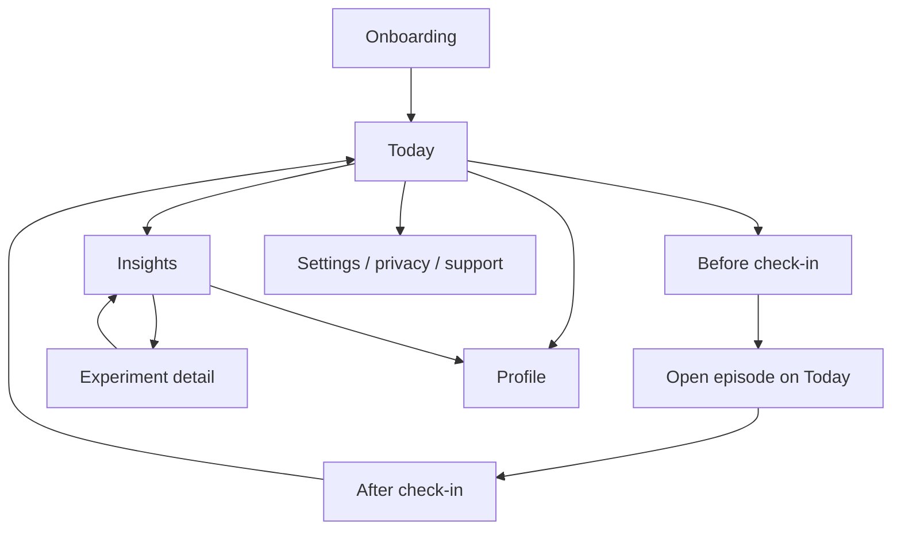
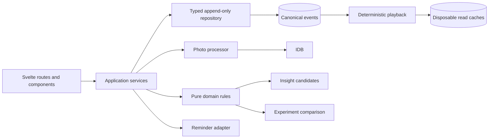

# Learn Your Appetite — MVP Design

## 1. Objective

Build a 30-day, mobile-first learning program that helps a person notice their
own hunger, fullness, and eating-context patterns without calorie counting.

The MVP succeeds only if lightweight paired check-ins create a useful personal
insight during the first week. Logging is the input; personalized learning is
the product.

### Core loop

```text
Notice → Understand → Experiment → Learn
   ↑                                  ↓
   └──────── less tracking over time ─┘
```

### Hypothesis

> If a person spends about ten seconds checking in before and after eating,
> can the app show them a personal observation within seven days that feels
> useful enough to continue?

### Pilot success signals

These are validation targets, not health outcomes:

- most activated users complete at least four paired episodes in their first
  seven days;
- every eligible user receives a first evidence-backed observation by day 7;
- at least 60% of first-insight feedback is “helpful” or “surprising”;
- at least half of users offered an experiment choose to try one; and
- interviews show that users can describe one thing learned about their own
  appetite without referring to calories, weight, or app compliance.

The pilot must also record why an insight was not generated: too few paired
entries, too little variation, missing after-check-ins, or no stable pattern.

## 2. Evidence and design decisions

The repository sources agree on the following:

- hunger and fullness are body signals that differ by person and day;
- severe hunger can include weakness, dizziness, irritability, urgency, or
  persistent food thoughts;
- comfortable satisfaction sits near the middle of a unified scale;
- uncomfortable fullness belongs at the high end;
- a number at one moment is not “right” or “wrong”;
- skipped eating, insufficient intake, illness, medication, stress, and strong
  feelings can affect signals; and
- learning the signals takes repetition and reflection.

The sources use both `0–10` and `1–10` scales. `VISION.md` requires `1–10`, and
the Alberta handout also uses `1–10`, so the MVP uses one unified `1–10` scale
before and after eating. It does not reverse the direction between the two
check-ins.

This resolves an important ambiguity in the phrase “hunger 1–10”: a user is
never asked to guess whether 10 means more hungry or more full. The prompt is
“How does your body feel?” and the scale always runs from urgent hunger to
painful fullness.

The app uses original, plain-language anchors. It must not reproduce the
source charts, branding, layout, or extended wording. The Alberta document is
marked CC BY-NC-ND 4.0, and `Hunger scale.jpg` has unknown provenance.

## 3. Intended user and safety boundary

The intended MVP user is an adult who wants to understand everyday appetite
patterns and prefers not to count calories. The product is not designed to
diagnose or treat an eating disorder, prescribe intake, or replace care.

Onboarding and Settings say:

- this is a learning tool, not medical advice;
- body signals can be difficult or unreliable for many reasons;
- all entries are optional and can be paused or deleted; and
- professional support may be more appropriate if eating feels out of control,
  produces guilt or distress, regularly ends in extreme discomfort, or if
  tracking makes the person feel worse.

Repeated `9–10` after-eating entries may surface one quiet support card. It
does not diagnose, repeatedly interrupt, or infer a disorder. The card offers
“Pause check-ins,” “Learn about support,” and “Dismiss.” No score causes praise,
punishment, food restriction advice, or an instruction to override body cues.

## 4. Product principles

1. **A score is a description, never a grade.**
2. **Only the score is required.** Context enriches insights but never blocks
   saving.
3. **Show evidence with every claim.** Say “Based on 5 evening check-ins,” not
   “You always…”.
4. **Describe association, not cause.** Use “tended to” and “appeared,” not
   “because” or “fixed.”
5. **Do not optimize for eating less.** Comfortable, uncomfortable, hungry,
   and neutral states are noticed without a calorie or weight objective.
6. **Prefer robust, explainable rules.** The MVP uses deterministic statistics
   and templates, not a generative model.
7. **Let tracking fade.** Missed days do not reset progress; reminder defaults
   taper by week.
8. **Keep private data local.** A backend is not required to test the product
   hypothesis.

## 5. The sensation scale

The compact control shows `1`, `5`, and `10` anchors at all times. Tapping a
number immediately shows its short phrase; a “What do these mean?” disclosure
shows the full set.

| Level | Original MVP anchor |
| ---: | --- |
| 1 | Urgent hunger; weak, shaky, or dizzy may be present |
| 2 | Strong hunger; empty, irritable, or eager to eat |
| 3 | Clear hunger; ready to eat without urgency |
| 4 | Early hunger; subtle body cues or more thoughts of food |
| 5 | Neutral; neither hungry nor full |
| 6 | Satisfied and comfortable; hunger has eased |
| 7 | Comfortably full; little interest in more food |
| 8 | Too full; pressure or mild discomfort |
| 9 | Very full; marked discomfort |
| 10 | Painfully full; nauseated or unwell may be present |

The control must:

- use words, numbers, shape, and position rather than color alone;
- expose each option as a native radio or button with a complete accessible
  name;
- support arrow-key and direct-key navigation;
- keep each target at least 44 × 44 CSS pixels;
- never default to a value; and
- announce the selected number and phrase.

The app may explain that many references describe `3–4` as emerging hunger and
`5–7` as a comfortable range, but it does not turn those bands into universal
targets. The program's purpose is to learn the individual's experience.

## 6. Information architecture

Use three persistent destinations:

- **Today** — next action, active experiment, week focus, and recent episodes;
- **Insights** — observations, evidence, feedback, and current experiment; and
- **Profile** — learning progress and the day-30 Appetite Profile.

The paired Check-In is a focused route or sheet launched from Today. Experiment
details live under Insights, rather than occupying a fourth top-level tab.
Settings is a utility route for reminders, privacy, export/delete, scale help,
and support.

### Screen states



## 7. Core flows

### 7.1 Onboarding

Onboarding has four short steps:

1. **Promise** — “Spend 30 days learning your appetite, without counting.”
2. **Scale** — interact once with the unified scale and confirm its direction.
3. **How learning works** — paired check-ins become observations, then one
   optional experiment.
4. **Privacy and safety** — local-device storage, optional fields, deletion,
   support boundary, and optional reminder setup.

Activation creates a `Program` and opens Today. Account creation, weight,
height, calorie target, diet goal, demographic survey, and notification
permission are not activation requirements.

### 7.2 Before eating

1. Tap **Check in before eating**.
2. Answer “How does your body feel right now?” on the unified scale.
3. Tap **Save**. Saving may be automatic after a clear confirmation affordance,
   but a stray selection must remain reversible.

An optional “Add context” disclosure offers an occasion label and photo. The
primary path requires one selection and one confirmation.

Saving creates an open episode. Today makes **Finish after eating** the primary
action and persists it across reloads.

### 7.3 After eating

1. Open the pending episode.
2. Answer the same body-sensation question on the same scale.
3. Save, or optionally add:
   - reason: physical hunger, craving, emotion, boredom, habit, or
     social/context;
   - occasion: breakfast, lunch, dinner, snack, or other;
   - note of at most 140 characters; and
   - one photo.

The reason is self-description. The app accepts any combination of score and
reason without warning that the user is inconsistent.

If another before-check-in begins while an episode is open, offer **Finish**,
**Mark unfinished**, or **Go back**. Never silently attach an after score to the
wrong episode. An open episode becomes “unfinished” after four hours but can
be recalled and completed for up to 24 hours; recalled entries are labelled
and can be excluded in sensitivity tests.

### 7.4 Today

Today shows, in this order:

1. pending after-check-in or new before-check-in action;
2. active experiment, if any;
3. current week focus;
4. “moments noticed today,” not a quota or streak; and
5. recent complete and incomplete episodes.

An episode can be corrected or deleted. Delete appends a tombstone that removes
its materialized record and photo from the current app and exports. Derived
insights and profile sections recompute immediately.

### 7.5 Insights

An insight card contains:

- a one-sentence observation;
- a small comparison or distribution, when useful;
- “Based on _n_ paired check-ins” and the relevant context;
- an evidence-strength label: **Early observation** or **Recurring pattern**;
- “Why you are seeing this” details; and
- optional **Helpful**, **Not for me**, and **Try an experiment** actions.

Before eligibility, show progress truthfully: “Two more paired check-ins will
help compare where you started and finished.” Never fill the empty state with
generic advice disguised as personalization.

### 7.6 Experiment

Only one experiment can be active. The user may accept, skip, replace, pause,
or stop it without penalty.

The detail explains:

- the observation that made it eligible;
- one behavior to try;
- the seven-day comparison window;
- what measure will be compared; and
- that the result is an observation, not proof of cause.

At completion, show one of:

- **Appeared to change** — the predefined measure crossed its meaningful
  threshold;
- **Appeared similar** — enough data, threshold not crossed; or
- **Still learning** — insufficient comparable data.

### 7.7 Appetite Profile

The Profile grows throughout the program and unlocks its summary on day 30.
It includes only supported sections:

- typical starting sensation;
- typical ending sensation;
- time-of-day or optional occasion patterns;
- common self-described non-hunger contexts;
- contexts more often associated with comfortable or uncomfortable endings;
- completed experiment comparisons; and
- two or three continuing practices chosen from observed patterns.

Each section displays its sample size. Sparse sections say what is missing.
Day 30 ends the program, not access: the person may export, continue occasional
check-ins, pause, or delete everything.

## 8. Thirty-day progression

Progress is based on elapsed program days, not consecutive-day compliance.
Returning after a gap resumes the current stage.

| Stage | Focus | Product behavior |
| --- | --- | --- |
| Days 1–7 | Hunger | Teach early versus urgent cues; establish typical starts; prioritize paired completion |
| Days 8–14 | Fullness | Teach satisfaction versus discomfort; show ending distribution; introduce midway noticing |
| Days 15–21 | Hunger versus wanting food | Offer optional reason; compare physical hunger with craving, emotion, boredom, habit, and social context |
| Days 22–30 | Personal patterns | Rank strongest supported pattern; run one experiment; assemble the Appetite Profile |

Education is contextual and short—one or two sentences on Today or a scale
disclosure. The MVP does not build a content library.

## 9. Insight engine

### 9.1 Requirements

The engine is the MVP's highest-priority domain module. It must be:

- deterministic and fully unit-tested;
- explainable from stored evidence;
- versioned independently from the record schema;
- robust to missing, edited, deleted, recalled, and sparse entries;
- conservative about small samples and multiple comparisons; and
- incapable of producing diagnoses, causal claims, or restriction advice.

It returns structured results. Rendering templates turn those results into
copy; calculations never parse UI prose.

```ts
interface InsightResult {
  id: string;
  algorithmVersion: number;
  kind: InsightKind;
  strength: 'early' | 'recurring';
  evidenceEpisodeIds: string[];
  sampleSize: number;
  metrics: Record<string, number | string>;
  context?: TimeBucket | Occasion;
  eligibleExperiment?: ExperimentKind;
}
```

### 9.2 Derived definitions

- A **paired episode** has valid before and after levels.
- **Urgent hunger** is a before level of `1–2`.
- **Comfortable ending** is an after level of `5–7`.
- **Uncomfortable ending** is an after level of `8–10`.
- Time buckets use the captured local timezone: morning `05:00–10:59`, midday
  `11:00–15:59`, evening `16:00–20:59`, and late `21:00–04:59`.
- Typical levels use medians. Spread uses observed range or interquartile range
  only when the sample supports it.

These bands enable consistent calculations but are not user goals.

### 9.3 Evidence gates

- Show an overall typical-start or typical-end **early observation** after four
  paired episodes.
- Show a context subgroup only with at least three relevant episodes.
- Compare two groups only when each has at least three episodes.
- Call a pattern **recurring** at eight total paired episodes and at least four
  relevant subgroup episodes.
- Require a difference of at least 25 percentage points for rate comparisons,
  or one full scale point for median comparisons.
- Suppress a claim when one outlier creates the entire effect, when the values
  do not vary, or when edited/deleted data invalidates the gate.

These are explicit MVP heuristics, not clinical thresholds. Pilot data should
inform later calibration; they must not be loosened merely to generate more
cards.

### 9.4 Candidate observations

The initial engine generates only a small, testable library:

| Candidate | Minimum evidence | Example rendering |
| --- | --- | --- |
| Typical start | 4 paired | “Your last 5 check-ins usually began near 4, early hunger.” |
| Typical end | 4 paired | “You most often finished near 6, satisfied and comfortable.” |
| Urgent-start association | 3 urgent + 3 comparison | “Episodes that began at 1–2 more often ended uncomfortably full (3 of 4 vs 1 of 5).” |
| Comfortable-start band | 4 in best band + comparison | “Starting around 3–4 was most often followed by a comfortable ending in your check-ins.” |
| Time/occasion difficulty | 4 in context + comparison | “Evening check-ins more often ended at 8 or above than your earlier check-ins.” |
| Non-hunger context | 3 in context | “Most late check-ins were described as craving, habit, or boredom rather than physical hunger.” |
| Easy context | 4 in context | “Midday check-ins most often ended in your comfortable range.” |

If an occasion was not entered, copy uses a time bucket such as “evening
check-ins,” never an inferred meal name such as “dinner.”

Rank candidates by evidence strength, magnitude, recency, actionability, and
novelty. Suppress near-duplicates. Show at most one new primary observation in
a seven-day period, while keeping prior observations available in history.

## 10. Experiment engine

The first library is intentionally small:

| Eligible pattern | Experiment | Target measure |
| --- | --- | --- |
| Urgent hunger followed by discomfort | Check in 30–60 minutes before the usual time; if hunger is present, notice the option of eating earlier | Rate of after level `8–10` in that context |
| Comfortable start but uncomfortable end | Pause roughly midway and notice the scale, with no required stop point | Median after level and comfortable-ending rate |
| Evening non-hunger context | Before eating, name “body hunger” or “wanting food”; either answer still permits eating | Share of episodes with an explicit reason and after-level distribution |
| Difficult recurring time/occasion | Slow the first few minutes and do one midway sensation check | Comfortable-ending rate in that context |

Do not suggest an experiment unless the triggering pattern passed its evidence
gate. Do not suggest delaying food to someone with urgent hunger, or continuing
to eat through discomfort.

### Comparison

- Baseline is the most recent eligible episodes before experiment start, up to
  14 days.
- Intervention is seven elapsed days after start.
- Require at least three comparable paired episodes in each window.
- Compare the predefined target only; do not search retrospectively for a
  favorable result.
- A rate changes meaningfully at 25 percentage points; a median changes at one
  scale point.
- Render “appeared,” never “caused,” “worked,” or “fixed.”

## 11. Data model

An append-only, versioned IndexedDB event sequence is canonical. The record
types below are materialized read models produced by deterministic playback.
Their IndexedDB stores are disposable caches: application commands append
events and never edit projection records. Opening the repository and every
successful append rebuilds those caches from the complete sequence.

```ts
interface AppetiteEvent<Type extends string, Payload> {
  sequence: number;
  id: string;
  type: Type;
  occurredAt: number;
  version: 1;
  payload: Payload;
}
```

The event vocabulary covers program activation/status, settings changes,
episode start/change/delete, local photo storage, insight snapshots, and
experiment changes. A schema-v2 installation is migrated once by translating
its final records into an initial event sequence; subsequent playback never
consults those old mutable records as authority.

### Program

```ts
interface Program {
  id: string;
  startedAt: number;
  timeZone: string;
  status: 'active' | 'paused' | 'complete';
  onboardingVersion: number;
  schemaVersion: number;
}
```

### Eating episode

```ts
type EatingReason =
  | 'physical-hunger'
  | 'craving'
  | 'emotion'
  | 'boredom'
  | 'habit'
  | 'social-context';

type Occasion = 'breakfast' | 'lunch' | 'dinner' | 'snack' | 'other';

interface EatingEpisode {
  id: string;
  programId: string;
  startedAt: number;
  completedAt: number | null;
  capturedTimeZone: string;
  beforeLevel: number;
  afterLevel: number | null;
  reason: EatingReason | null;
  occasion: Occasion | null;
  note: string | null;
  photoId: string | null;
  recalledAfter: boolean;
  status: 'open' | 'complete' | 'unfinished';
  createdAt: number;
  updatedAt: number;
  schemaVersion: number;
}
```

### Insight snapshot

Persist the structured result and rendered-copy version when first shown so a
person can revisit what they actually saw. Recompute eligibility after edits
or deletion and label an older snapshot “based on deleted or changed entries”
rather than silently rewriting history.

### Experiment

Store kind, triggering insight, start/end time, fixed target definition,
baseline episode IDs, status, result, and algorithm version. Only one record
may have `active` status.

### Settings and photos

Settings contain reminder windows, permission state as last observed, reduced
prompt preference, and export defaults. Photos live in a separate blob store.
On-device processing:

- correct orientation;
- resize to a maximum 1280-pixel edge;
- encode WebP or JPEG to a target below 350 KB;
- strip EXIF and location metadata; and
- retain no reference to the original file.

If photo processing or quota fails, save the episode without the photo and
explain what happened. A photo failure must never lose a sensation score.

## 12. Architecture

### Fixed MVP decisions

- SvelteKit 5, TypeScript strict mode, Bun, static adapter.
- Installable PWA with no required account or server.
- IndexedDB behind a typed append-only repository interface.
- One pure event projector and disposable read caches for all application
  records; no route or component may write a projection store.
- Svelte state loaded from projected repository records; no Redux requirement.
- Pure TypeScript modules for progression, insights, experiments, exports, and
  migrations.
- Plain Svelte-scoped CSS and a small global token/reset layer.
- Vitest for domain behavior and Playwright for vertical slices.
- Nix-managed development and CI toolchain.



### Suggested module boundaries

```text
src/lib/
  domain/
    scale.ts
    progression.ts
    insights.ts
    experiments.ts
    profile.ts
  data/
    schema.ts
    repository.ts
    indexeddb.ts
    migrations.ts
  platform/
    photos.ts
    reminders.ts
    export.ts
  components/
  stores/
src/routes/
  onboarding/
  check-in/
  insights/
  profile/
  settings/
```

Domain modules do not import Svelte, browser globals, IndexedDB, or copy. They
accept records plus an explicit clock and return structured values. This makes
30-day histories, timezones, missing data, and algorithm versions cheap to
test.

### Error states

Every write is transactional and visibly reports `saving`, `saved`, or
`error`. On failure, keep the user's current selection in the form and offer
retry. The app validates and migrates stored data before rendering insights;
an unsupported future schema shows export and reset options rather than
guessing.

## 13. Reminder strategy

Reminder copy asks the person to notice, never to eat or stop eating:

> “Want to notice how your body feels?”

Default cadence tapers:

- week 1: up to two user-chosen daily windows plus a pending after-check-in;
- week 2: one daily window plus pending completion;
- week 3: context-focused reminders only when enabled;
- week 4: experiment reminder only; and
- after day 30: off by default.

Web platforms cannot reliably schedule a closed-browser local notification.
The PWA therefore promises only persistent in-app prompts. If out-of-app
reminders are required for the pilot, use a thin native shell with a local
notification adapter. Do not add a cloud push service, user account, or remote
food data solely for reminders in V1, and never claim a browser reminder was
scheduled when the platform cannot deliver it.

Permission is requested only after the user chooses a reminder window and sees
why it is useful. Denial does not block any feature.

## 14. Privacy, security, and export

- No login or cloud sync in V1.
- No note, reason, photo, sensation score, or profile is sent off-device.
- Strip photo metadata before storage.
- Export JSON and a human-readable summary; exclude photos unless the user
  explicitly includes them.
- Deleting one episode appends a tombstone that removes the episode and its
  photo from the current projection and every export. Because the source log
  is immutable, prior local events remain until the user chooses Delete all.
- Delete all data clears IndexedDB, Cache Storage, scheduled native reminders,
  program preferences, source events, and projection caches, then verifies the
  stores are empty.
- Explain that browser storage is not end-to-end encrypted and may be visible
  to someone with access to the device/browser profile.
- Use a restrictive Content Security Policy and no third-party scripts in the
  application shell.

To validate the hypothesis during a pilot, collect insight feedback in the
local record and discuss it in consented interviews or an explicit participant
export. A future analytics endpoint requires a separate privacy design and
must never include raw scores, notes, reasons, photos, or stable identity by
default.

## 15. Accessibility and visual design

- Mobile-first, one-handed primary actions, 44-pixel targets, safe-area
  padding, and visible focus.
- Native controls and landmarks before custom ARIA.
- Scale meaning conveyed with text and position, not a red/green success
  gradient.
- No confetti, streak flames, “perfect,” “bad,” “cheat,” or “failed” states.
- Charts have prose summaries and accessible data tables or lists.
- Respect text zoom, high contrast, reduced motion, and light/dark preference.
- Photos are private memory aids and never required to understand an entry.
- Saving, insight generation, experiment changes, and deletion use polite live
  regions and deliberate focus placement.

The tone is curious and specific: “What did you notice?” “Based on six
check-ins…” “Still learning.” Avoid “control,” “be good,” “resist,” “burn,” or
“earn.”

## 16. Delivery plan: vertical slices

Each slice ends in a usable browser capability, pure-rule tests, a numbered
Playwright scenario, reviewed phone/desktop screenshots, and documentation.

### Slice 1 — Foundation and onboarding

- Scaffold static SvelteKit, Bun, strict TypeScript, fonts, design tokens,
  manifest, build marker, Nix app tools, verifier, hooks, and CI.
- Add typed IndexedDB repository and closed-by-default external network policy.
- Implement onboarding and Today empty state.
- Prove `001-shell-and-onboarding`.

### Slice 2 — Paired check-in

- Implement the scale as a pure mapping and accessible component.
- Create, persist, finish, recall, edit, and delete an episode.
- Add optional context and client-side photo processing.
- Prove scenarios `002–004`.

### Slice 3 — First useful observation

- Implement typical-start/end, evidence gates, structured results, templates,
  feedback, and honest insufficient-data states.
- Seed deterministic histories and recompute after edit/delete.
- Prove `005-first-week-insight` before adding more insight types.

This slice is the first hypothesis checkpoint. If users do not find the simple
observation useful, improve the evidence/copy/value proposition before adding
features.

### Slice 4 — Progression and pattern library

- Add elapsed-day stages, time/occasion comparisons, association candidates,
  ranking, deduplication, and reminder taper settings.
- Prove `006-progression-and-recurring-patterns`.

### Slice 5 — One experiment

- Add experiment eligibility, choice, one-active invariant, fixed target,
  baseline, seven-day comparison, and insufficient-data results.
- Prove `007-experiment-lifecycle`.

### Slice 6 — Profile, privacy, offline, and safety completion

- Assemble day-30 Profile and exports.
- Complete offline shell, event migration, quota errors, explicit deletion,
  reminder adapter, support path, and responsive/accessibility audit.
- Prove scenarios `008–012` and the production static build.

## 17. Definition of MVP complete

The MVP is complete when:

- a new user can understand and complete a before check-in in roughly ten
  seconds without scale-direction confusion;
- paired entries survive reload and offline reopening and remain editable and
  removable by an event tombstone;
- every eligible fixed first-week fixture produces the expected structured
  observation with visible evidence;
- no ineligible fixture produces a personalized claim;
- one experiment can be run and compared honestly;
- day 30 produces a supported, exportable Appetite Profile;
- all private data stays local and photos have metadata removed;
- safety, pause, export, one-entry deletion, and delete-all paths work;
- all numbered E2E scenarios pass at required viewports with semantic and
  zero-pixel assertions;
- unit tests cover every insight/experiment gate and schema migration;
- static checks, tests, production build, and whitespace checks pass through
  one verifier; and
- pilot users can answer whether the first insight was useful—without the app
  having introduced calorie, weight, diagnostic, or causal claims.

## 18. Explicit non-goals

Do not add in V1:

- calorie, nutrient, macro, portion, weight, fasting, or food-quality tracking;
- recipes, grocery tools, wearables, social feed, coaching marketplace, or
  elaborate journaling;
- AI chat or generative insight copy;
- remote accounts, synchronization, or a cloud photo store;
- a large education library;
- eating-disorder screening or diagnosis;
- hormone, metabolism, satiety-repair, or weight-loss claims; or
- engagement mechanics that reward logging frequency or eating less.
