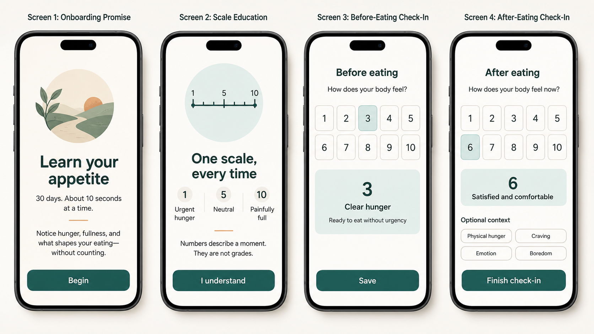
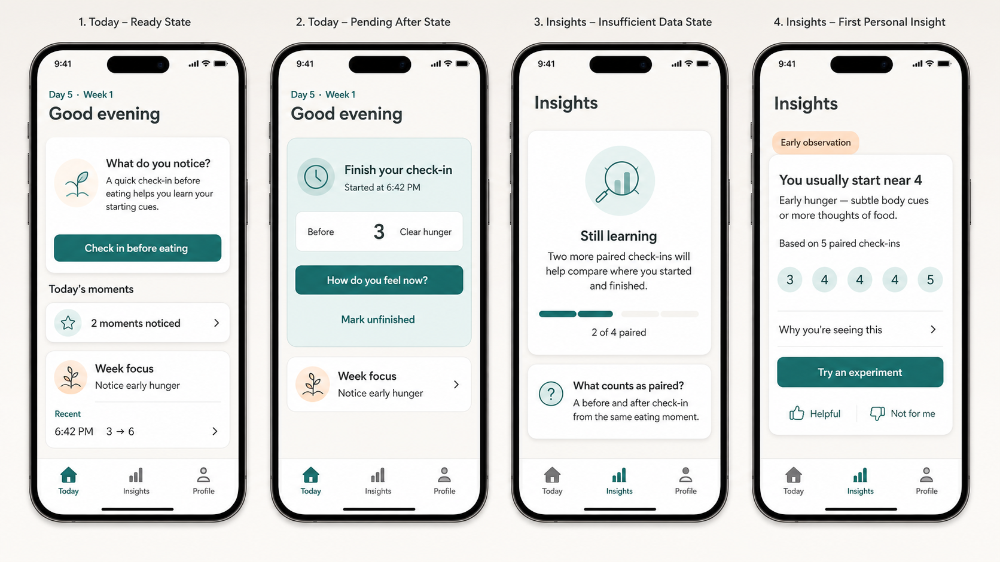
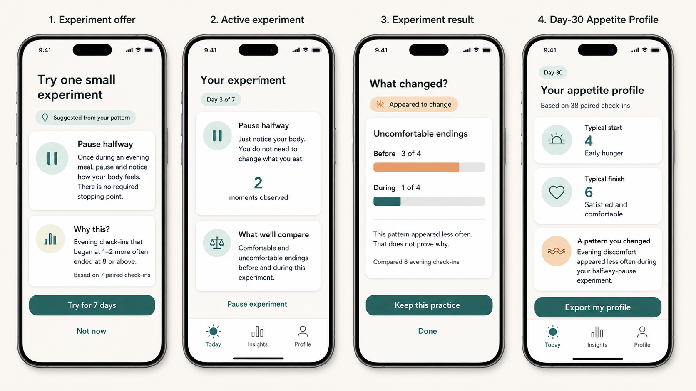
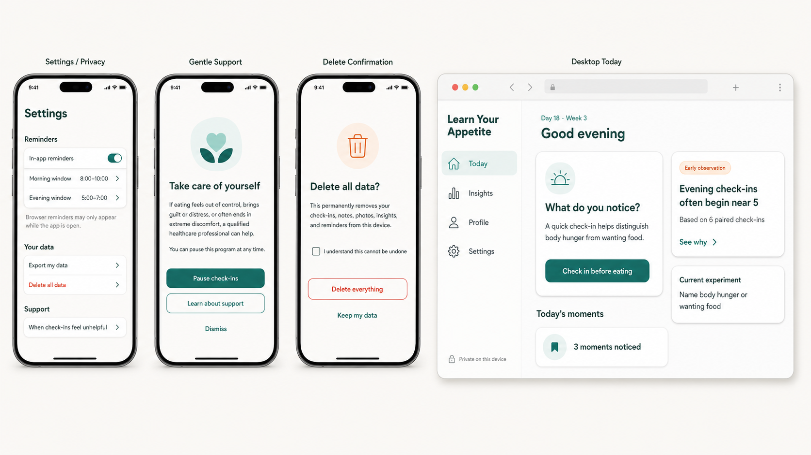
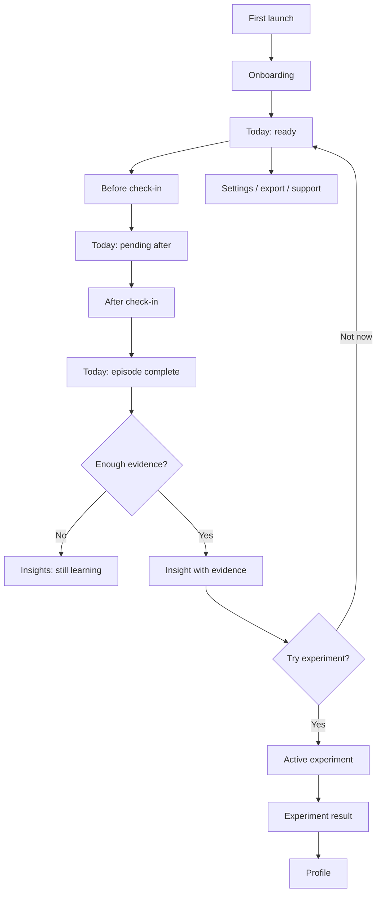

# Learn Your Appetite — UX Design

## 1. Purpose

This document is the implementation source of truth for the MVP user
experience described in [MVP_DESIGN.md](MVP_DESIGN.md). It defines the
application's navigation, screen states, interaction behavior, responsive
layout, visual system, accessibility, copy, and acceptance criteria.

The generated mockups establish visual direction. When a mockup and this text
disagree, this document and the domain rules in `MVP_DESIGN.md` win.

## 2. Design intent

Learn Your Appetite should feel like a quiet noticing practice, not a diet app,
medical dashboard, or habit-compliance system.

The desired experience is:

- **calm** — generous space, few simultaneous choices, no urgent decoration;
- **curious** — prompts ask what happened rather than grading the answer;
- **specific** — insights show values, context, and evidence counts;
- **lightweight** — the required path is one sensation selection and one save;
- **private** — local storage and deletion are visible, not buried in policy;
- **supportive** — difficult patterns lead to options and care, not diagnosis;
- **accessible** — language, layout, color, touch, keyboard, and assistive
  technology all communicate the same meaning; and
- **finite** — the interface shows a 30-day learning arc and deliberately
  reduces prompting over time.

### Never make the product feel like

- calorie or macro tracking;
- a weight-loss challenge;
- a food diary that rewards volume of logging;
- a traffic-light judgment of hunger or fullness;
- therapy or medical diagnosis;
- an AI personality interpreting the user; or
- a streak that can be broken.

## 3. Generated mockups

### Onboarding and paired check-in

This board establishes the minimal activation path, unified scale direction,
five-by-two number grid, selected-sensation explanation, and optional context.

### Today and Insights

This board establishes the mobile shell, state-driven primary action, calm
progress language, honest insufficient-data state, and visible evidence on an
early observation.

### Experiments and Appetite Profile

This board establishes one experiment at a time, predeclared comparison,
non-causal result language, and a profile built from supported observations.

### Privacy, safety, deletion, and desktop

This board establishes first-class privacy controls, a gentle professional-
support path, deliberate destructive confirmation, and a true desktop
recomposition with sidebar and evidence column.

The boards were generated as original visual design artifacts with no source
images. They are not screenshots of a working build and must not be used as
pixel baselines. Production baselines begin only after accessible HTML and CSS
implement the specification.

## 4. User mental model

The user should understand four things without consulting help:

1. One scale always runs from urgent hunger at `1`, through neutral at `5`, to
   painful fullness at `10`.
2. A before and after entry together form one eating episode.
3. Repeated episodes let the app describe personal patterns with visible
   evidence.
4. An experiment is an optional noticing practice, not a rule about eating.

The interface uses “check-in,” “episode,” “observation,” “pattern,” and
“experiment.” It does not call entries meals unless the user selected a meal
occasion.

## 5. Navigation and routes

### Primary destinations

| Destination | Route | Purpose |
| --- | --- | --- |
| Today | `/` | Current next action, stage focus, experiment, and recent episodes |
| Insights | `/insights` | Evidence-backed observations and insight history |
| Profile | `/profile` | Program progress and day-30 Appetite Profile |
| Settings | `/settings` | Reminders, scale help, privacy, export/delete, and support |

### Focused routes

| Route | Purpose |
| --- | --- |
| `/onboarding` | Four-step activation |
| `/check-in/new` | Before-eating sensation |
| `/check-in/:episodeId/after` | Complete the paired episode |
| `/episode/:episodeId` | Review, edit, or delete one episode |
| `/insights/:insightId` | Evidence and explanation for one insight |
| `/experiment` | Offer, active state, or result for the current experiment |
| `/settings/reminders` | Reminder windows and platform capability |
| `/settings/data` | Export, photo inclusion, and delete-all |
| `/support` | Pause tracking and professional-support guidance |

Check-in routes intentionally hide primary navigation to reduce accidental
abandonment. Browser Back returns without saving after a confirmation only if
a selection or optional field changed. A successful save returns to Today and
puts focus on the saved-state message or pending completion card.

### Mobile shell

- Bottom navigation contains Today, Insights, and Profile.
- Settings opens from a clearly labelled gear in the page header or Profile.
- The bar is 64 CSS pixels plus safe-area inset.
- The active destination uses icon, text, weight, and a pale background or
  indicator—not color alone.
- The bar never covers the last content or action.

### Desktop shell

At `960px` and wider, replace the bottom bar with a `240px` sidebar containing
brand, four destinations, and “Private on this device.” The main content has a
maximum readable width and may use a secondary evidence column. Desktop is a
recomposition, not a stretched phone.

## 6. Core flow

## 7. Screen specifications

### 7.1 Onboarding

Onboarding uses one idea and one primary action per screen. Show `1 of 4`
progress as plain position, not completion scoring. Back is always available;
closing before activation preserves no partial personal record.

#### Screen 1 — Promise

- Heading: **Learn your appetite**
- Lead: **30 days. About 10 seconds at a time.**
- Body: **Notice hunger, fullness, and what shapes your eating—without
  counting.**
- Primary action: **Begin**
- Optional original illustration: an abstract path, horizon, or growing plant.
  Do not use a body, scale, plate size, measuring tape, or before/after person.

#### Screen 2 — One scale

- Heading: **One scale, every time**
- Persistent anchors:
  - `1` Urgent hunger
  - `5` Neutral
  - `10` Painfully full
- Body: **Numbers describe a moment. They are not grades.**
- Require one exploratory selection so the user hears/reads the associated
  phrase.
- Primary action: **I understand**

#### Screen 3 — How learning works

- Heading: **Small moments become patterns**
- Three steps: **Check in before**, **Check in after**, **See what repeats**.
- Body: **When there is enough evidence, you will see what the app noticed and
  which check-ins support it.**
- Primary action: **Continue**

#### Screen 4 — Privacy and choice

- Heading: **Private by default**
- State that records and photos remain on this device in the MVP.
- State that every context field is optional.
- Link to support boundary and data details without forcing a policy scroll.
- Offer reminder setup as **Set up reminders** and **Not now**. Do not request
  permission until the user chooses a window.
- Primary completion action: **Start day 1**

### 7.2 Today

Today is state-driven. Only one card has primary visual emphasis.

#### Ready state

Order:

1. `Day n · Week n` eyebrow and time-appropriate neutral greeting;
2. primary **What do you notice?** card;
3. active experiment, if one exists;
4. **Today's moments** count;
5. **Week focus**;
6. recent episodes; and
7. unobtrusive Settings action.

Primary copy:

- Week 1: **A quick check-in before eating helps you learn your starting
  cues.**
- Week 2: **Notice where satisfaction becomes fullness for you.**
- Week 3: **Notice body hunger and wanting food; either can be present.**
- Week 4: **Look for what repeats while you try one small experiment.**

Primary action: **Check in before eating**.

“Today's moments” is descriptive. Do not show a daily target, empty circles to
fill, streak, or success percentage.

#### Pending-after state

Replace the ready card with:

- **Finish your check-in**;
- start time;
- before value and phrase;
- primary action **How do you feel now?**; and
- secondary action **Mark unfinished**.

If the episode is less than four hours old, keep it first. At four hours, add
“This may be an earlier eating moment” and offer Finish, Mark unfinished, or
Start a new check-in. Never silently abandon or pair it.

#### Recent episodes

Each row shows local time, optional occasion, `before → after`, and status.
Unfinished entries show `before → —` and the word **Unfinished**. A row opens
episode details. Photos appear only as small private thumbnails after the text
content; absence of a photo does not alter row height or meaning.

### 7.3 Before check-in

The check-in is a focused, near-full-height surface.

- Header: Back, **Before eating**, and optional **Scale help**.
- Prompt: **How does your body feel?**
- Ten unselected controls in a five-by-two grid.
- Persistent compact anchors below or above the grid.
- After selection, show a pale-teal description panel containing number, short
  phrase, and one-line cue.
- Primary action **Save** is disabled until a value is selected.
- Optional **Add context** disclosure contains occasion and photo only.

No value is preselected, including a previously common answer. Selecting a
number updates the explanation without saving. Save uses an IndexedDB
transaction, changes to **Saving…**, then returns to Today's pending state.

### 7.4 After check-in

Use the identical number grid, anchors, and direction.

- Header: **After eating**
- Prompt: **How does your body feel now?**
- Primary action: **Finish check-in**
- Optional context appears after the selected-description panel.

Optional reason choices are multi-line-safe single-select chips:

- Physical hunger
- Craving
- Emotion
- Boredom
- Habit
- Social/context

Occasion choices are Breakfast, Lunch, Dinner, Snack, and Other. Occasion and
reason are independent. Note is a 140-character plain-text field with a visible
remaining count only after 100 characters. Photo is one optional file.

Context stays collapsed until requested or after the user has used it before.
The primary action remains visible in the normal phone viewport; a sticky
action may be used only with enough bottom padding and no content overlap.

#### Contradictory-looking answers

If someone chooses `8` before eating and “Physical hunger,” save it normally.
Do not warn, correct, or reinterpret. Body signals are self-reported.

### 7.5 Episode details

Show timestamp, before/after values and full phrases, optional context, note,
and photo. Actions:

- **Edit check-in**;
- **Delete this check-in**; and
- **Back to Today**.

Editing opens the same controls with current values. Save states that insights
may update. Deletion uses a confirmation sheet that names the local time and
occasion, then physically removes the record and photo. Restore is not
promised unless implemented as a real transaction-safe undo.

### 7.6 Insights

#### Still-learning state

Use a single explanatory card:

- Heading: **Still learning**
- Dynamic body: **_n_ more paired check-in(s) will help compare where you
  started and finished.**
- Progress label such as **2 of 4 paired**.
- Secondary explanation: **A before and after check-in from the same eating
  moment.**

Do not show generic advice under an “Insight” heading.

#### Insight card

Required elements:

1. **Early observation** or **Recurring pattern** badge;
2. one-sentence finding;
3. phrase that translates any prominent score;
4. evidence visualization only when it improves comprehension;
5. **Based on _n_ paired check-ins**;
6. **Why you're seeing this** disclosure;
7. Helpful and Not for me feedback; and
8. experiment action only when a supported experiment is eligible.

Insight history is chronological with the most recent primary observation
expanded. Prior cards collapse to date, title, evidence count, and strength.
Dismissal hides a card from the default list but does not delete source data.

#### Evidence disclosure

The detail route says:

- the exact context and date range;
- how the app grouped the records;
- counts or medians compared;
- which records were included, linked to episode details;
- algorithm strength label; and
- **This is an observation, not proof of cause.**

### 7.7 Experiment

#### Offer

- Heading: **Try one small experiment**
- Badge: **Suggested from your pattern**
- Action-oriented but non-prescriptive title.
- One-sentence instruction.
- Explicit freedom, such as **There is no required stopping point.**
- **Why this?** card with triggering observation and evidence count.
- Primary action **Try for 7 days**.
- Secondary action **Not now**.

#### Active

- Heading: **Your experiment**
- Elapsed position, for example **Day 3 of 7**—not a completion ring.
- The practice and its safety boundary.
- **_n_ moments observed**, not “completed.”
- **What we'll compare** with the predeclared target.
- **Pause experiment** and **End experiment** in an overflow or detail area.

Do not add a separate checkbox after each episode. If the experiment needs an
extra observation, collect it in the paired after check-in as one optional
question.

#### Result

- Heading: **What changed?**
- State: **Appeared to change**, **Appeared similar**, or **Still learning**.
- The one target metric, with before/during counts.
- Evidence count and comparison context.
- Required caveat: **That does not prove why.**
- Actions **Keep this practice** and **Done**. Keeping means save it to the
  Profile, not schedule indefinite prompts.

No confetti, winning language, green success bars, or red failure bars.

### 7.8 Profile

Before day 30, Profile shows supported cards as they become available and a
plain **Day _n_ of 30** marker. Locked sections say what evidence is needed;
they do not show mystery icons or gamified locks.

At day 30:

- Heading: **Your appetite profile**
- **Based on _n_ paired check-ins**
- Typical start: number plus phrase
- Typical finish: number plus phrase
- Easier contexts, when supported
- More difficult contexts, when supported
- Common self-described reasons, when supported
- Experiment results
- Two or three continuing practices derived from supported patterns
- Primary action **Export my profile**
- Secondary actions **Continue occasionally**, **Pause check-ins**, and
  **Settings**

Each section has its own evidence count. Missing sections say **Not enough
check-ins in this context yet**. The profile is a summary, not a score.

### 7.9 Settings

Group settings in this order:

1. **Reminders** — in-app state, native capability, morning/evening windows,
   tapered week defaults, pause all;
2. **Scale and program** — scale reference, current day/week, restart only after
   explicit confirmation;
3. **Your data** — export, export-photo default off, storage summary, delete all;
4. **Accessibility** — follow-system motion and appearance, optional larger
   controls if needed beyond browser zoom; and
5. **Support** — when check-ins feel unhelpful, product boundary, source notes.

Settings use rows with visible values, not unlabeled toggles. Every toggle has
an adjacent label and status that a screen reader announces.

### 7.10 Support

Show the gentle support card after repeated extreme discomfort or when opened
directly. Exact core copy:

> If eating feels out of control, brings guilt or distress, or often ends in
> extreme discomfort, a qualified healthcare professional can help.

Follow with **You can pause this program at any time.** Actions:

- **Pause check-ins**;
- **Learn about support**; and
- **Dismiss**.

Do not infer an eating disorder, label emotional eating, show an emergency
style, or repeat the card after dismissal unless the user opens Support.
Country-specific resources require maintained external content and are not
hard-coded until reviewed.

### 7.11 Export and delete

Export offers human-readable HTML/PDF-like summary and structured JSON.
**Include photos** is off by default and states the expected export size.

Delete-all is a dedicated confirmation, not a browser `confirm()` dialog:

- Heading: **Delete all data?**
- Explain that check-ins, notes, photos, insights, experiments, reminders, and
  program state leave this device.
- Require **I understand this cannot be undone**.
- Keep destructive action disabled until checked.
- Use **Delete everything** and **Keep my data**.
- After deletion, verify stores and scheduled reminders are empty before
  returning to onboarding.

Red is permitted here as a conventional destructive affordance because it is
unrelated to appetite values.

## 8. Unified scale interaction

The scale is the most important control and must be implemented once, reused
everywhere.

### Compact layout

- Five columns by two rows on phone.
- Minimum target `52 × 52px`; preferred `56–64px` where viewport permits.
- `8px` gap minimum.
- Number centered in at least `20px` type.
- Selected state: `2px` deep-teal border, pale-teal fill, heavier number.
- Hover: border emphasis only.
- Focus: `3px` high-contrast outer ring with `2px` offset.
- No hunger-to-fullness color gradient.

### Accessible semantics

Implement as a `fieldset` with legend and ten native radios styled as tiles.
Accessible names contain number and short phrase, for example **3, Clear
hunger**. The description panel is associated with the selected input and
announced politely once. Arrow keys move within the radio group; Tab leaves the
group.

### Reference help

Scale help is a sheet or page with all ten phrases. It always repeats the
direction and says **Your experience may differ from day to day.** It is
available from check-in headers, onboarding, episode edit, and Settings.

## 9. Visual system

### Color tokens

| Token | Value | Use |
| --- | --- | --- |
| `--canvas` | `#F7F4EE` | Page background |
| `--surface` | `#FFFFFF` | Cards, sheets, controls |
| `--ink` | `#25312D` | Primary text |
| `--ink-muted` | `#596862` | Secondary text with verified contrast |
| `--primary` | `#236B61` | Primary button, active state, focus support |
| `--primary-soft` | `#DDEBE7` | Selected and informational surface |
| `--accent` | `#E9A36B` | Sparing non-semantic highlight background |
| `--accent-ink` | `#6E3814` | Text on light accent surface |
| `--border` | `#D7DED9` | Card and control border |
| `--danger` | `#B42318` | Destructive data actions only |
| `--focus` | `#0B5FFF` | High-visibility keyboard focus ring |

All final foreground/background combinations must meet WCAG 2.2 AA: `4.5:1`
for normal text, `3:1` for large text and UI boundaries. The listed values are
starting tokens; automated and manual contrast verification is required.

Do not use red, yellow, and green to encode urgent hunger, comfort, and
fullness. Discomfort is conveyed by the number, phrase, evidence, and position.

### Typography

Use repository-managed Atkinson Hyperlegible for UI and headings. Avoid remote
font requests.

| Style | Mobile size / line | Desktop size / line | Weight |
| --- | --- | --- | ---: |
| Display | `32 / 38` | `40 / 48` | 700 |
| H1 | `28 / 34` | `32 / 38` | 700 |
| H2 | `22 / 28` | `24 / 30` | 700 |
| H3 | `18 / 24` | `20 / 26` | 700 |
| Body | `16 / 24` | `16 / 24` | 400 |
| Body strong | `16 / 24` | `16 / 24` | 700 |
| Small | `14 / 20` | `14 / 20` | 400 |
| Micro | `12 / 16` | `12 / 16` | 600 |

Respect browser text sizing and `200%` zoom. Never place essential text inside
raster assets.

### Spacing and shape

- Base spacing unit: `4px`.
- Common spacing: `8`, `12`, `16`, `24`, `32`, `48`.
- Phone page gutter: `16px`; `20px` at `430px` and wider.
- Desktop main gutter: `32px`; maximum primary column `720px`.
- Card padding: `20px` phone, `24px` desktop.
- Card radius: `16px`; control radius: `12px`; pill radius only for badges and
  chips.
- Card shadow: very soft and optional; border must still define the surface.
- Avoid nested cards deeper than two levels.

### Buttons

- Minimum height `48px`, minimum target `44 × 44px`.
- One filled primary button per view.
- Secondary buttons use border; tertiary actions use text plus sufficient
  target padding.
- Disabled state includes reduced contrast and native `disabled` semantics;
  loading state remains readable and prevents duplicate activation.
- Destructive action is never the default focused button.

### Icons and illustration

Use simple original or appropriately licensed inline SVG with `2px` strokes,
rounded joins, and `20–24px` size. Icons reinforce text; they do not replace
labels for primary navigation or actions. Decorative icons are hidden from
assistive technology.

Illustration is limited to onboarding/empty-state atmosphere. Use abstract
nature/path motifs, not specific foods, bodies, medical organs, scales, tape
measures, or transformations.

### Motion

- Standard transition `160ms` ease-out for opacity and small transforms.
- No bounce, celebration, pulsing reminders, or automatic carousel.
- Check-in selection may fade the description panel without moving the grid.
- Under `prefers-reduced-motion: reduce`, remove transforms and use immediate or
  short opacity changes.

## 10. Data visualization

Visualizations answer one clear sentence already present in text.

Allowed MVP forms:

- a row of dots for a small distribution;
- two labelled bars for a rate comparison;
- a compact range line for typical values; and
- a chronological list for observations.

Every visualization includes:

- visible title;
- direct value labels;
- evidence count;
- accessible prose summary;
- no hover-only information; and
- no green/red success encoding.

Axes start at honest bounds. A rate bar uses the same 0–100% scale for both
groups. Tiny samples show counts (`1 of 4`) rather than percentages alone.

## 11. Responsive behavior

### Compact: below `600px`

- Single column, bottom navigation, `16px` gutter.
- Scale uses five-by-two grid.
- Cards stack in reading order.
- Dialog-like experiences use bottom sheets only when focus trapping and
  keyboard behavior are correct; otherwise use a page.

### Medium: `600–959px`

- Single main column up to `680px`, centered.
- Bottom navigation remains unless pointer/space tests justify sidebar.
- Insight and Profile cards may use two columns when each remains at least
  `280px`.

### Wide: `960px` and above

- `240px` sidebar.
- Content grid: main column `minmax(520px, 720px)` plus optional `320px`
  evidence/experiment rail.
- Today places primary action and moments in main; current insight and
  experiment in side rail.
- Check-in remains a focused centered panel no wider than `620px`; do not spread
  the scale across the entire window.

### Viewport constraints

- No horizontal page overflow at `320px` width.
- Phone check-in's prompt, grid, selected description, and primary action fit
  at `393 × 852` with standard text sizing.
- At `200%` zoom or mobile landscape, vertical scrolling is allowed and the
  action must not cover content.
- Account for top and bottom safe-area insets.

## 12. Accessibility contract

- One H1 per page and logical heading order.
- Landmarks for header, main, navigation, and footer where present.
- Skip link on desktop.
- Native controls before ARIA; no clickable `div`.
- Persistent visible labels; placeholders are examples, not labels.
- Keyboard focus is visible, ordered, and restored after sheets/dialogs.
- Status changes use a polite live region; errors use field association and a
  summary when multiple.
- Touch targets are at least `44 × 44px` with `8px` separation where practical.
- Information never relies on color, icon, position, or sound alone.
- All charts have equivalent prose and data values.
- Decorative images have empty alt text; informative user photos use
  user-provided context or generic **Optional eating-moment photo**.
- Support browser zoom/reflow through `400%` desktop and `200%` mobile text.
- Honor reduced motion, forced colors, and system appearance.
- After navigation, focus the H1 or the most relevant changed-state heading.
- After save, announce **Before check-in saved** or **Check-in complete**.

Run automated checks, but treat keyboard, screen-reader, zoom, contrast, and
touch testing as required manual review.

## 13. Copy system

### Voice

Use short, plain, observational sentences. Prefer:

- **What do you notice?**
- **Based on 5 paired check-ins…**
- **This pattern appeared less often.**
- **Still learning.**
- **Not for me.**

Avoid:

- good/bad, clean/cheat, success/failure;
- control, resist, earn, burn, compensate;
- should/shouldn't about eating;
- perfect, on track, fell off, missed your goal;
- overeater, emotional eater, disordered;
- fixed, caused, repaired, reset hormones; and
- calorie, macro, weight, or portion language outside an explicit non-goal or
  safety explanation.

### Time and progress

- Use local time with locale formatting.
- Show **Day 5 · Week 1**, not **5-day streak**.
- Show **2 moments noticed**, not **2/3 complete**.
- Show **Day 3 of 7** for experiment elapsed time, not a completion ring.
- Missed days leave elapsed program stage intact and receive no warning badge.

### Evidence

- Singular/plural grammar must be correct.
- Prefer counts for small samples.
- “Usually” requires the relevant engine gate; UI copy cannot strengthen an
  `early` result into a recurring claim.
- Never infer “breakfast,” “lunch,” or “dinner” from time alone.

## 14. Platform and privacy states

### Offline

The normal local experience continues. Show a small **Offline—saved on this
device** status only where needed; do not block check-ins. PWA asset-update
failures stay separate from record-save status.

### Photo processing

After selection show local thumbnail plus **Stored only on this device**.
Processing state is **Preparing photo…**. On quota or encoding failure:

> Your check-in was saved without the photo. This device did not have enough
> storage for it.

Actions: **Continue** and **Manage data**. Never retry-upload because there is
no upload service.

### Reminders

Before permission, explain which window will be scheduled. If only in-app
reminders are possible, state **Browser reminders may only appear while the app
is open.** Do not display a native-success confirmation on unsupported web.

### Storage migration

During a supported migration show the shell and **Updating your private
records…** with no editable content. On failure, offer **Export original data**
and **Reset app**; do not guess or discard silently.

### Save error

Keep all form values. Place a concise error above the primary action, focus it,
and offer **Try again**. Do not navigate away.

## 15. Component inventory

Build shared components only when a real slice needs them:

- `AppShell`
- `PrimaryNavigation`
- `PageHeader`
- `SensationScale`
- `SensationDescription`
- `CheckInForm`
- `ContextDisclosure`
- `ChoiceChipGroup`
- `EpisodeRow`
- `WeekFocusCard`
- `InsightCard`
- `EvidenceDisclosure`
- `DotDistribution`
- `RateComparison`
- `ExperimentCard`
- `ProfileSection`
- `StatusMessage`
- `ConfirmationDialog`
- `PhotoPicker`
- `SupportCard`

Components receive structured values and callbacks. They do not calculate
insight eligibility, progression stage, or experiment results.

## 16. Screen acceptance criteria

### Onboarding

- Scale direction can be stated correctly after one interaction.
- Photos, reminders, and all personal context can be declined.
- No calorie, weight, diet-goal, or account fields appear.

### Check-in

- Required path is one number selection and one save.
- Scale has no default and remains directionally identical before/after.
- Selected number, phrase, and save status are screen-reader announced.
- Save survives reload; failure preserves input.

### Today

- Exactly one state-appropriate primary action appears.
- Pending episode cannot be silently overwritten.
- Progress uses moments and elapsed days, never compliance.

### Insights

- No personalized claim appears below its domain evidence gate.
- Every claim exposes count, context, and evidence details.
- Dismissal and feedback do not alter source episodes.

### Experiment

- Only one experiment is active.
- Offer states why it was suggested and freedom not to try it.
- Result shows the predeclared metric and non-causal caveat.

### Profile

- Every section has evidence or an honest missing-data state.
- No overall score ranks the person's appetite.
- Export excludes photos by default.

### Privacy and safety

- Individual and all-data deletion are real and testable.
- Photo metadata is removed before storage.
- Support is calm, non-diagnostic, dismissible, and able to pause prompts.

### Responsive/accessibility

- Core journey works at all E2E viewports in `E2E_GUIDE.md`.
- No horizontal overflow, clipped target, covered action, or inaccessible
  custom control.
- Keyboard, screen reader, zoom, reduced motion, and forced-color checks pass.

## 17. Implementation handoff

Implement in the vertical-slice order from `MVP_DESIGN.md`:

1. tokens, typography, shell, onboarding, and Today empty state;
2. the single reusable scale and paired check-in states;
3. episode review/edit/delete and recent Today history;
4. still-learning and first evidence-backed insight;
5. progression and additional supported insight cards;
6. one experiment and its comparison result;
7. Profile, export/delete, reminders, support, offline, and responsive audit.

For each slice:

- implement semantic HTML before screenshot styling;
- test the pure state/result independently;
- add the browser tracer bullet and generated walkthrough;
- review phone and desktop baselines at ordinary and large text;
- compare rendered copy with the allowed voice; and
- update this document when a deliberate UX decision changes.

Do not copy pixels blindly from the generated boards. Preserve their
hierarchy, calm density, and design system while satisfying real content,
platform behavior, and accessibility.

## 18. Mockup generation provenance

The four design boards were generated with the built-in OpenAI image-generation
tool on 2026-08-29 using the `ui-mockup` workflow. Prompts specified a
shippable, accessible wellbeing UI; the exact screen copy; warm ivory/deep teal
tokens; consistent phone dimensions; and explicit exclusions for calories,
weight, food judgment, trademarks, medical imagery, red/green appetite
semantics, and watermarks. No repository PDF, scale image, or third-party UI
was provided as an image reference.
