# Learn Your Appetite — UX Overhaul

Status: proposed direction for approval. This document changes presentation,
navigation depth, and copy density only. It does not authorize implementation
or change the product, evidence, privacy, or event-sourcing contracts in
`MVP_DESIGN.md`.

## 1. Why this overhaul

The current application is functionally complete, but too often reads like a
well-formatted document instead of feeling like a focused iOS app:

- important actions compete with explanatory copy;
- Today and Settings stack several full cards into long pages;
- the check-in repeats its question and uses vertical space for guidance that
  is no longer needed after onboarding;
- Insights exposes history and methodology before the user asks for it;
- Settings expands every concern on one route instead of acting as a hub; and
- the visual hierarchy is calm but flat, formal, and weakly tactile.

The overhaul should make the common loop feel like **glance, tap, done**. It
should preserve calmness without making every screen look like a policy page.

## 2. Desired experience

The application should feel:

- **immediate** — the next useful action is apparent within one glance;
- **compact** — the first viewport contains the decision, its essential
  context, and its primary action;
- **tactile** — controls have depth and clear pressed, selected, and focused
  states;
- **human** — copy is conversational, short, and concrete;
- **personal** — light and dark appearances feel intentionally designed, not
  like one palette inverted by the browser;
- **native-minded** — safe areas, tab navigation, sheets, switches, action
  placement, and hierarchy follow familiar iOS conventions; and
- **quiet** — no streaks, gamification, urgency, food judgment, or ornamental
  animation.

The core loop remains unchanged:

```text
Notice → Understand → Experiment → Learn
```

## 3. Proposed visual direction

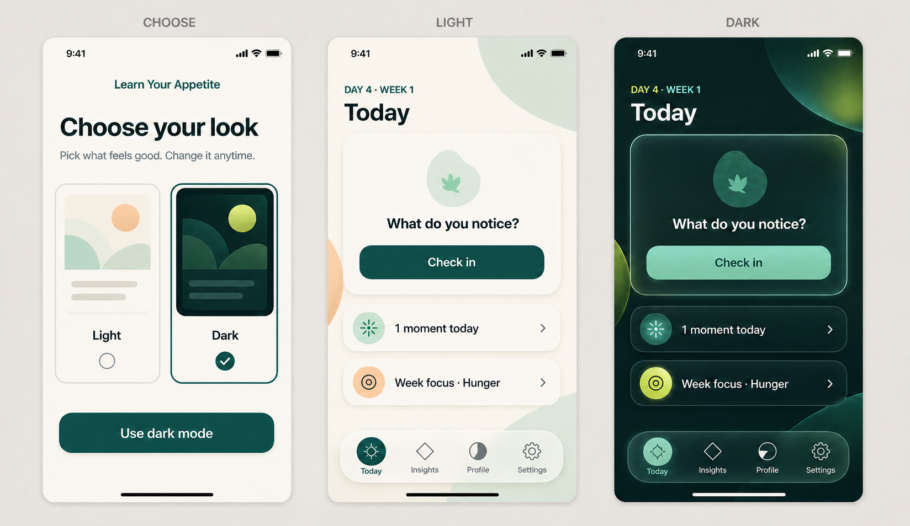

The first board establishes the install-time appearance choice and the shared
Today hierarchy. Both modes use identical information architecture and
semantics.

### Light — warm liquid glass

Light mode evolves the current warm ivory and teal system:

- a warm, lightly tinted content canvas;
- restrained mint and apricot ambient shapes behind content;
- mostly solid or softly translucent content surfaces;
- liquid-glass treatment on the floating tab bar, primary controls, sheets,
  and other functional layers; and
- deep-teal type and controls with sparing apricot emphasis.

Glass is not a card style applied everywhere. Apple describes Liquid Glass as
a distinct functional layer for controls and navigation, and recommends using
it sparingly rather than throughout the content layer. This proposal follows
that separation. See [Apple's materials guidance](https://developer.apple.com/design/human-interface-guidelines/materials)
and [Liquid Glass overview](https://developer.apple.com/documentation/TechnologyOverviews/liquid-glass).

### Dark — nano-banana glass

“Nano-banana” is a project shorthand, not a formal platform design system. For
this application it means:

- a deep charcoal-forest canvas rather than pure black;
- slow, abstract mint, aqua, and banana-lime light fields;
- frosted functional surfaces with crisp rims and subtle refraction;
- luminous mint actions and tiny lime emphasis;
- enough opaque backing to preserve text contrast; and
- premium depth without neon cyberpunk clutter.

Dark mode may use a richer glass treatment than light mode, but content must
remain readable when transparency is reduced, contrast is increased, or
motion is disabled.

### Material hierarchy

| Layer | Purpose | Treatment |
| --- | --- | --- |
| Canvas | Sense of place | Warm ambient fields in light; restrained luminous fields in dark |
| Content | Reading and evidence | Solid or high-opacity surfaces; minimal blur |
| Controls | Navigation and action | Regular glass, distinct outline, strong foreground |
| Transient UI | Sheets, menus, confirmations | Glass over a dimmed content layer |

The background can infuse controls, but controls may never become difficult to
locate. The most important content remains near the top in reading order, in
line with [Apple's layout guidance](https://developer.apple.com/design/human-interface-guidelines/layout).

## 4. Appearance choice

Appearance is the first explicit choice on first launch and is available later
from Settings.

1. Infer a preview selection from the device appearance.
2. Show two large, live preview tiles: **Light** and **Dark**.
3. Require one clear confirmation action: **Use light mode** or **Use dark
   mode**.
4. State only: **Pick what feels good. Change it anytime.**
5. Continue into the existing scale and learning explanation.

The choice does not activate the program or create a synthetic user event. It
stays in temporary onboarding state until activation, then is recorded through
the authoritative settings event path. Changing it later also appends a
settings event; no projection is edited directly.

There are two product themes, not a third “system” mode. Device appearance is
used only for the initial selection. This keeps the first choice legible and
ensures that a user who deliberately chooses dark does not unexpectedly change
appearance later.

## 5. Complete onboarding flow

Onboarding keeps the approved four-step product sequence and adds the appearance
choice in front of it. It should feel like a short guided setup, not a terms
document or a first check-in. At standard text size, each stage occupies one
phone viewport and exposes its primary action without scrolling.

The whole path is:

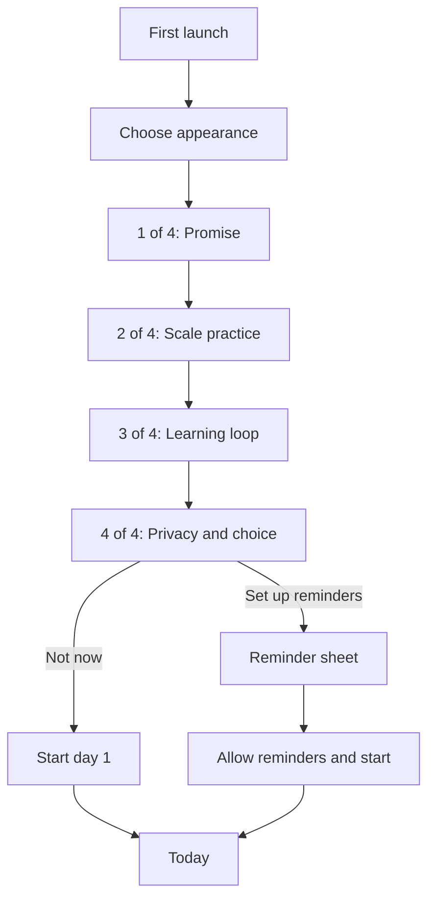

Appearance setup precedes onboarding, so it has no artificial `0 of 4` label.
The four numbered stages retain the established product meaning. Back is
available after the first stage, and moving backward does not discard choices
made during the current run.

### Stage 0 — Choose appearance

This is the first interactive screen after launch:

- Brand: **Learn Your Appetite**.
- Heading: **Choose your look**.
- Supporting line: **Pick what feels good. Change it anytime.**
- Two large live previews: **Light** and **Dark**.
- The device appearance preselects one tile, but both remain equally available.
- Primary action: **Use light mode** or **Use dark mode**, matching the selected
  preview.

Selecting a tile updates the screen immediately so the choice is understood
before confirmation. Confirmation applies the preview to the rest of
onboarding, but does not activate the program or append a user event. No privacy
copy, account prompt, or explanation of design terminology appears here.

### Stage 1 — Promise

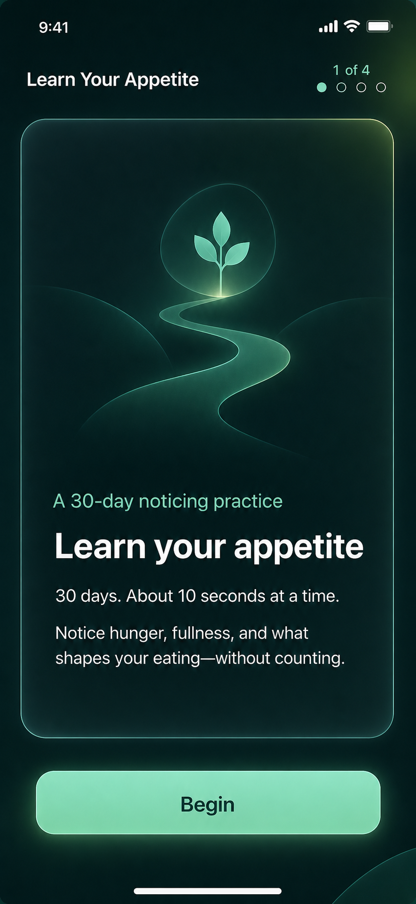

This screen answers only “why would I do this?”:

- Position: **1 of 4**.
- Heading: **Learn your appetite**.
- Lead: **30 days. About 10 seconds at a time.**
- Body: **Notice hunger, fullness, and what shapes your eating—without
  counting.**
- Primary action: **Begin**.

One quiet abstract path or growth motif may support the promise. It must not
depict a body, portion, weighing scale, measuring tape, or before/after person.
The action remains in the decision viewport; decorative art yields space before
the copy or action does.

The mockup shows dark mode. Light mode keeps the same hierarchy, content,
geometry, and semantics while applying the light material tokens.

<br clear="right">

### Stage 2 — One scale

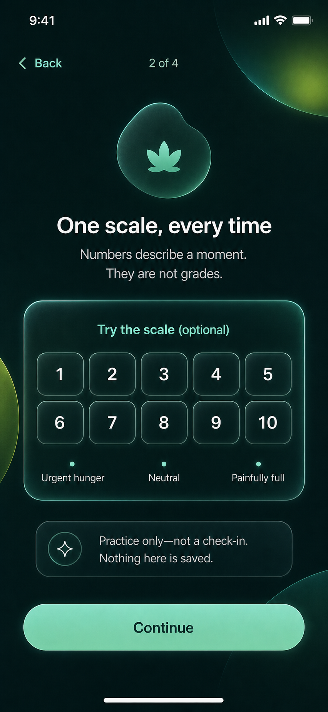

This is education, not data collection:

- Position: **2 of 4**.
- Heading: **One scale, every time**.
- Body: **Numbers describe a moment. They are not grades.**
- Anchors: `1` **Urgent hunger**, `5` **Neutral**, and `10` **Painfully full**.
- Control label: **Try the scale (optional)**.
- Primary action: **Continue**; secondary action: **Back**.

Nothing is selected by default. A user may tap values to see the corresponding
phrase or continue without touching the scale. A compact line beside the
control says **Practice only—not a check-in. Nothing here is saved.** A practice
selection never creates an episode, never counts as insight evidence, and never
appears in history.

The illustrated scale is intentionally unselected. Selection styling may be
previewed interactively, but it must not imply that the user has begun a
check-in.

<br clear="right">

### Stage 3 — How learning works

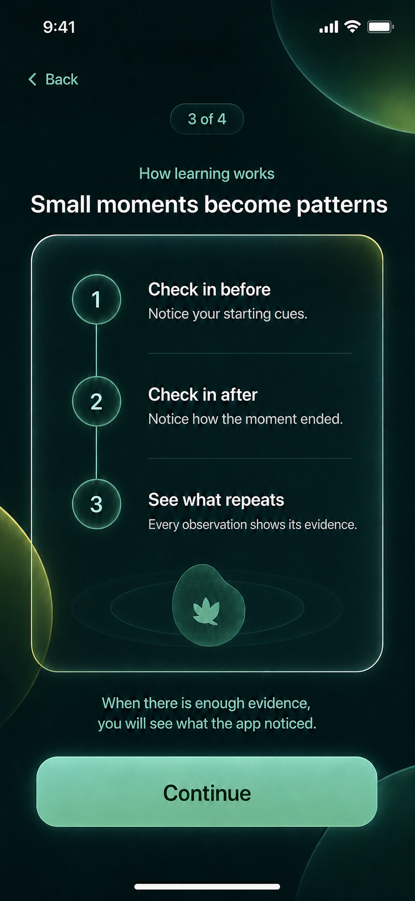

This screen turns the product model into three compact, scannable steps:

1. **Check in before** — Notice your starting cues.
2. **Check in after** — Notice how the moment ended.
3. **See what repeats** — Every observation shows its evidence.

The position is **3 of 4**, the heading is **Small moments become patterns**,
and the supporting line is **When there is enough evidence, you will see what
the app noticed.** The primary action is **Continue** and the secondary action
is **Back**. Methodology, thresholds, charts, and experiment rules stay out of
onboarding and remain available where they become relevant.

The visual connection expresses sequence only. It is not a completion meter,
streak, or promise that an insight will appear after a fixed number of days.

<br clear="right">

### Stage 4 — Privacy and choice

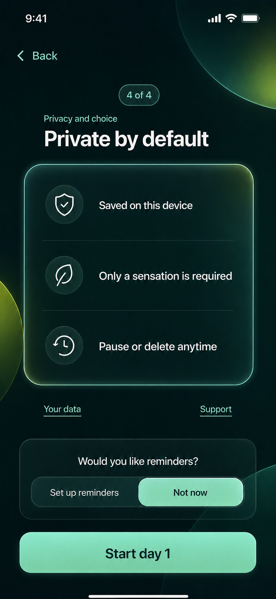

The final screen establishes trust and offers reminders without making them a
condition of use:

- Position: **4 of 4**.
- Heading: **Private by default**.
- Three concise rows: **Saved on this device**, **Only a sensation is
  required**, and **Pause or delete anytime**.
- Links: **Your data** and **Support**, opening focused detail without losing
  onboarding progress.
- Reminder choices: **Set up reminders** and **Not now**.

Choosing **Not now** exposes the primary action **Start day 1**. Choosing **Set
up reminders** opens a focused sheet so reminder controls cannot push the
activation action below the fold.

The mockup shows **Not now** selected and the resulting **Start day 1** action.
The reminder-setup branch changes the choice and action labels, not the privacy
promises or their placement.

<br clear="right">

### Reminder setup branch

The reminder sheet uses iOS-style switches for **Morning**, **Midday**, and
**Evening**, with a maximum of two windows. It says that reminders stay on this
device and can be changed later in Settings. Toggling a switch does not request
system permission.

Closing the sheet returns to the unchanged final stage. When at least one
window is selected, its primary action becomes **Allow reminders and start**.
That explicit action is the only point at which iOS requests notification
permission. If permission is denied or unavailable, activation still completes,
no delivery claim is made, and Settings provides the recovery path. Browser
use likewise saves the preference without claiming background delivery.

### Activation and arrival on Today

The final action is one transaction from the user's perspective:

1. create the 30-day program;
2. append the confirmed appearance and reminder settings through the
   authoritative event path;
3. reconcile native reminders when permission and capability permit; and
4. replace onboarding with Today at **Day 1 · Week 1**.

The first Today viewport shows the normal primary check-in action. It does not
open a check-in automatically. Completed onboarding supplies the first honest
insight-progress step, so the first progress meter reads `1 of 5` (20%) before
any eating moments exist; the scale practice does not supply that progress.

### Interruption, accessibility, and error behavior

- Before activation, no program, episode, insight evidence, or durable settings
  event exists. Relaunching starts at appearance choice rather than pretending
  setup was completed.
- Back preserves the in-memory theme preview, practice selection, and reminder
  draft for the current run.
- The focused heading receives focus after every forward or backward transition;
  VoiceOver announces the new position and heading once.
- The scale and reminder switches retain their existing semantic controls,
  44-point targets, keyboard behavior, and non-color state cues.
- At large text sizes the page may scroll, but the action area receives opaque
  backing and safe-area inset; it never obscures focused content.
- A storage or activation failure leaves the user on the final stage, preserves
  the draft, cancels any newly scheduled reminders on a best-effort basis, and
  offers the same labelled action to retry.
- Offline mode changes none of the flow. No screen waits for a network request.

Onboarding is complete only after the activation events are successfully
appended. Its E2E tracer must cover light and dark choices, the reminder and
no-reminder branches, permission denial, back navigation, relaunch before
activation, practice-scale non-persistence, the `1 of 5` insight starting
state, and geometric CTA visibility at the phone baseline.

## 6. The decision viewport

The primary design unit is a `393 × 852` point phone viewport including safe
areas and the bottom navigation. Every common task must expose the following
without scrolling at standard text size:

1. where the user is;
2. the one decision being asked;
3. enough context to make it safely; and
4. the primary action.

### Above-fold contract

- A screen with a primary CTA must show the complete CTA before the bottom
  safe area or tab bar.
- The CTA must not depend on scrolling to become enabled or visible.
- A focused task may use a bottom action region, but it cannot cover content.
- At 200% text size, scrolling is allowed; the action remains sticky only when
  it has an opaque/regular-material backing and sufficient content inset.
- Error text appears immediately above the action and never pushes the action
  out of reach.

### Density budget

Within the first viewport, a common screen may contain:

- one page title, normally no more than two lines;
- one primary task surface;
- at most two compact summary rows beneath it;
- one primary filled action; and
- no more than two lines of helper copy at a time.

Anything else is disclosed through a focused route, sheet, collapsed row, or
detail action.

## 7. Core-task mockups

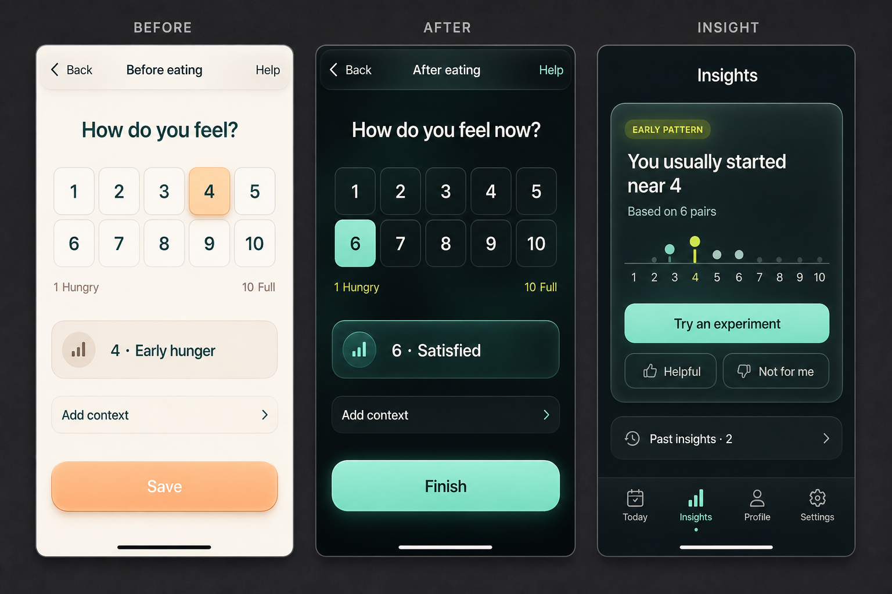

### Check-in

The check-in becomes one question, one scale, one interpretation, and one
action:

- remove the duplicate eyebrow and repeated question;
- shorten **Scale help** to **Help** in the navigation bar;
- keep the same accessible 1–10 radio group in a five-by-two grid;
- reduce persistent scale copy to the two endpoints, with full phrases in
  Help;
- show the selected value in one short tactile panel;
- move optional context into a focused sheet rather than expanding it inline;
- keep **Save** or **Finish** fully visible; and
- hide the persistent tab bar during the task.

The scale still has no default. Color does not classify appetite values; the
selected treatment identifies only the user's current choice.

### Insights

Insights opens with one useful statement rather than its methodology:

- one short observation;
- evidence count on the same card;
- one compact chart only when it materially clarifies the sentence;
- **Try an experiment** above the fold when eligible;
- feedback as compact secondary controls; and
- history collapsed into one row.

**Why this?**, source records, algorithm version, changed-source labels, and
the non-causal explanation remain available on the detail route. Evidence is
not removed; it is progressively disclosed.

## 8. Compact destinations

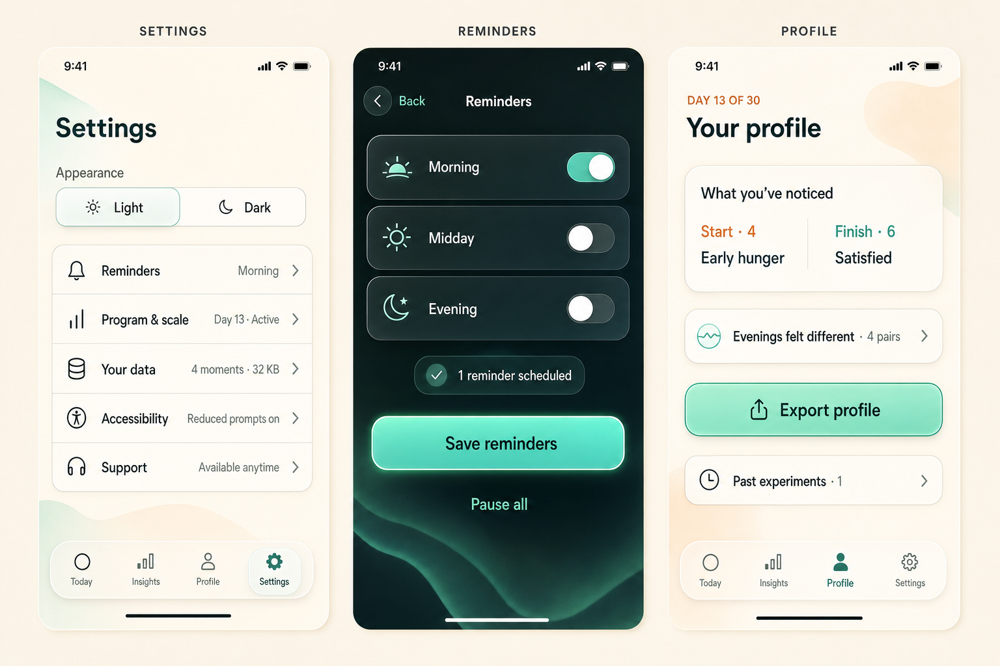

### Settings becomes a hub

The current single long Settings document becomes one viewport of summary
rows:

- Appearance
- Reminders
- Program & scale
- Your data
- Accessibility
- Support

Each row shows its current state and opens a focused route or sheet. Technical
diagnostics such as projection rebuild and build identity live under **Your
data → Diagnostics**, rather than competing with everyday preferences.

Destructive actions remain in **Your data** and retain deliberate confirmation.
Support retains its safety language, but the full boundary copy appears only
after the user opens Support.

### Reminder detail

Reminder choices get their own focused surface with three labelled switches,
one schedule status, **Save reminders**, and **Pause all**. Permission and
failure explanations appear contextually only when required.

### Profile

Profile leads with the small number of supported things the app knows now.
Evidence details remain one tap away. The export CTA is visible before history
or incomplete sections.

## 9. Screen-by-screen restructure

| Screen | First viewport | Moved behind disclosure |
| --- | --- | --- |
| First launch | Theme previews and one confirmation | No policy content |
| Onboarding promise | One sentence and Continue | Longer product boundary in final privacy step |
| Scale learning | Scale, selected phrase, Continue | Full ten-value reference in Help |
| Privacy | Three one-line promises and Start | Reminder setup in focused sheet; support/data details in links |
| Today | Day/week, primary action, two summary rows | Recent history and week explanation below the fold or behind rows |
| Before/after | One question, scale, selected phrase, CTA | Optional context sheet; scale reference in Help |
| Episode | Values and Edit | Context/photo metadata and Delete in detail/overflow |
| Insights | Primary observation and eligible action | Evidence methodology and history |
| Experiment | Practice, day, measure, current action | Pause/end and full baseline explanation |
| Profile | Current supported summary and Export | Sparse sections, evidence lists, past experiments |
| Settings | Appearance plus six summary rows | Each settings category on a focused surface |
| Support | Core safety sentence and choices | Longer educational boundary only on request |

Scrolling remains valid for history, evidence, legal/privacy explanation,
large text, and destructive confirmations. It is not the default interaction
for completing a check-in or finding a primary action.

## 10. Copy overhaul

The new voice is still careful, but less institutional. Lead with the action or
observation; explain only when requested.

| Current | Proposed |
| --- | --- |
| “Take a moment when it is useful. There is no daily target.” | Remove from the default Today view. |
| “Begin with how your body feels.” | “What do you notice?” |
| “Check in before eating” | “Check in” when the surrounding screen already establishes timing. |
| “Personal observations appear only when your paired check-ins provide enough evidence.” | “Your patterns will show up here.” |
| “For seven local calendar days, observe one predeclared measure.” | “Try this for 7 days. No pass or fail.” |
| “The event log is authoritative; the app can rebuild its editable views…” | Move to **Diagnostics** and say “Rebuild app views from your saved history.” |
| “Storage is not end-to-end encrypted…” | “Saved on this device.” Keep the full warning in **Your data**. |
| “Would a pause or extra support feel useful?” | “Want to pause or find support?” |

Copy limits:

- headings: five words where practical;
- task helper text: one sentence, two lines maximum;
- buttons: one to three words where context makes the result unambiguous;
- cards: one idea each; and
- technical implementation language: Diagnostics only.

Safety, consent, destructive action, permission, storage failure, and evidence
caveats may exceed these limits when accuracy requires it.

## 11. Before and after

The generated boards are direction artifacts, not screenshots or pixel
baselines. The “before” column uses current phone E2E evidence; the “after”
column points to the relevant panel in the new board.

### Today

| Before — stacked explanatory cards | After — one action and two glanceable rows |
| --- | --- |
| 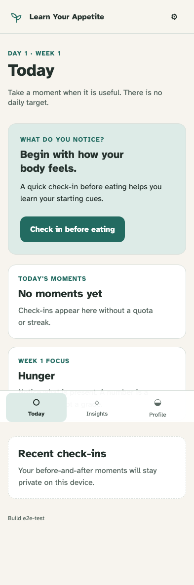 |  |

The proposed first viewport removes repeated reassurance, makes **Check in**
the unmistakable action, and turns moments and week focus into compact rows.

### Check-in

| Before — repeated prompt and tall guidance | After — one compact decision viewport |
| --- | --- |
| 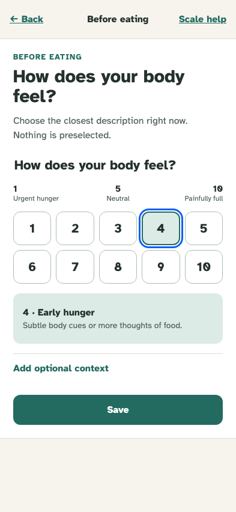 |  |

The required task fits without scroll while optional context leaves the main
flow.

### Insights

| Before — evidence and history expanded | After — conclusion first, detail on demand |
| --- | --- |
| 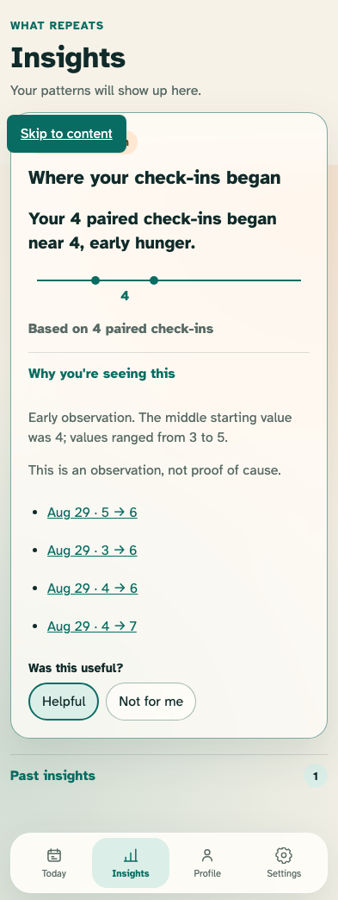 |  |

The evidence contract remains intact, but the default screen communicates the
finding before exposing its audit trail.

### Settings

| Before — all categories expanded in one long page | After — one-screen hub and focused details |
| --- | --- |
| 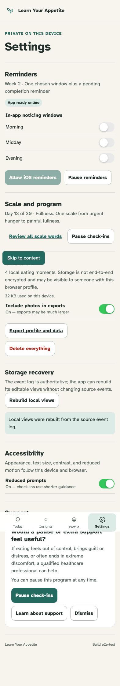 |  |

Settings becomes navigable rather than scroll-searchable. Everyday choices no
longer compete with recovery, support, and developer diagnostics.

## 12. Theme tokens

These are starting values for implementation and contrast review, not final
pixel approvals.

| Role | Light | Dark |
| --- | --- | --- |
| Canvas | `#F7F3EA` | `#061411` |
| Content surface | `rgba(255,255,255,.88)` | `rgba(13,39,35,.82)` |
| Glass control | `rgba(255,255,255,.60)` | `rgba(26,70,62,.54)` |
| Primary ink | `#102923` | `#F3FBF7` |
| Secondary ink | `#53665F` | `#B8CCC5` |
| Primary | `#087466` | `#79E5C6` |
| Small accent | `#F0A266` | `#C7F33F` |
| Border/rim | `rgba(16,41,35,.14)` | `rgba(176,255,232,.32)` |
| Focus | `#0B5FFF` | `#9CC2FF` |

All text and meaningful control boundaries must meet WCAG 2.2 AA in both
themes and with transparency disabled. Forced-colors mode replaces decorative
materials with system colors and borders.

## 13. Shape, type, and motion

- Keep Atkinson Hyperlegible for continuity and offline packaging.
- Reduce phone H1 from the current visual dominance to approximately `30/34`;
  task prompts use `28/32` only when they remain on one or two lines.
- Use `16/22` body and `13–14/18` status copy.
- Use concentric radii: approximately `24px` hero, `18px` rows, and capsule
  actions where the surrounding container supports them.
- Standard content spacing is `12–16px`; reserve `24px` gaps for major groups.
- Use depth from rim, translucency, and a soft shadow, not multiple borders.
- Pressed controls compress or dim subtly; selection changes may use a short
  material highlight.
- Do not animate ambient backgrounds continuously.
- Honor reduced motion by removing scale/translation and shortening fades.

## 14. Interaction patterns

### Focused sheets

Use sheets for optional context, reminder editing, scale help, appearance
change, and short confirmations. Use routes for evidence, data management,
support, and content likely to exceed one screen.

Every sheet:

- has a clear title and close/back action;
- traps and restores focus correctly on web;
- respects the keyboard and safe areas;
- uses regular/opaque material under important text; and
- becomes a full-height route when text enlargement would otherwise clip it.

### Navigation

The four existing destinations remain Today, Insights, Profile, and Settings.
No capability or history is deleted to achieve compactness. The floating tab
bar is a functional glass layer and remains visible only on destination
screens, never during focused check-ins.

### Feedback

- Use inline status near the control that changed.
- Prefer a short toast for successful non-destructive background work.
- Keep save errors persistent above the CTA with **Try again**.
- Use haptics only from native-owned confirmation points, never as the sole
  indication of state.

## 15. Accessibility and privacy constraints

Visual richness cannot weaken the existing contracts:

- 44-point targets and native control semantics remain mandatory;
- transparency-reduction and increased-contrast settings receive a more opaque
  surface and stronger rim;
- dark and light themes expose identical names, reading order, states, and
  actions;
- no essential text or icons live only in the generated raster assets;
- the scale has no value-based red/green gradient;
- theme choice and every later change remain local and event-backed;
- no remote font, texture, image, or animation is introduced; and
- the packaged iOS shell remains fully offline.

## 16. Acceptance criteria for implementation

The direction is implemented only when:

- first launch presents a clear light/dark choice and Settings can change it;
- theme choice survives relaunch through the authoritative event sequence;
- every common-action phone baseline shows its CTA completely above the fold
  at `393 × 852` with standard text;
- onboarding, before check-in, after check-in, reminder editing, and experiment
  acceptance require no scroll at standard text;
- Today exposes its primary action plus moments and week focus in one viewport;
- Settings presents all top-level categories in one standard phone viewport;
- evidence, privacy, and safety detail remain reachable after progressive
  disclosure;
- both themes pass automated contrast, forced-colors, reduced-transparency,
  reduced-motion, keyboard, VoiceOver, and 200% text checks;
- every existing domain, event-replay, offline, native bridge, reminder,
  export, deletion, and migration test remains green; and
- new phone-first E2E scenarios compare light and dark layouts and assert CTA
  visibility geometrically rather than relying only on screenshots.

## 17. Review decisions

Approval of this document approves the following direction:

1. light/dark is a deliberate first-launch choice, with the device theme only
   preselecting a recommendation;
2. light mode uses restrained liquid glass on functional layers;
3. dark mode uses the richer nano-banana glass treatment shown in the boards;
4. Settings becomes a hub with focused detail surfaces;
5. optional context moves out of the main check-in viewport;
6. conclusions precede evidence details on Insights and Profile; and
7. above-fold CTA geometry becomes a tested release requirement.

This approval does not treat generated raster details as exact implementation
specifications. Semantic HTML, contrast, real content, iOS behavior, and the
rules above take precedence.

## 18. Mockup provenance

The three overview boards and four individual onboarding screens were generated
with the built-in OpenAI image-generation tool on 2026-09-02 using the
`ui-mockup` workflow. The prompts specified shippable portrait iOS screens,
exact minimal copy, the existing product navigation,
light liquid-glass and dark nano-banana glass treatments, above-fold primary
actions, and exclusions for calorie, weight, food judgment, medical imagery,
emoji, trademarks, and watermarks.

The first board received one targeted edit to correct both generated bottom
navigation bars to **Today**, **Insights**, **Profile**, and **Settings**. No
source PDF, third-party application screenshot, or licensed design asset was
used as an image-generation input.

The learning and privacy onboarding screens each received one targeted edit so
their visual heading hierarchy exactly matches the written specification. The
original generated variants remain as provenance; the document references the
corrected `-v2` assets.
