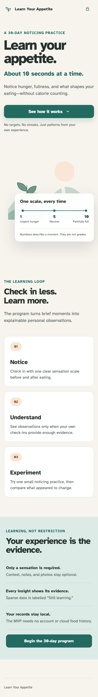
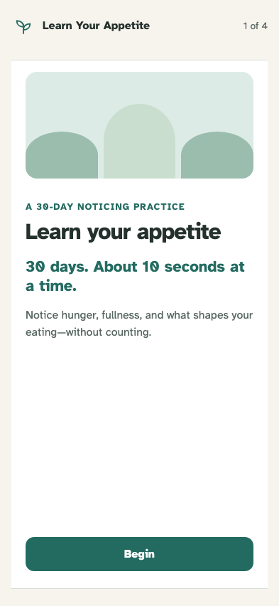
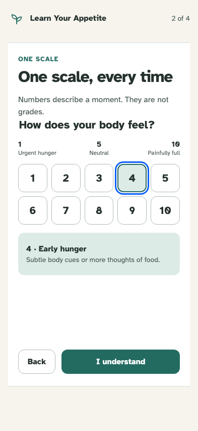
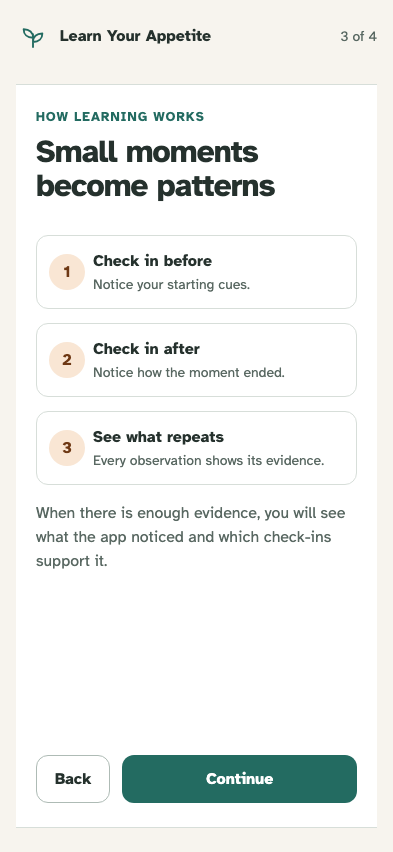
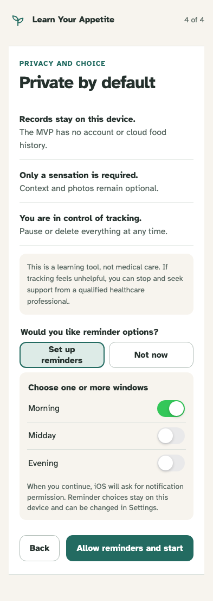
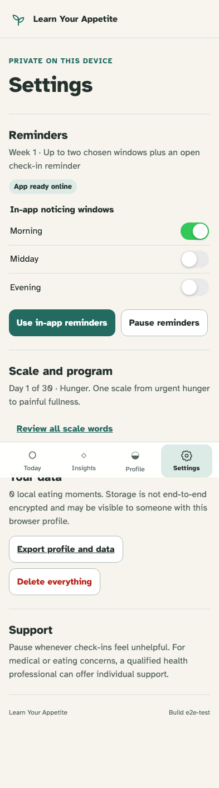
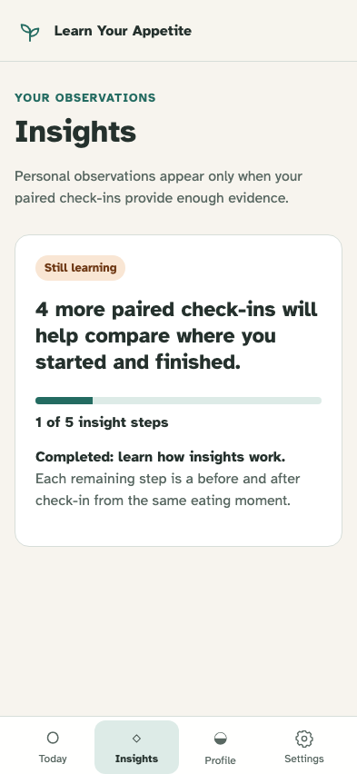

# Application shell and onboarding

A new user can understand the promise and unified scale, choose private reminder windows, and activate a private 30-day program.

## The 30-day learning promise is clear

**Verifications:**

- [x] The document title identifies Learn Your Appetite
- [x] The primary promise avoids calorie tracking
- [x] The unified scale keeps its direction and non-judgmental framing
- [x] The page explains the complete Notice, Understand, Experiment loop
- [x] Privacy is visible without exposing implementation details

## Onboarding introduces one calm idea at a time

**Verifications:**

- [x] The promise states the finite 30-day duration and lightweight effort
- [x] Activation asks for no account, weight, calorie target, or diet goal

## Scale education is clearly separate from a real check-in

**Verifications:**

- [x] The scale retains urgent hunger, neutral, and painful fullness anchors
- [x] The optional practice is explicitly not saved as a check-in
- [x] The interface says numbers describe rather than grade a moment

## Paired moments lead to evidence-backed patterns

**Verifications:**

- [x] The complete check-in and learning sequence is explicit

## Reminder setup reveals native-style windows before asking permission

**Verifications:**

- [x] Records stay local and every context field remains optional
- [x] Morning, Midday, and Evening switches appear and one window is selected
- [x] Permission timing is explained before the activation action
- [x] The medical boundary and freedom to pause are stated without alarm

## Activation opens a persisted Day 1 Today state

**Verifications:**

- [x] Today uses elapsed program language with no quota or streak
- [x] The next action, Week 1 focus, privacy, and four app destinations are available
- [x] Activation requests permission and schedules only the selected window

## Settings owns the build identity and the fourth navigation tab

**Verifications:**

- [x] The selected reminder window persists in Settings
- [x] The deterministic build identifier appears only in Settings
- [x] Settings uses the bundled SVG gear and no gear emoji

## Completed onboarding supplies an honest first step toward an insight

**Verifications:**

- [x] The initial meter starts at one of five steps, or 20 percent
- [x] The completed step is onboarding, while all four evidence pairs remain required
- [x] No synthetic eating moment or personalized claim was created
