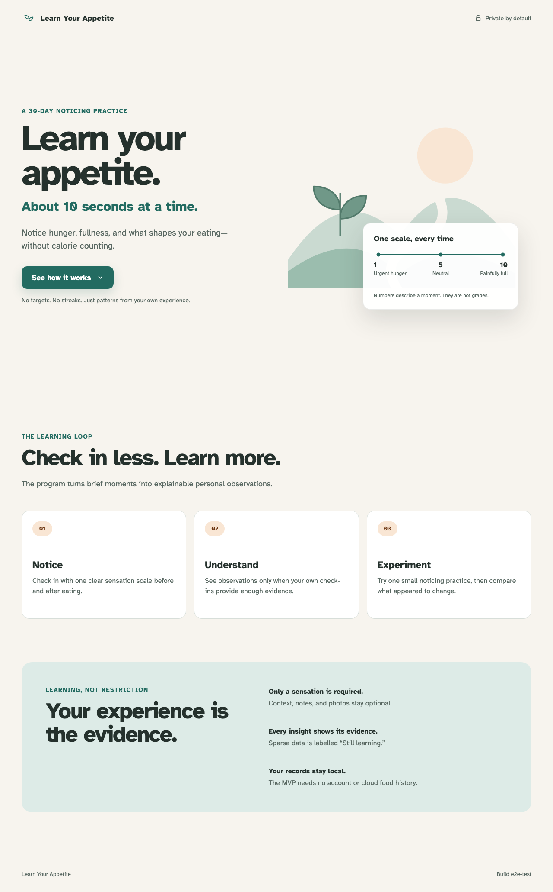

# Application shell and landing promise

The static Learn Your Appetite client loads a responsive, accessible explanation of the 30-day program.

## The 30-day learning promise is clear

**Verifications:**

- [x] The document title identifies Learn Your Appetite
- [x] The primary promise avoids calorie tracking
- [x] The unified scale keeps its direction and non-judgmental framing
- [x] The page explains the complete Notice, Understand, Experiment loop
- [x] Privacy is visible and the deterministic build marker is present
