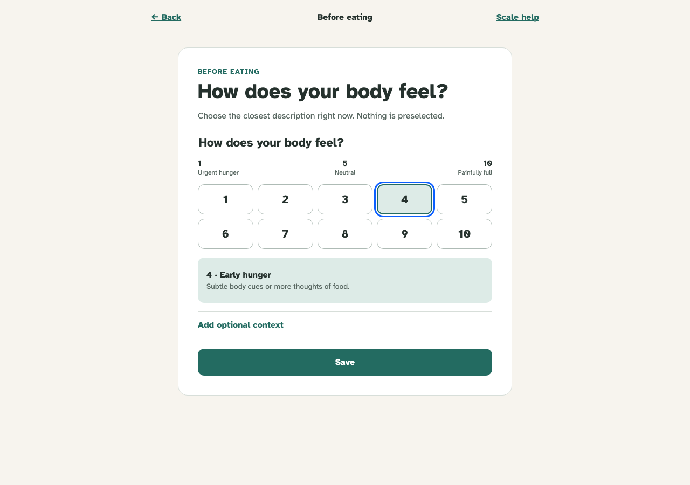
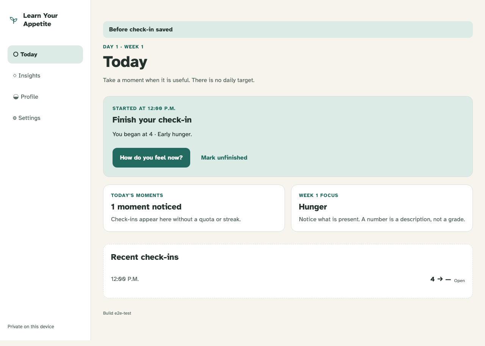

# Before-eating check-in

One keyboard-operable sensation selection creates a private open eating episode and a clear next action.

## The required path is one unambiguous sensation and one save

**Verifications:**

- [x] No scale value is selected by default
- [x] Arrow-key selection exposes the complete number and phrase
- [x] Optional context is disclosed separately and does not block save

## Today preserves the open episode and makes completion the next action

**Verifications:**

- [x] The saved-state announcement and exact starting sensation are visible
- [x] Completion is primary and unfinished is a deliberate alternative
