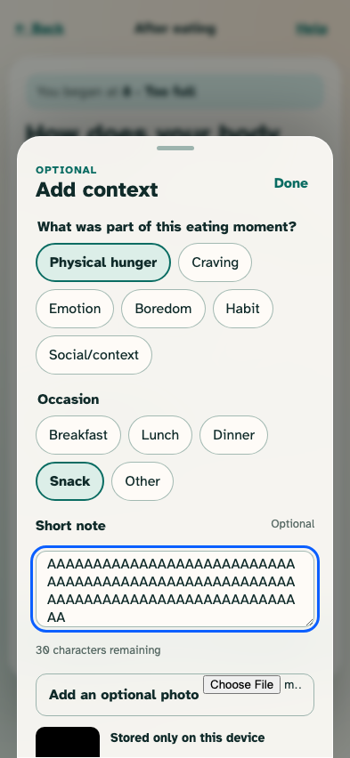
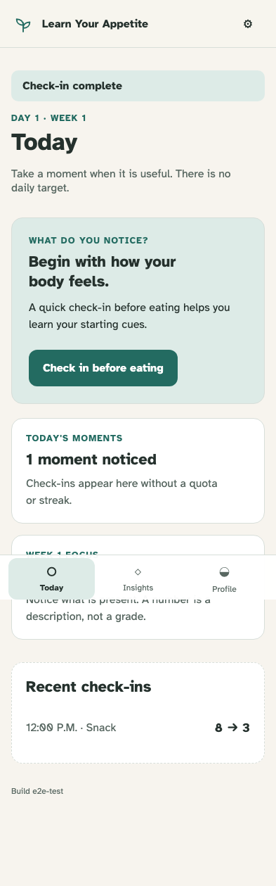

# After-eating check-in

The identical-direction scale completes the open episode while self-described context and a processed local photo remain optional.

## Optional context enriches but never judges the same-scale answer

**Verifications:**

- [x] The before summary and after scale preserve one direction
- [x] A contradictory-looking physical-hunger answer is accepted without warning
- [x] Note length and locally prepared photo state are explicit

## Today shows one completed paired episode

**Verifications:**

- [x] Completion is announced and the before/after values remain paired
- [x] The optional occasion is shown without inferring a meal from time
