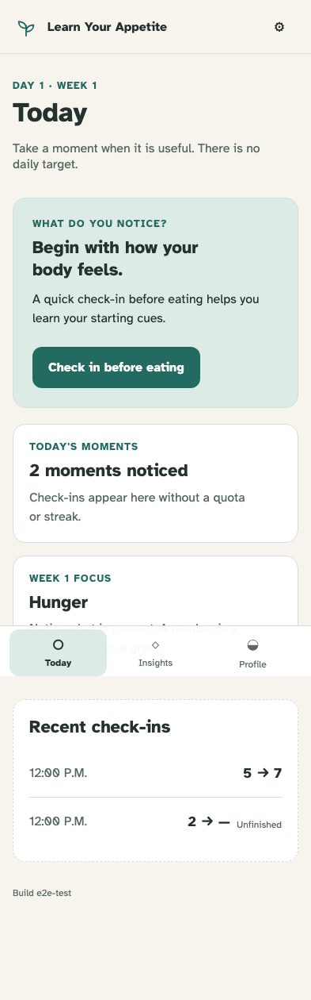
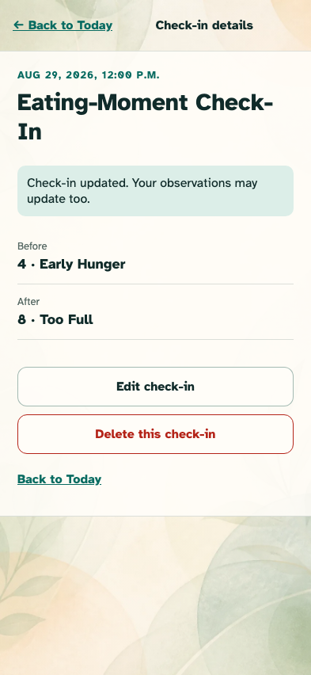

# Today, correction, and incomplete episodes

Recent moments remain editable and deletable, while an abandoned check-in never receives an invented after score.

## Today distinguishes complete and deliberately unfinished moments

**Verifications:**

- [x] Both moments are retained in local-time order
- [x] The abandoned entry explicitly says Unfinished and has no invented after value

## A correction updates the canonical episode

**Verifications:**

- [x] The corrected values and full phrases replace the mistaken values
- [x] The interface warns that derived observations may update
