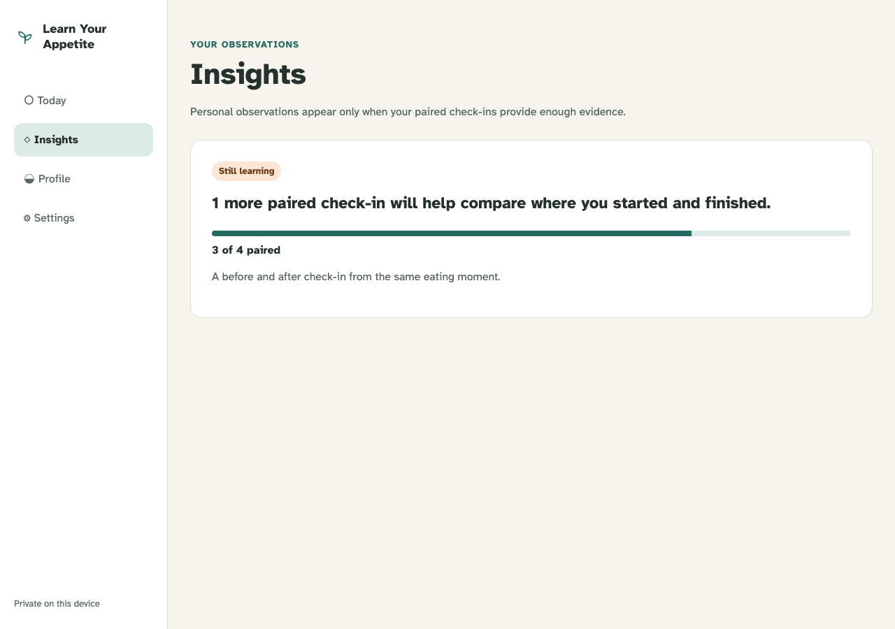
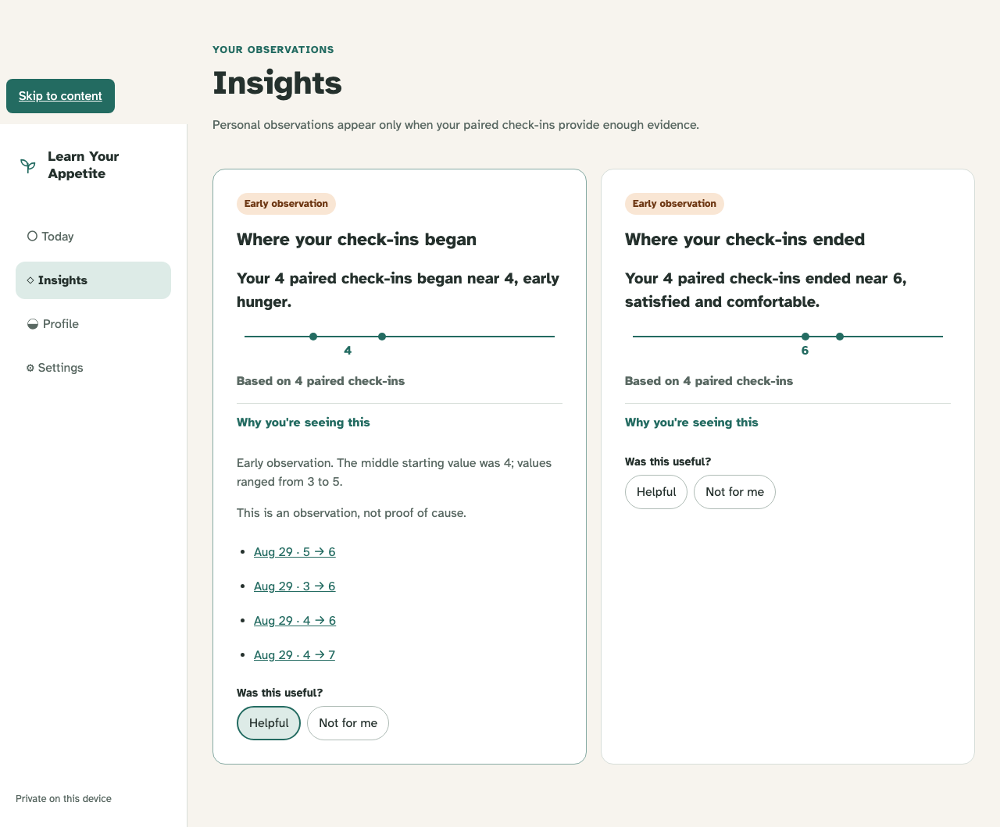

# First-week insight

The app makes no personal claim below its fixed gate, then explains the exact records behind a neutral early observation.

## Three pairs produce progress, not generic advice disguised as an insight

**Verifications:**

- [x] The exact remaining evidence and paired definition are visible
- [x] No personalized finding or unsupported recommendation is rendered

## Four pairs unlock a transparent, feedback-ready early observation

**Verifications:**

- [x] The structured typical-start result renders its median phrase and evidence count
- [x] The disclosure shows range, source records, and a non-causal caveat
- [x] Helpful feedback is optional and persisted separately from source episodes
