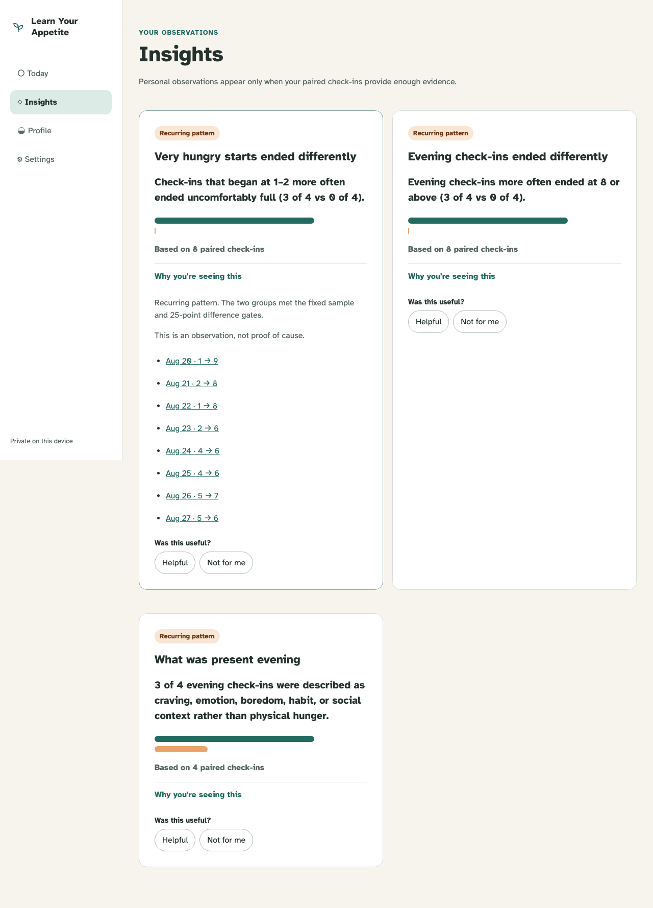

# Progression and recurring patterns

Elapsed program stages survive gaps, while a fixed eight-pair history produces a rate-gated recurring pattern and tapered reminders.

## Elapsed time reaches personal patterns without a streak or reset

**Verifications:**

- [x] Day 23 is Week 4 with the personal-pattern focus
- [x] Recent moments remain available after elapsed days with no compliance warning

## The strongest supported association is ranked first with exact evidence

**Verifications:**

- [x] The urgent-start association crosses recurring and effect-size gates
- [x] The disclosure names fixed gates and exposes all eight source episodes
