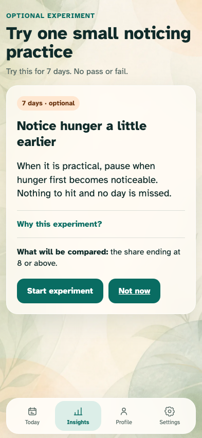
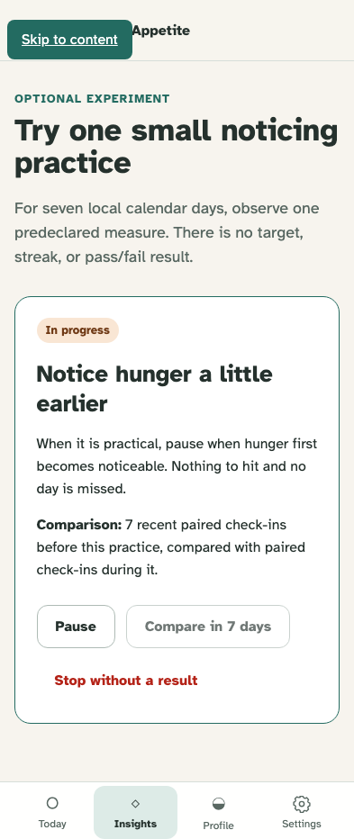
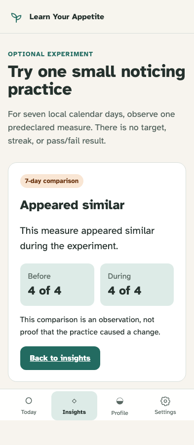

# Experiment lifecycle

A passed observation can offer one optional, stoppable, non-causal seven-day comparison.

## The highest-priority supported pattern offers a fixed and fully optional practice

**Verifications:**

- [x] The offer states seven days, the practice, exact comparison, and non-causal rationale
- [x] Not now returns to insights without creating an experiment

## One record is active and remains freely pausable or stoppable

**Verifications:**

- [x] The active view names its baseline and offers pause, finish, and stop paths

## Completed results report only the predeclared measure with cautious language

**Verifications:**

- [x] Changed, similar, and still-learning states were all rendered from deterministic records
- [x] The result shows before and during counts and explicitly rejects causality
