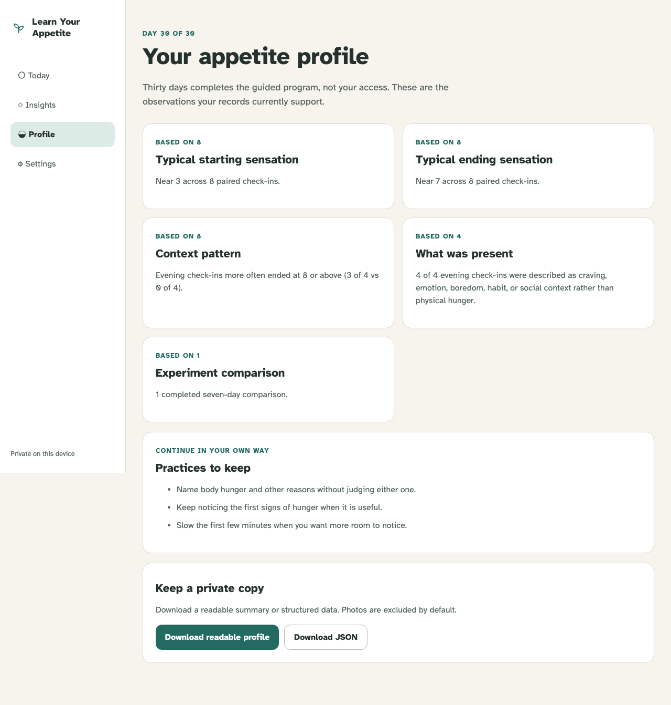
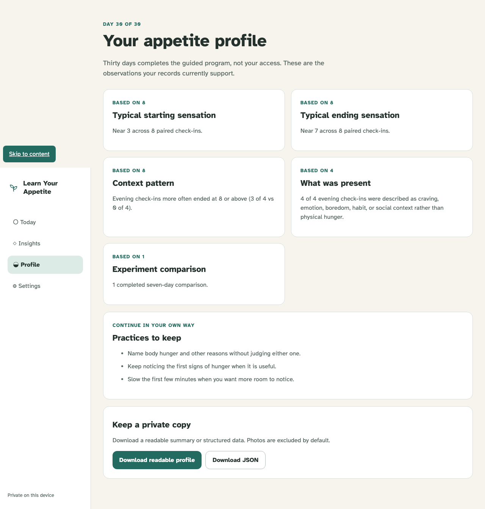

# Day-30 Appetite Profile

The finite program ends with an evidence-labelled profile that remains locally accessible and exportable.

## Day 30 ends the guide and assembles only evidence-supported sections

**Verifications:**

- [x] Program completion does not lock records or imply a streak
- [x] Start, end, context, reason, and experiment sections each show evidence
- [x] Continuing practices come from supported patterns

## Readable and structured exports are explicit and exclude photos by default

**Verifications:**

- [x] Both downloads use stable names and the structured export declares version 1
- [x] Neither downloaded representation contains the local photo identifier
