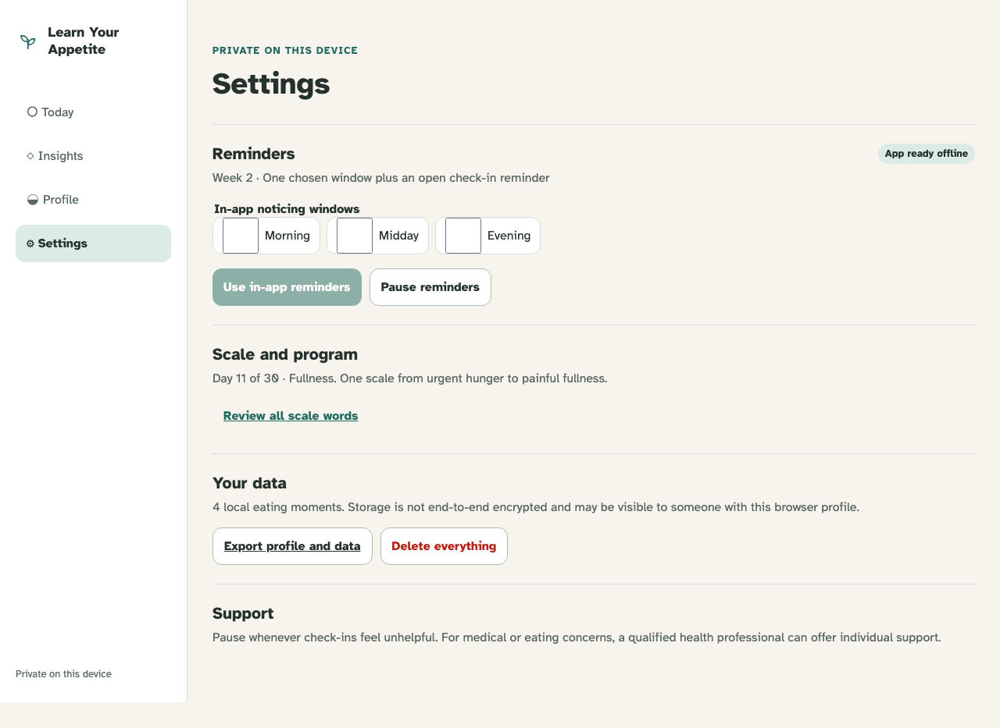
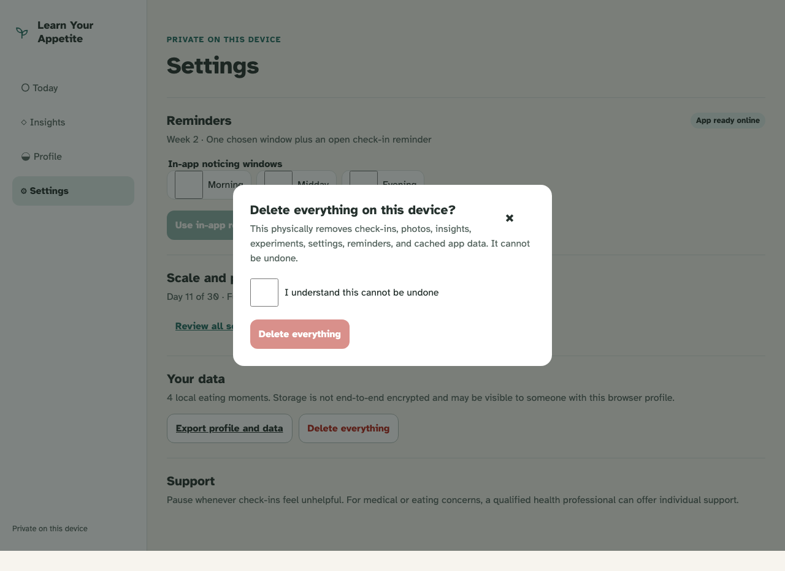

# Persistence, offline, and privacy

Legacy local records remain useful offline, while deletion is deliberate and complete.

## Version-one records migrate through the real repository and reopen without a network

**Verifications:**

- [x] The offline shell reports its real state and retains all four local moments
- [x] Privacy copy names browser-profile visibility and provides export access

## Delete-all enumerates every private category and stays disabled without confirmation

**Verifications:**

- [x] The dialog includes records, photos, settings, reminders, and cached app data
- [x] The destructive control requires an explicit irreversible confirmation
