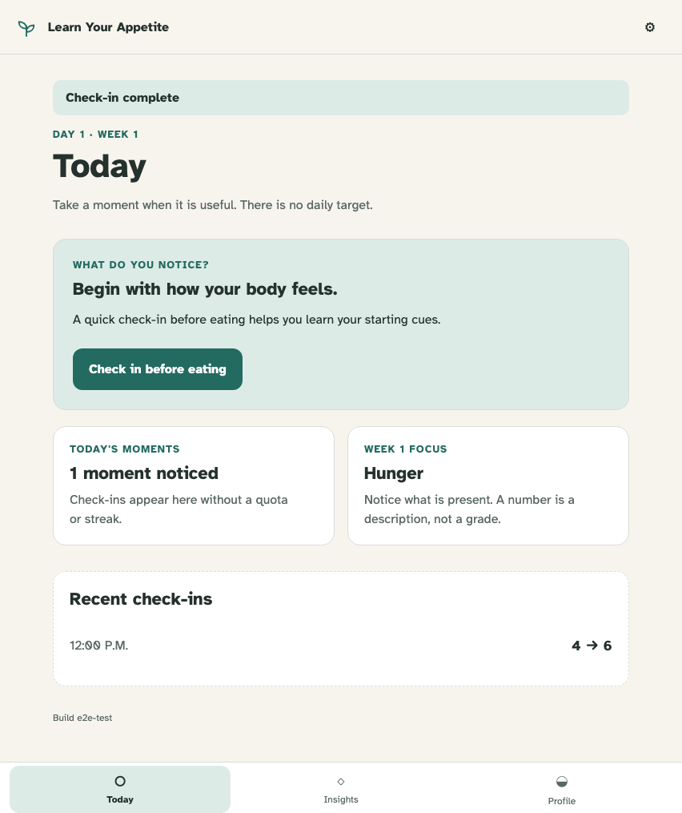
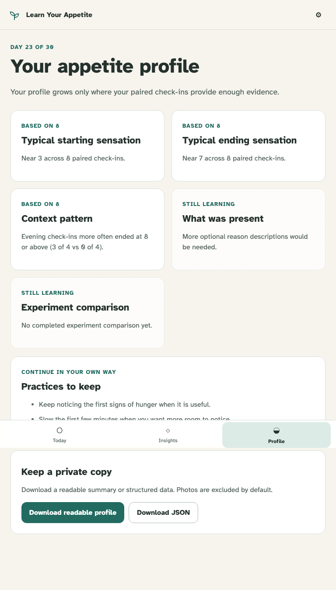

# Responsive and accessible journey

Activation, a paired moment, an experiment offer, and Profile remain keyboard-operable across required viewport classes.

## The complete paired loop works from the keyboard in a short landscape viewport

**Verifications:**

- [x] The before and after actions persisted one completed local moment
- [x] No horizontal overflow appears at mobile landscape size
- [x] Reduced-motion media preference is active

## The progressive Profile reflows at tablet width after a keyboard-started experiment

**Verifications:**

- [x] The Profile exposes evidence-labelled supported and sparse sections
- [x] Every visible interactive target is at least 44 by 44 CSS pixels
- [x] No forbidden judgement, calorie, weight, streak, diagnostic, or causal-result copy appears
