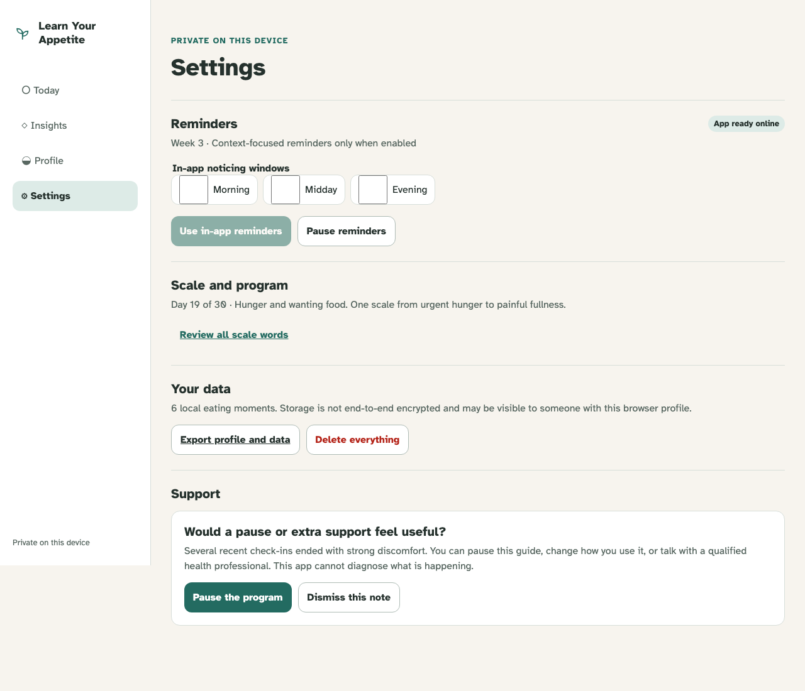

# Safety and non-judgmental states

Repeated high-discomfort endings prompt options, never a diagnosis or alarm.

## A calm card offers pause, dismissal, and outside support after repeated discomfort

**Verifications:**

- [x] The copy observes recent discomfort without diagnosis, alarm, or moral judgement
- [x] Pause and dismissal remain independent choices
- [x] Rendered copy contains no forbidden achievement or eating-morality language
