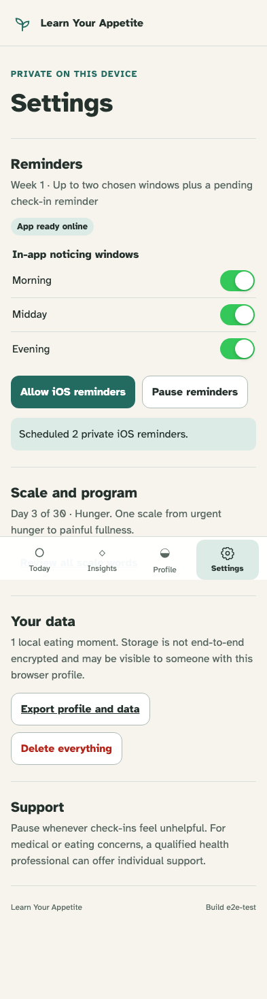

# Reminder adapter and graceful degradation

Reminder settings taper with the program and accurately describe browser capability.

## A selected window is retained without making a false browser scheduling claim

**Verifications:**

- [x] The adapter is triggered only after a window is selected
- [x] Reminder choices retain checkbox semantics in an iOS-sized switch
- [x] The app says browser background reminders are unavailable
- [x] Pause is available and no native scheduling claim is rendered

## Every settings transition replaces the complete desired native schedule

**Verifications:**

- [x] Two selected windows reconcile immediately without an extra apply action
- [x] Resume restores the desired schedule and the UI retains both choices
