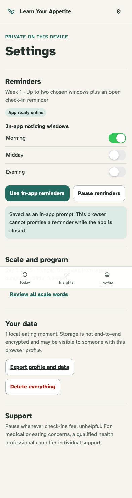

# Reminder adapter and graceful degradation

Reminder settings taper with the program and accurately describe browser capability.

## A user-selected window becomes an in-app prompt with an explicit capability limit

**Verifications:**

- [x] The adapter is triggered only after a window is selected
- [x] Reminder choices retain checkbox semantics in an iOS-sized switch
- [x] The app says it cannot promise delivery while closed
- [x] Pause is available and no native scheduling claim is rendered
