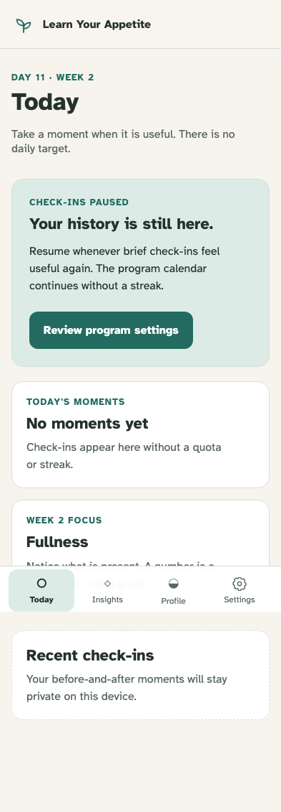

# Program lifecycle and local calendar progression

Pause blocks new check-ins, day 30 completes from any route, and restart requires explicit confirmation.

## A paused program keeps its calendar and history while removing the new check-in action

**Verifications:**

- [x] Today explains the pause without streak or failure language
- [x] No new before-eating check-in action is available while paused

## A confirmed restart begins a fresh day-one projection without deleting prior source events

**Verifications:**

- [x] Today renders the new program at day 1 with check-ins available
- [x] Playback retains both program starts and the completion transition
