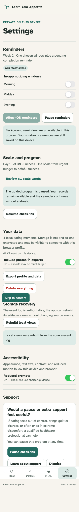

# Settings, scale guidance, and support

Existing users can revisit guidance without onboarding, persist privacy preferences, recover projections, and use every support action.

## Settings preserves explicit preferences and exposes honest local recovery

**Verifications:**

- [x] Reduced prompts and photo export are explicit persisted switches
- [x] Projection recovery completes without replacing the source event log

## The quiet support path can be learned from, dismissed, restored, and paused

**Verifications:**

- [x] Support eligibility never diagnoses or uses emergency language
- [x] Pause check-ins is reversible from the same Settings screen
