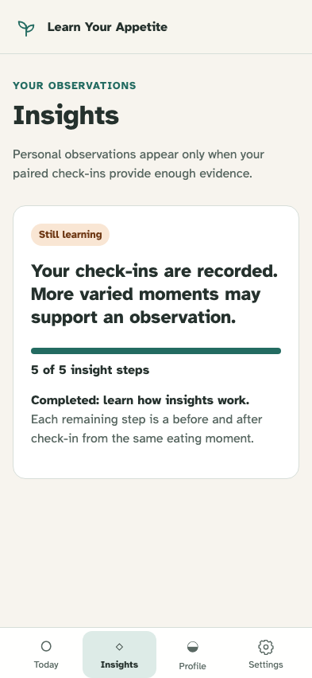
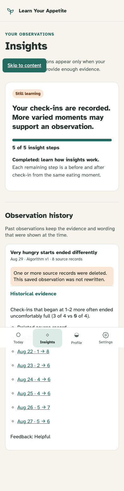

# Insight history and evidence

Constant or outlier-only data makes no claim; a supported observation publishes once and retains honest history after its sources change.

## A constant history remains in the learning state

**Verifications:**

- [x] No personalized observation is created without variation
- [x] The UI does not turn a constant value into advice

## The saved observation survives edits, deletion, and projection replay with explicit provenance

**Verifications:**

- [x] Deleted evidence is labeled without rewriting the historical finding
- [x] History retains evidence count, algorithm version, and optional feedback
- [x] Rebuilding projections does not resurrect deleted current evidence
