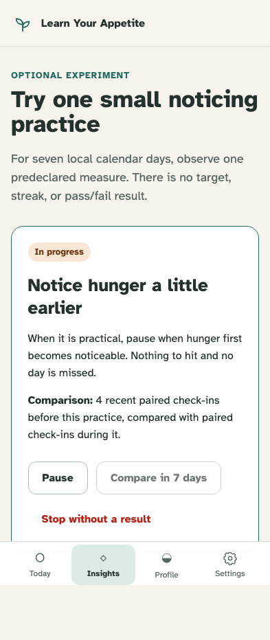
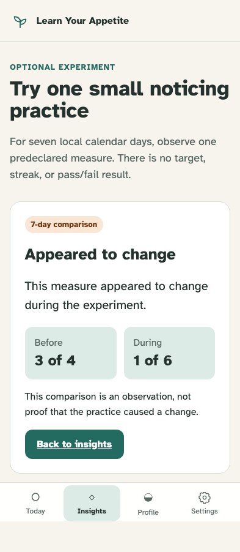

# Timed experiment on Today

A predeclared experiment stays optional, cannot finish early, and becomes an honest comparison after seven local days.

## Today keeps the check-in primary while exposing reversible experiment controls

**Verifications:**

- [x] The active experiment is a secondary card with pause and stop controls
- [x] The comparison remains disabled before seven local calendar days

## The seventh local day materializes one neutral result through the append-only event log

**Verifications:**

- [x] Today promotes the comparison only after the complete interval
- [x] Projection replay retains the fixed baseline, target, and result
