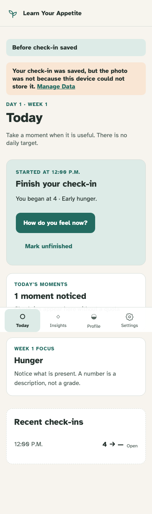
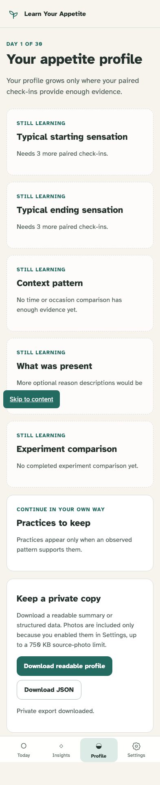

# Storage pressure and private export

Photo failures never discard a sensation; exports remain photo-free until an explicit, bounded opt-in.

## A failed optional photo write preserves the authoritative sensation event

**Verifications:**

- [x] Today announces both the saved check-in and omitted photo
- [x] Manage Data is offered at the failure boundary

## The same export changes policy only after the persisted iOS-style opt-in

**Verifications:**

- [x] Default JSON contained metadata but no image bytes
- [x] Opted-in JSON documents its source-byte ceiling and omission count
