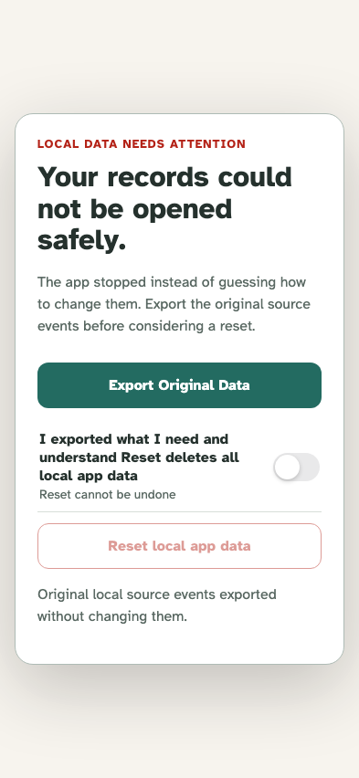
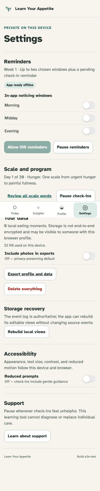

# Migration and offline update

Source events rebuild disposable views, fail safely when unsupported, and remain usable behind one versioned offline shell.

## Projection deletion replays, while unsupported source data stops with export-before-reset recovery

**Verifications:**

- [x] The open episode survived wholesale projection deletion
- [x] Original Data includes the unmodified unsupported event before Reset

## The activation cleanup removes an obsolete cache and the current shell serves every primary route without a network

**Verifications:**

- [x] Only current versioned application caches remain
- [x] Settings and every other primary route rendered offline
