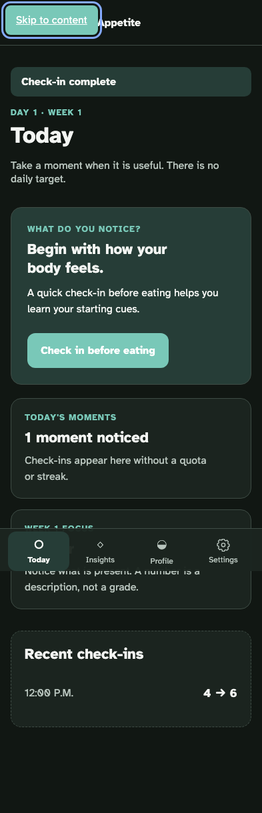
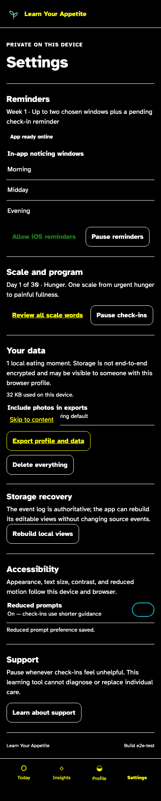

# Accessible release journey

The primary phone journey follows system appearance, keyboard and motion preferences, and remains usable at layout extremes.

## A paired check-in completes in system dark appearance with visible keyboard focus

**Verifications:**

- [x] System dark colors are active without changing semantic content
- [x] Reduced motion and keyboard focus remain observable

## Settings remains semantic at 200% text, forced colors, smallest phone, landscape, and tablet sizes

**Verifications:**

- [x] The iOS-style preferences retain accessible switch names
- [x] The page has no horizontal overflow in the canonical phone viewport
