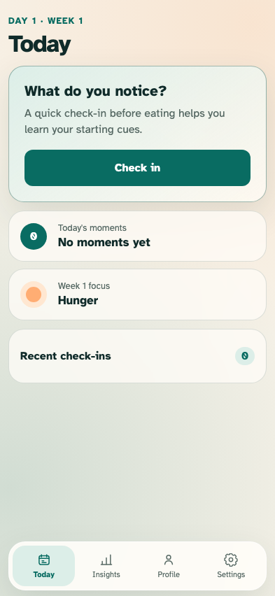
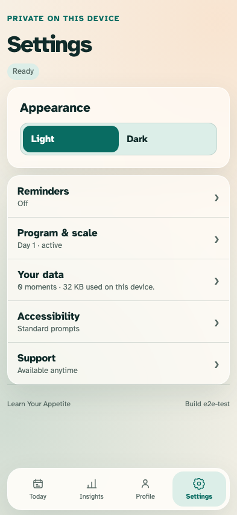
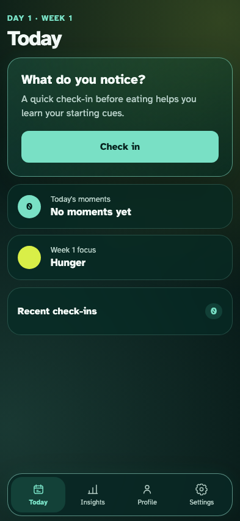

# Phone UX overhaul

The complete setup and daily shell fit the primary phone viewport, with identical semantics in deliberate light and dark appearances.

## Light mode keeps Today’s action and both glanceable summaries in one viewport

**Verifications:**

- [x] The primary action is completely above the phone fold
- [x] Moments and week focus are visible without scrolling

## Settings presents every top-level choice as a one-screen hub

**Verifications:**

- [x] Appearance and all five focused categories are visible in the phone viewport
- [x] The build identity remains confined to Settings

## Event-replayed dark mode changes material, not content or action geometry

**Verifications:**

- [x] Dark appearance survives projection replay and relaunch
- [x] The dark primary action retains the light layout geometry above the fold
